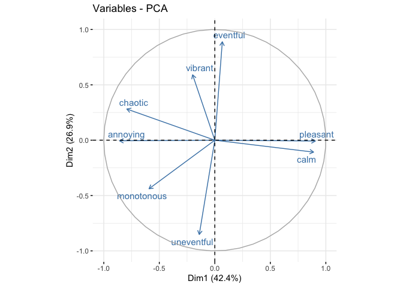

<script src="README_files/libs/kePrint-0.0.1/kePrint.js"></script>
<link href="README_files/libs/lightable-0.0.1/lightable.css" rel="stylesheet" />


# Replication code for “Crossing the Linguistic Causeway: Ethno-national Differences on Soundscape Attributes in Bahasa Melayu”

## Setup Environment

**R version 4.1.1 (2021-08-10)**

**Platform:** aarch64-apple-darwin20 (64-bit)

**locale:**
en_US.UTF-8\|\|en_US.UTF-8\|\|en_US.UTF-8\|\|C\|\|en_US.UTF-8\|\|en_US.UTF-8

**attached base packages:** *stats*, *graphics*, *grDevices*, *utils*,
*datasets*, *methods* and *base*

**other attached packages:** *CircE(v.1.1)*, *circumplex(v.0.3.8)*,
*RTHORR(v.0.1.2)*, *gdata(v.2.18.0)*, *ggthemes(v.4.2.4)*,
*ggExtra(v.0.10.0)*, *ggforce(v.0.4.1)*, *factoextra(v.1.0.7)*,
*kableExtra(v.1.3.4)*, *ggbrace(v.0.1.0)*, *ggsignif(v.0.6.3)*,
*muStat(v.1.7.0)*, *fmsb(v.0.7.1)*, *conover.test(v.1.1.5)*,
*rstatix(v.0.7.0)*, *psych(v.2.1.6)*, *ggfortify(v.0.4.14)*,
*readxl(v.1.4.2)*, *reshape2(v.1.4.4)*, *plyr(v.1.8.7)*,
*janitor(v.2.1.0)*, *lubridate(v.1.9.2)*, *forcats(v.1.0.0)*,
*stringr(v.1.5.0)*, *dplyr(v.1.1.1)*, *purrr(v.1.0.1)*,
*readr(v.2.1.4)*, *tidyr(v.1.3.0)*, *tibble(v.3.2.1)*,
*ggplot2(v.3.4.2)*, *tidyverse(v.2.0.0)*, *dataverse(v.0.3.10)* and
*pander(v.0.6.5)*

**loaded via a namespace (and not attached):** *colorspace(v.2.0-3)*,
*ellipsis(v.0.3.2)*, *rio(v.0.5.27)*, *snakecase(v.0.11.0)*,
*rstudioapi(v.0.14)*, *farver(v.2.1.1)*, *ggrepel(v.0.9.1)*,
*fansi(v.1.0.3)*, *xml2(v.1.3.4)*, *mnormt(v.2.0.2)*, *knitr(v.1.39)*,
*polyclip(v.1.10-0)*, *jsonlite(v.1.8.4)*, *broom(v.1.0.4)*,
*shiny(v.1.7.4)*, *compiler(v.4.1.1)*, *httr(v.1.4.5)*,
*backports(v.1.4.1)*, *assertthat(v.0.2.1)*, *fastmap(v.1.1.0)*,
*cli(v.3.6.1)*, *later(v.1.3.0)*, *tweenr(v.1.0.2)*,
*htmltools(v.0.5.5)*, *tools(v.4.1.1)*, *gtable(v.0.3.0)*,
*glue(v.1.6.2)*, *Rcpp(v.1.0.9)*, *carData(v.3.0-4)*,
*cellranger(v.1.1.0)*, *vctrs(v.0.6.3)*, *svglite(v.2.1.0)*,
*nlme(v.3.1-152)*, *xfun(v.0.31)*, *openxlsx(v.4.2.4)*,
*rvest(v.1.0.3)*, *timechange(v.0.2.0)*, *mime(v.0.12)*,
*miniUI(v.0.1.1.1)*, *lifecycle(v.1.0.3)*, *gtools(v.3.9.2)*,
*MASS(v.7.3-54)*, *scales(v.1.2.0)*, *hms(v.1.1.3)*,
*promises(v.1.2.0.1)*, *parallel(v.4.1.1)*, *yaml(v.2.3.5)*,
*curl(v.4.3.2)*, *gridExtra(v.2.3)*, *stringi(v.1.7.8)*,
*permute(v.0.9-7)*, *zip(v.2.2.0)*, *rlang(v.1.1.1)*,
*pkgconfig(v.2.0.3)*, *systemfonts(v.1.0.4)*, *evaluate(v.0.15)*,
*lattice(v.0.20-44)*, *tidyselect(v.1.2.0)*, *magrittr(v.2.0.3)*,
*R6(v.2.5.1)*, *generics(v.0.1.2)*, *DBI(v.1.1.1)*, *pillar(v.1.9.0)*,
*haven(v.2.5.2)*, *foreign(v.0.8-81)*, *withr(v.2.5.0)*,
*abind(v.1.4-5)*, *car(v.3.0-11)*, *utf8(v.1.2.2)*, *tmvnsim(v.1.0-2)*,
*tzdb(v.0.3.0)*, *rmarkdown(v.2.14)*, *grid(v.4.1.1)*,
*data.table(v.1.14.8)*, *digest(v.0.6.29)*, *webshot(v.0.5.3)*,
*xtable(v.1.8-4)*, *httpuv(v.1.6.5)*, *munsell(v.0.5.0)* and
*viridisLite(v.0.4.0)*

## Data Loading and Preparation

The survey data was collected via a [Matlab
GUI](https://github.com/kenowr/satp-gui "Link to GitHub"). The survey
and demographic data are stored in a public data repository at
<https://doi.org/10.21979/N9/9AZ21T>.

Load supplementary data for analysis

1.  SATP zsm Stage 1: <https://doi.org/10.21979/N9/0NE37R>
2.  ARAUS dataset: <https://doi.org/10.21979/N9/9OTEVX>

### SATP zsm Stage 1 & 2 dataverse datasets

``` r
#Dataverse dataset doi links
data.satp.zsm2.name = "10.21979/N9/9AZ21T" #dataset linked to this paper
data.satp.zsm1.name = "10.21979/N9/0NE37R" #satp stage 1 dataset
data.araus.name = "10.21979/N9/9OTEVX" #araus dataset

# Loading SATP Stage 2 dataset
## Define a list of data frame names and associated dataset file names
data.names <- data.frame(
        df.name=c("data.subj.zsm2", "data.demo.zsm2", #zsm2
                  "data.main.zsm1","data.der.zsm1" #zsm1
                  ),
        filename=c("SATP_Stage2_zsm_questionnaire.tab",#zsm2 demographic
                   "SATP_Stage2_zsm_demographics.tab", #zsm2 demographic
                   "SATP_Stage1_zsm_main.tab", #zsm1 main-axis attributes
                  "SATP_Stage1_zsm_derived.tab" #zsm1 derived-axis attributes
                  ))

## Load datasets into a list
data.satp.zsm2.l <- datavLoader(data.names[1:2,], data.satp.zsm2.name)
```

    [1] "Loading: data.subj.zsm2; From: 10.21979/N9/9AZ21T"
    [1] "Loading: data.demo.zsm2; From: 10.21979/N9/9AZ21T"

``` r
# Loading SATP Stage 1 dataset
data.satp.zsm1.l <- datavLoader(data.names[3:4,], data.satp.zsm1.name)
```

    [1] "Loading: data.main.zsm1; From: 10.21979/N9/0NE37R"
    [1] "Loading: data.der.zsm1; From: 10.21979/N9/0NE37R"

### ARAUS Dataset

``` r
data.araus.filename <- "data.zip" #filename of araus data

#download data.zip
data.araus.bin<-dataverse::get_file_by_name(filename = data.araus.filename,
                            dataset = data.araus.name)
#write the binary file to zip
writeBin(data.araus.bin, paste0("./data/",data.araus.filename))

#unzip and retrieve only responses.csv and participants.csv
unzip(data.araus.filename, 
      files=c("data/responses.csv","data/participants.csv"))
```

    Warning in unzip(data.araus.filename, files = c("data/responses.csv",
    "data/participants.csv")): error 1 in extracting from zip file

### ARAUS: cleaning and preparation

``` r
#araus participant data
data.araus.participant <- read_csv("./data/participants.csv") %>%
        dplyr::filter(ethnic==2 & residence_length==1) %>% #ethnic malays
        dplyr::select(participant)

#subjective test data
data.araus<-read_csv("./data/responses.csv") %>%
        #only local resident + ethnic malays
        dplyr::filter(participant %in% data.araus.participant$participant) %>%
        #only soundscapes; no augmentation
        dplyr::filter(grepl("silence",masker)) %>%
        #remove test and calibration folds
        dplyr::filter(!fold_r %in% c(0,-1)) %>%
        #compute ISOPL and ISOEV
        dplyr::mutate(ISOPL=((pleasant-annoying)+
                              cospi(0.25)*(calm-chaotic)+
                              cospi(0.25)*(vibrant-monotonous))/
                       (4+sqrt(32))) %>%
        dplyr::mutate(ISOEV=((eventful-uneventful)+
                              cospi(0.25)*(chaotic-calm)+
                              cospi(0.25)*(vibrant-monotonous))/
                       (4+sqrt(32))) %>%
        #select only relevant columns
        dplyr::select(c(participant,soundscape,
                        eventful,vibrant,pleasant,calm,
                        uneventful, monotonous, annoying, chaotic,
                        ISOPL, ISOEV))
```

## Demographic Analysis

``` r
#no of participants
n.participsnts.SG <- length(
        unique(data.satp.zsm2.l$data.subj.zsm2 %>%
                       dplyr::filter(ETHNICITY=="SG") %>%
                       .$participantID))
n.participsnts.MY.M <- length(
        unique(data.satp.zsm2.l$data.subj.zsm2 %>%
                       dplyr::filter(ETHNICITY=="MY:M") %>%
                       .$participantID))
n.participsnts.MY.O <- length(
        unique(data.satp.zsm2.l$data.subj.zsm2 %>%
                       dplyr::filter(ETHNICITY=="MY:O") %>%
                       .$participantID))

#summarise language fluency count by groups
data.demo.merged.gender.fluency <- data.satp.zsm2.l$data.demo.zsm2 %>%
        dplyr::mutate(fluency=ifelse(
                set=="UPM", #fluent in oral zsm >6
                ifelse(as.numeric(as.character(fluency))>6,"Yes","No"),
                "Yes")) %>%
                group_by(group,fluency) %>%
                dplyr::summarise(count=n()) %>%
                pivot_wider(names_from = group,values_from = c(count)) %>%
                column_to_rownames(var = "fluency") %>%
                mutate_all(~replace(., is.na(.), 0)) %>%
        rbind(data.satp.zsm2.l$data.demo.zsm2 %>%
        group_by(group,gender) %>%
        dplyr::summarise(count=n()) %>%
        pivot_wider(names_from = group,values_from = c(count)) %>%
        column_to_rownames(var = "gender"))
```

    Warning: There was 1 warning in `dplyr::mutate()`.
    ℹ In argument: `fluency = ifelse(...)`.
    Caused by warning in `ifelse()`:
    ! NAs introduced by coercion

``` r
#demos stats for age, written & spoken fluency scores
data.demo.merged.numeric <- data.satp.zsm2.l$data.demo.zsm2 %>% 
        dplyr::mutate(fluency=ifelse(
                fluency=="Yes",NA,as.numeric(as.character(fluency)))) %>%
        dplyr::group_by(group) %>%
        dplyr::summarise(across(c("age","written","fluency"),
                                list(mean=mean,sd=sd))) %>%
        dplyr::mutate(Age=paste0(format(round(age_mean,2),nsmall=2),
                                 " (",
                                 format(round(age_sd,2),nsmall=2),") "),
                      `Written Fluency`=paste0(
                              format(round(written_mean,2),nsmall=2),
                              " (",
                              format(round(written_sd,2),nsmall=2),
                              ") "),
                      `Spoken Fluency`=paste0(
                              format(round(fluency_mean,2),nsmall=2),
                              " (",
                              format(round(fluency_sd,2),nsmall=2),
                              ") "),
                      `Spoken Fluency`=ifelse(
                              group=="SG","",`Spoken Fluency`)) %>%
        dplyr::select(!c(age_mean,age_sd,written_mean,written_sd,
                         fluency_mean,fluency_sd))
```

    Warning: There was 1 warning in `dplyr::mutate()`.
    ℹ In argument: `fluency = ifelse(fluency == "Yes", NA,
      as.numeric(as.character(fluency)))`.
    Caused by warning in `ifelse()`:
    ! NAs introduced by coercion

``` r
#summarise in a table
data.demo.merged.table<- as.data.frame(t(data.demo.merged.numeric))  %>%
        row_to_names(row_number = 1) %>% #convert 1st row to colname
        `rownames<-`(c("Age","Written Fluency","Summary")) %>%
        #update `Spoken Fluency` for grouped rows
        dplyr::mutate(SG=ifelse(SG=="","-",SG)) %>%
        rbind(data.demo.merged.gender.fluency) %>%
        kableExtra::kbl(booktabs = T, linesep = "",
                        #format = "latex",
                        format = "html",
                        label = "demo",
                        caption = "Summary of demographic information")%>%
        pack_rows("Spoken Fluency", 3, 5) %>%
        pack_rows("Gender", 6, 7) %>%
        row_spec(3, hline_after = T) %>%
        #kable_styling(latex_table_env = "tabularx") %>%
        kable_styling(protect_latex = TRUE) %>%
        kable_paper(full_width = T) #%>%
        #save_kable(paste0(getwd(),"/Table tex files/demo.tex"))
data.demo.merged.table
```

|                    | MY:M         | MY:O         | SG           |
|:-------------------|:-------------|:-------------|:-------------|
| Age                | 24.00 (4.87) | 23.09 (2.64) | 25.91 (7.18) |
| Written Fluency    | 8.74 (1.26)  | 6.38 (1.56)  | 8.06 (1.58)  |
| **Spoken Fluency** |              |              |              |
| Summary            | 9.48 (0.72)  | 6.16 (1.53)  | \-           |
| Yes                | 31           | 17           | 32           |
| No                 | 0            | 15           | 0            |
| **Gender**         |              |              |              |
| Female             | 15           | 16           | 16           |
| Male               | 16           | 16           | 16           |

Summary of demographic information

## Exploratory analysis

### Summary statistics

``` r
#summary of median values
data.merged.median<-data.satp.zsm2.l$data.subj.zsm2 %>%
        dplyr::group_by(stimuliID,set) %>%
        dplyr::summarise(across(pleasant:monotonous,
                         median,na.rm=TRUE)) %>%
        pivot_longer(cols=-c(1:2),names_to = "PAQ",values_to = "median")
```

    Warning: There was 1 warning in `dplyr::summarise()`.
    ℹ In argument: `across(pleasant:monotonous, median, na.rm = TRUE)`.
    ℹ In group 1: `stimuliID = 1`, `set = "NTU"`.
    Caused by warning:
    ! The `...` argument of `across()` is deprecated as of dplyr 1.1.0.
    Supply arguments directly to `.fns` through an anonymous function instead.

      # Previously
      across(a:b, mean, na.rm = TRUE)

      # Now
      across(a:b, \(x) mean(x, na.rm = TRUE))

``` r
#pivot to long table
data.merged.long<-data.satp.zsm2.l$data.subj.zsm2 %>%
        pivot_longer(names_to = "PAQ",
                     values_to = "Score",
                     cols = c("pleasant":"monotonous"))

#ISOPL and ISOEV
data.ISOPLEV.median <- data.satp.zsm2.l$data.subj.zsm2 %>%
        group_by(stimuliID,ETHNICITY) %>%
        dplyr::summarise(across(c(ISOPL,ISOEV),
                         median,na.rm=TRUE))

#Median contour plot with median points of ISOPL and ISOEV
p.ISOPLEV.contour.facetedStimuli<-ggplot(data=data.satp.zsm2.l$data.subj.zsm2,
                                         aes(x = ISOPL, y = ISOEV)) +
        facet_wrap(~stimuliID, ncol = 9) +
        # stat_density_2d(bins=3,contour_var = "ndensity",breaks=c(0.5),
        #                 aes(color=ETHNICITY)) +
        stat_density_2d(bins=3,contour_var = "ndensity",breaks=c(0.5),
                        geom = "density_2d",
                        aes(color=ETHNICITY)) +
        geom_point(data = data.ISOPLEV.median, 
                    aes(x = ISOPL, y = ISOEV, color=ETHNICITY)) +
        ylim(c(-1,1)) + xlim(c(-1,1)) +
        ggthemes::scale_colour_few() +
        ylim(c(-1.1,1.1)) + xlim(c(-1.1,1.1))
p.ISOPLEV.contour.facetedStimuli
```


``` r
#KDE contour of all points 
p.ISOPLEV.contour.all<-ggplot(data=data.satp.zsm2.l$data.subj.zsm2,
                              aes(x = ISOPL, y = ISOEV)) +
        #facet_wrap(~stimuliID, ncol = 9) +
        stat_density_2d(data=data.satp.zsm2.l$data.subj.zsm2,
                        geom = "density_2d",
                        alpha=0.7,
                        contour_var = "ndensity",
                        breaks=c(0.2),
                        aes(color=ETHNICITY,
                            fill=ETHNICITY,
                            alpha = stat(level))) +
        stat_density_2d(data=data.araus,
                geom = "density_2d",
                alpha=0.5,
                n=100,
                contour_var = "ndensity",
                breaks=c(0.2),
                contour = TRUE, 
                color="#F17CB0",
                linetype = "dashed") +
        #geom_path(aes(x, y), data=contour_95) +
        geom_point(data = data.ISOPLEV.median, alpha=0.3,
                    aes(x = ISOPL, y = ISOEV, color=ETHNICITY)) +
        # geom_circle(aes(x0 = 0, y0 = 0, r = 1),
        #             fill = NA, color = "grey",
        #             linetype = "twodash") +  # Add circles
        #scale_colour_brewer(palette = "Set1") +
        ggthemes::scale_colour_few() +
        ylim(c(-1.2,1.2)) + xlim(c(-1.2,1.2)) +
        theme(legend.position="bottom")
```

    Warning in stat_density_2d(data = data.satp.zsm2.l$data.subj.zsm2, geom =
    "density_2d", : Ignoring unknown aesthetics: fill

``` r
        #theme(legend.position="none")

p.ISOPLEV.contour.all.marg<-ggMarginal(p.ISOPLEV.contour.all,
                                       groupColour = T,
                                       groupFill = T,
                                       alpha=0.15)
```

    Warning: `stat(level)` was deprecated in ggplot2 3.4.0.
    ℹ Please use `after_stat(level)` instead.

``` r
p.ISOPLEV.contour.all.marg
```


``` r
ggsave(paste0("./outputs/allcontour.pdf"),
       plot = p.ISOPLEV.contour.all.marg, 
       width = 2300, height = 2350, units = "px",scale = 0.7)
```

## Statistical Analysis

### Order effects analysis

Due to a bug in the MATLAB GUI program, the same randomized participant
order was presented to the participants whenever the MATLAB GUI program
was restarted. Here, the NTU set is evaluated for order effects since
some of the participants had the same randomized order but some were
truly randomized.

``` r
#extract stimuli order from NTU group
NTUorder.df <- data.satp.zsm2.l$data.subj.zsm2 %>% 
        filter(set=="NTU") %>%
        dplyr::select(participantID,stimuliID) %>%
        pivot_wider(names_from = participantID, values_from = stimuliID)
```

    Warning: Values from `stimuliID` are not uniquely identified; output will contain
    list-cols.
    • Use `values_fn = list` to suppress this warning.
    • Use `values_fn = {summary_fun}` to summarise duplicates.
    • Use the following dplyr code to identify duplicates.
      {data} %>%
      dplyr::group_by(participantID) %>%
      dplyr::summarise(n = dplyr::n(), .groups = "drop") %>%
      dplyr::filter(n > 1L)

``` r
# Create a reference column (assuming it is the first column)
reference_column <- NTUorder.df$"8"[[1]]

# Initialize a list to store equivalent columns
equivalent_columns <- list()

# Loop through each column starting from the second column
for (i in 1:ncol(NTUorder.df)) {
  # Compare each column to the reference column
  if (all(reference_column == NTUorder.df[1, i][[1]][[1]])) {
          equivalent_columns[[
                  length(equivalent_columns) + 1
                  ]] <- as.numeric(colnames(NTUorder.df[1, i]))
  }
}

# Extract the equivalent columns from the dataframe
same.order.pid <- unlist(equivalent_columns)

# Print the equivalent columns
cat("Participant IDs with the same order:\n")
```

    Participant IDs with the same order:

``` r
print(same.order.pid)
```

     [1]  8 21 23 24 25 26 28 31 32 34

``` r
#create new column to store 
ks.order.df <- data.merged.long %>%
        dplyr::filter(set=="NTU") %>%
        dplyr::mutate(group=ifelse(
                participantID %in% same.order.pid, "same", "random"),
                across(c(stimuliID,PAQ),.fns = as.factor)) %>%
        dplyr::group_by(PAQ,stimuliID) %>%
        dplyr::summarize(
                ks_test = list(ks.test(Score[group == "same"],
                                       Score[group == "random"],
                                       exact = NULL,
                                       alternative = "two.sided")),
                stat = ks_test[[1]]$statistic,
                ks.pvalue = ks_test[[1]]$p.value,
                ks.signif = ks.pvalue<0.05,
                n.same = length(Score[group == "same"]),
                n.rand = length(Score[group == "random"])) %>%
        dplyr::ungroup() %>%
        dplyr::mutate(ks.padj = p.adjust(ks.pvalue, method="BH"),
                      ks.adjsignif = ks.padj<0.05) %>%
        dplyr::select(!ks_test)
```

    Warning: There were 216 warnings in `dplyr::summarize()`.
    The first warning was:
    ℹ In argument: `ks_test = list(...)`.
    ℹ In group 1: `PAQ = annoying`, `stimuliID = 1`.
    Caused by warning in `ks.test()`:
    ! cannot compute exact p-value with ties
    ℹ Run `dplyr::last_dplyr_warnings()` to see the 215 remaining warnings.

``` r
cat("Number of KS comparisons p <0.05: ", 
    sum(ks.order.df$ks.signif),"/",
    length(ks.order.df$ks.signif), "\n")
```

    Number of KS comparisons p <0.05:  10 / 216 

``` r
cat("Number of KS comparisons with p.adj <0.05: ", 
    sum(ks.order.df$ks.adjsignif),"/",
    length(ks.order.df$ks.adjsignif))
```

    Number of KS comparisons with p.adj <0.05:  0 / 216

Hence, there were no order effects present.

### Difference in PAQ scores across groups

Kruskal-Wallis Test

``` r
#initialise data frame
data.kwt<-data.frame(stimuliID=numeric(),
                     PAQ=character(),
                     pvalue=numeric(),
                     effect=numeric())

list.PAQ<-c("eventful","vibrant","pleasant","calm",
            "uneventful","monotonous","annoying","chaotic",
            "ISOPL","ISOEV")

#for each stimuli
for(s.ID in 1:length(unique(data.satp.zsm2.l$data.subj.zsm2$stimuliID))){
        #for each PAQ attribute
        for (paq in list.PAQ){
                df=data.satp.zsm2.l$data.subj.zsm2 %>%
                        dplyr::filter(stimuliID==s.ID)
                kwt<-kruskal.test(
                        as.formula(paste(paq,"~ETHNICITY")),
                        data=df)
                kwteff<-kruskal_effsize(
                        formula = as.formula(paste(paq,"~ETHNICITY")),
                        data=df)
                data.kwt<-rbind(
                        data.kwt, 
                        c(stimuliID=s.ID,
                          PAQ=paq,
                          pvalue=kwt$p.value,
                          effect=kwteff$effsize))
        }
}
colnames(data.kwt)<-c("stimuliID","PAQ","pvalue","effect")

#cases with significant differences
data.kwt.sig<-data.kwt %>%
        dplyr::filter(as.numeric(pvalue)<0.05 & as.numeric(effect)>=0.01)

#export to csv
write.csv(x=data.kwt.sig,
          file = "./outputs/SATP_Stage2_zsm_sigKWT.csv",
          row.names = FALSE)
```

Posthoc Conover-Iman Tests

``` r
#initialise data frame
data.cit<-data.frame(stimuliID=numeric(),
                     PAQ=character(),
                     stat=numeric(),
                     set=character(),
                     pvalue=numeric(),
                     adjpval=numeric())

#Perform CIT for significant cases in KWT
for(idx in 1:length(data.kwt.sig$stimuliID)){
        paq<-data.kwt.sig$PAQ[idx]
        x.ID<-data.kwt.sig$stimuliID[idx]
        #select only kwt significant
        df<-data.satp.zsm2.l$data.subj.zsm2 %>% 
                dplyr::filter(stimuliID==x.ID) 
        cit<-conover.test(x=df[,paq],
                          g=df$ETHNICITY,
                          kw=FALSE,
                          method='bonferroni',
                          altp=TRUE)
        data.cit<-rbind(
                data.cit,
                cbind(data.frame(stimuliID=x.ID,PAQ=paq),
                      as.data.frame(cit) %>%
                              dplyr::select(c("T",comparisons,
                                              altP,altP.adjusted))))
}
```


                               Comparison of x by group                            
                                     (Bonferroni)                                  
    Col Mean-|
    Row Mean |       MY:M       MY:O
    ---------+----------------------
        MY:O |   2.096353
             |     0.1164
             |
          SG |  -0.579087  -2.696931
             |     1.0000    0.0250*

    alpha = 0.05
    Reject Ho if p <= alpha

                               Comparison of x by group                            
                                     (Bonferroni)                                  
    Col Mean-|
    Row Mean |       MY:M       MY:O
    ---------+----------------------
        MY:O |   2.368721
             |     0.0598
             |
          SG |   0.074384  -2.312765
             |     1.0000     0.0689

    alpha = 0.05
    Reject Ho if p <= alpha

                               Comparison of x by group                            
                                     (Bonferroni)                                  
    Col Mean-|
    Row Mean |       MY:M       MY:O
    ---------+----------------------
        MY:O |   2.551105
             |    0.0372*
             |
          SG |  -1.288147  -3.870090
             |     0.6028    0.0006*

    alpha = 0.05
    Reject Ho if p <= alpha

                               Comparison of x by group                            
                                     (Bonferroni)                                  
    Col Mean-|
    Row Mean |       MY:M       MY:O
    ---------+----------------------
        MY:O |   1.374395
             |     0.5180
             |
          SG |  -2.042446  -3.444287
             |     0.1319    0.0026*

    alpha = 0.05
    Reject Ho if p <= alpha

                               Comparison of x by group                            
                                     (Bonferroni)                                  
    Col Mean-|
    Row Mean |       MY:M       MY:O
    ---------+----------------------
        MY:O |  -1.110177
             |     0.8094
             |
          SG |  -3.359556  -2.267446
             |    0.0034*     0.0771

    alpha = 0.05
    Reject Ho if p <= alpha

                               Comparison of x by group                            
                                     (Bonferroni)                                  
    Col Mean-|
    Row Mean |       MY:M       MY:O
    ---------+----------------------
        MY:O |  -2.665952
             |    0.0272*
             |
          SG |  -1.518144   1.157028
             |     0.3972     0.7508

    alpha = 0.05
    Reject Ho if p <= alpha

                               Comparison of x by group                            
                                     (Bonferroni)                                  
    Col Mean-|
    Row Mean |       MY:M       MY:O
    ---------+----------------------
        MY:O |   3.487605
             |    0.0022*
             |
          SG |   0.589962  -2.920917
             |     1.0000    0.0132*

    alpha = 0.05
    Reject Ho if p <= alpha

                               Comparison of x by group                            
                                     (Bonferroni)                                  
    Col Mean-|
    Row Mean |       MY:M       MY:O
    ---------+----------------------
        MY:O |   2.364866
             |     0.0604
             |
          SG |   2.650871   0.288301
             |    0.0284*     1.0000

    alpha = 0.05
    Reject Ho if p <= alpha

                               Comparison of x by group                            
                                     (Bonferroni)                                  
    Col Mean-|
    Row Mean |       MY:M       MY:O
    ---------+----------------------
        MY:O |   2.835132
             |    0.0169*
             |
          SG |   2.168377  -0.672110
             |     0.0981     1.0000

    alpha = 0.05
    Reject Ho if p <= alpha

                               Comparison of x by group                            
                                     (Bonferroni)                                  
    Col Mean-|
    Row Mean |       MY:M       MY:O
    ---------+----------------------
        MY:O |   2.815394
             |    0.0179*
             |
          SG |   1.404042  -1.422688
             |     0.4910     0.4746

    alpha = 0.05
    Reject Ho if p <= alpha

                               Comparison of x by group                            
                                     (Bonferroni)                                  
    Col Mean-|
    Row Mean |       MY:M       MY:O
    ---------+----------------------
        MY:O |   2.575278
             |    0.0348*
             |
          SG |   1.987977  -0.592018
             |     0.1494     1.0000

    alpha = 0.05
    Reject Ho if p <= alpha

                               Comparison of x by group                            
                                     (Bonferroni)                                  
    Col Mean-|
    Row Mean |       MY:M       MY:O
    ---------+----------------------
        MY:O |   2.370473
             |     0.0596
             |
          SG |   0.488495  -1.897094
             |     1.0000     0.1829

    alpha = 0.05
    Reject Ho if p <= alpha

                               Comparison of x by group                            
                                     (Bonferroni)                                  
    Col Mean-|
    Row Mean |       MY:M       MY:O
    ---------+----------------------
        MY:O |   2.767914
             |    0.0205*
             |
          SG |   1.454815  -1.323646
             |     0.4474     0.5667

    alpha = 0.05
    Reject Ho if p <= alpha

                               Comparison of x by group                            
                                     (Bonferroni)                                  
    Col Mean-|
    Row Mean |       MY:M       MY:O
    ---------+----------------------
        MY:O |  -1.577765
             |     0.3542
             |
          SG |  -2.685625  -1.116758
             |    0.0258*     0.8010

    alpha = 0.05
    Reject Ho if p <= alpha

                               Comparison of x by group                            
                                     (Bonferroni)                                  
    Col Mean-|
    Row Mean |       MY:M       MY:O
    ---------+----------------------
        MY:O |   1.941617
             |     0.1657
             |
          SG |   4.846866   2.928584
             |    0.0000*    0.0129*

    alpha = 0.05
    Reject Ho if p <= alpha

                               Comparison of x by group                            
                                     (Bonferroni)                                  
    Col Mean-|
    Row Mean |       MY:M       MY:O
    ---------+----------------------
        MY:O |   2.082022
             |     0.1204
             |
          SG |   4.894541   2.835110
             |    0.0000*    0.0169*

    alpha = 0.05
    Reject Ho if p <= alpha

                               Comparison of x by group                            
                                     (Bonferroni)                                  
    Col Mean-|
    Row Mean |       MY:M       MY:O
    ---------+----------------------
        MY:O |  -1.821498
             |     0.2153
             |
          SG |  -3.319877  -1.510414
             |    0.0039*     0.4031

    alpha = 0.05
    Reject Ho if p <= alpha

                               Comparison of x by group                            
                                     (Bonferroni)                                  
    Col Mean-|
    Row Mean |       MY:M       MY:O
    ---------+----------------------
        MY:O |  -0.382097
             |     1.0000
             |
          SG |  -4.526339  -4.177529
             |    0.0001*    0.0002*

    alpha = 0.05
    Reject Ho if p <= alpha

                               Comparison of x by group                            
                                     (Bonferroni)                                  
    Col Mean-|
    Row Mean |       MY:M       MY:O
    ---------+----------------------
        MY:O |  -2.412048
             |     0.0535
             |
          SG |  -4.283832  -1.886818
             |    0.0001*     0.1870

    alpha = 0.05
    Reject Ho if p <= alpha

                               Comparison of x by group                            
                                     (Bonferroni)                                  
    Col Mean-|
    Row Mean |       MY:M       MY:O
    ---------+----------------------
        MY:O |  -1.556009
             |     0.3694
             |
          SG |  -2.952641  -1.407850
             |    0.0120*     0.4876

    alpha = 0.05
    Reject Ho if p <= alpha

                               Comparison of x by group                            
                                     (Bonferroni)                                  
    Col Mean-|
    Row Mean |       MY:M       MY:O
    ---------+----------------------
        MY:O |   1.505121
             |     0.4072
             |
          SG |   5.127671   3.651647
             |    0.0000*    0.0013*

    alpha = 0.05
    Reject Ho if p <= alpha

                               Comparison of x by group                            
                                     (Bonferroni)                                  
    Col Mean-|
    Row Mean |       MY:M       MY:O
    ---------+----------------------
        MY:O |  -3.054735
             |    0.0088*
             |
          SG |  -3.135534  -0.081448
             |    0.0069*     1.0000

    alpha = 0.05
    Reject Ho if p <= alpha

                               Comparison of x by group                            
                                     (Bonferroni)                                  
    Col Mean-|
    Row Mean |       MY:M       MY:O
    ---------+----------------------
        MY:O |  -3.240922
             |    0.0050*
             |
          SG |  -3.355987  -0.115989
             |    0.0035*     1.0000

    alpha = 0.05
    Reject Ho if p <= alpha

                               Comparison of x by group                            
                                     (Bonferroni)                                  
    Col Mean-|
    Row Mean |       MY:M       MY:O
    ---------+----------------------
        MY:O |  -0.257033
             |     1.0000
             |
          SG |   3.529800   3.817250
             |    0.0020*    0.0007*

    alpha = 0.05
    Reject Ho if p <= alpha

                               Comparison of x by group                            
                                     (Bonferroni)                                  
    Col Mean-|
    Row Mean |       MY:M       MY:O
    ---------+----------------------
        MY:O |   0.075390
             |     1.0000
             |
          SG |   3.621164   3.574254
             |    0.0014*    0.0017*

    alpha = 0.05
    Reject Ho if p <= alpha

                               Comparison of x by group                            
                                     (Bonferroni)                                  
    Col Mean-|
    Row Mean |       MY:M       MY:O
    ---------+----------------------
        MY:O |   2.720999
             |    0.0234*
             |
          SG |   0.680343  -2.057046
             |     1.0000     0.1275

    alpha = 0.05
    Reject Ho if p <= alpha

                               Comparison of x by group                            
                                     (Bonferroni)                                  
    Col Mean-|
    Row Mean |       MY:M       MY:O
    ---------+----------------------
        MY:O |   0.343194
             |     1.0000
             |
          SG |  -3.007546  -3.377654
             |    0.0102*    0.0032*

    alpha = 0.05
    Reject Ho if p <= alpha

                               Comparison of x by group                            
                                     (Bonferroni)                                  
    Col Mean-|
    Row Mean |       MY:M       MY:O
    ---------+----------------------
        MY:O |  -0.247375
             |     1.0000
             |
          SG |  -2.617850  -2.389515
             |    0.0310*     0.0567

    alpha = 0.05
    Reject Ho if p <= alpha

                               Comparison of x by group                            
                                     (Bonferroni)                                  
    Col Mean-|
    Row Mean |       MY:M       MY:O
    ---------+----------------------
        MY:O |  -1.110394
             |     0.8092
             |
          SG |  -3.875555  -2.787371
             |    0.0006*    0.0194*

    alpha = 0.05
    Reject Ho if p <= alpha

                               Comparison of x by group                            
                                     (Bonferroni)                                  
    Col Mean-|
    Row Mean |       MY:M       MY:O
    ---------+----------------------
        MY:O |  -0.994770
             |     0.9674
             |
          SG |   2.955386   3.981885
             |    0.0119*    0.0004*

    alpha = 0.05
    Reject Ho if p <= alpha

                               Comparison of x by group                            
                                     (Bonferroni)                                  
    Col Mean-|
    Row Mean |       MY:M       MY:O
    ---------+----------------------
        MY:O |  -3.757375
             |    0.0009*
             |
          SG |  -3.806249  -0.049266
             |    0.0008*     1.0000

    alpha = 0.05
    Reject Ho if p <= alpha

                               Comparison of x by group                            
                                     (Bonferroni)                                  
    Col Mean-|
    Row Mean |       MY:M       MY:O
    ---------+----------------------
        MY:O |   1.484189
             |     0.4235
             |
          SG |  -1.355782  -2.862782
             |     0.5355    0.0156*

    alpha = 0.05
    Reject Ho if p <= alpha

                               Comparison of x by group                            
                                     (Bonferroni)                                  
    Col Mean-|
    Row Mean |       MY:M       MY:O
    ---------+----------------------
        MY:O |   3.087326
             |    0.0080*
             |
          SG |   2.173749  -0.920914
             |     0.0969     1.0000

    alpha = 0.05
    Reject Ho if p <= alpha

                               Comparison of x by group                            
                                     (Bonferroni)                                  
    Col Mean-|
    Row Mean |       MY:M       MY:O
    ---------+----------------------
        MY:O |   2.900857
             |    0.0140*
             |
          SG |   1.053426  -1.862270
             |     0.8847     0.1973

    alpha = 0.05
    Reject Ho if p <= alpha

                               Comparison of x by group                            
                                     (Bonferroni)                                  
    Col Mean-|
    Row Mean |       MY:M       MY:O
    ---------+----------------------
        MY:O |  -1.218424
             |     0.6785
             |
          SG |  -2.831497  -1.626029
             |    0.0171*     0.3221

    alpha = 0.05
    Reject Ho if p <= alpha

                               Comparison of x by group                            
                                     (Bonferroni)                                  
    Col Mean-|
    Row Mean |       MY:M       MY:O
    ---------+----------------------
        MY:O |   3.763649
             |    0.0009*
             |
          SG |   3.977643   0.215712
             |    0.0004*     1.0000

    alpha = 0.05
    Reject Ho if p <= alpha

                               Comparison of x by group                            
                                     (Bonferroni)                                  
    Col Mean-|
    Row Mean |       MY:M       MY:O
    ---------+----------------------
        MY:O |  -0.588748
             |     1.0000
             |
          SG |  -3.000999  -2.431627
             |    0.0104*     0.0509

    alpha = 0.05
    Reject Ho if p <= alpha

                               Comparison of x by group                            
                                     (Bonferroni)                                  
    Col Mean-|
    Row Mean |       MY:M       MY:O
    ---------+----------------------
        MY:O |  -0.672797
             |     1.0000
             |
          SG |  -2.440599  -1.782001
             |    0.0497*     0.2341

    alpha = 0.05
    Reject Ho if p <= alpha

                               Comparison of x by group                            
                                     (Bonferroni)                                  
    Col Mean-|
    Row Mean |       MY:M       MY:O
    ---------+----------------------
        MY:O |   3.404160
             |    0.0030*
             |
          SG |   2.144413  -1.269865
             |     0.1039     0.6220

    alpha = 0.05
    Reject Ho if p <= alpha

                               Comparison of x by group                            
                                     (Bonferroni)                                  
    Col Mean-|
    Row Mean |       MY:M       MY:O
    ---------+----------------------
        MY:O |   2.664143
             |    0.0273*
             |
          SG |   2.877581   0.215151
             |    0.0149*     1.0000

    alpha = 0.05
    Reject Ho if p <= alpha

                               Comparison of x by group                            
                                     (Bonferroni)                                  
    Col Mean-|
    Row Mean |       MY:M       MY:O
    ---------+----------------------
        MY:O |  -1.285967
             |     0.6050
             |
          SG |  -2.607179  -1.331823
             |    0.0320*     0.5586

    alpha = 0.05
    Reject Ho if p <= alpha

                               Comparison of x by group                            
                                     (Bonferroni)                                  
    Col Mean-|
    Row Mean |       MY:M       MY:O
    ---------+----------------------
        MY:O |   1.128625
             |     0.7860
             |
          SG |  -2.269567  -3.425487
             |     0.0767    0.0028*

    alpha = 0.05
    Reject Ho if p <= alpha

                               Comparison of x by group                            
                                     (Bonferroni)                                  
    Col Mean-|
    Row Mean |       MY:M       MY:O
    ---------+----------------------
        MY:O |  -1.945972
             |     0.1641
             |
          SG |  -3.230487  -1.294832
             |    0.0051*     0.5959

    alpha = 0.05
    Reject Ho if p <= alpha

                               Comparison of x by group                            
                                     (Bonferroni)                                  
    Col Mean-|
    Row Mean |       MY:M       MY:O
    ---------+----------------------
        MY:O |   2.237080
             |     0.0831
             |
          SG |  -0.307322  -2.564839
             |     1.0000    0.0358*

    alpha = 0.05
    Reject Ho if p <= alpha

                               Comparison of x by group                            
                                     (Bonferroni)                                  
    Col Mean-|
    Row Mean |       MY:M       MY:O
    ---------+----------------------
        MY:O |   2.543273
             |    0.0380*
             |
          SG |  -0.367376  -2.934030
             |     1.0000    0.0127*

    alpha = 0.05
    Reject Ho if p <= alpha

                               Comparison of x by group                            
                                     (Bonferroni)                                  
    Col Mean-|
    Row Mean |       MY:M       MY:O
    ---------+----------------------
        MY:O |  -0.232436
             |     1.0000
             |
          SG |  -2.625746  -2.412534
             |    0.0304*     0.0535

    alpha = 0.05
    Reject Ho if p <= alpha

                               Comparison of x by group                            
                                     (Bonferroni)                                  
    Col Mean-|
    Row Mean |       MY:M       MY:O
    ---------+----------------------
        MY:O |  -1.774008
             |     0.2381
             |
          SG |  -3.796499  -2.038736
             |    0.0008*     0.1330

    alpha = 0.05
    Reject Ho if p <= alpha

                               Comparison of x by group                            
                                     (Bonferroni)                                  
    Col Mean-|
    Row Mean |       MY:M       MY:O
    ---------+----------------------
        MY:O |   1.093543
             |     0.8310
             |
          SG |   2.959157   1.880598
             |    0.0118*     0.1896

    alpha = 0.05
    Reject Ho if p <= alpha

                               Comparison of x by group                            
                                     (Bonferroni)                                  
    Col Mean-|
    Row Mean |       MY:M       MY:O
    ---------+----------------------
        MY:O |   3.342066
             |    0.0036*
             |
          SG |   1.028624  -2.332024
             |     0.9191     0.0656

    alpha = 0.05
    Reject Ho if p <= alpha

                               Comparison of x by group                            
                                     (Bonferroni)                                  
    Col Mean-|
    Row Mean |       MY:M       MY:O
    ---------+----------------------
        MY:O |  -2.548568
             |    0.0374*
             |
          SG |  -0.863477   1.698625
             |     1.0000     0.2783

    alpha = 0.05
    Reject Ho if p <= alpha

                               Comparison of x by group                            
                                     (Bonferroni)                                  
    Col Mean-|
    Row Mean |       MY:M       MY:O
    ---------+----------------------
        MY:O |   2.691147
             |    0.0254*
             |
          SG |   1.518143  -1.182426
             |     0.3972     0.7203

    alpha = 0.05
    Reject Ho if p <= alpha

                               Comparison of x by group                            
                                     (Bonferroni)                                  
    Col Mean-|
    Row Mean |       MY:M       MY:O
    ---------+----------------------
        MY:O |   2.753876
             |    0.0213*
             |
          SG |   2.224770  -0.533355
             |     0.0856     1.0000

    alpha = 0.05
    Reject Ho if p <= alpha

                               Comparison of x by group                            
                                     (Bonferroni)                                  
    Col Mean-|
    Row Mean |       MY:M       MY:O
    ---------+----------------------
        MY:O |   2.402845
             |     0.0548
             |
          SG |   0.434670  -1.983983
             |     1.0000     0.1507

    alpha = 0.05
    Reject Ho if p <= alpha

                               Comparison of x by group                            
                                     (Bonferroni)                                  
    Col Mean-|
    Row Mean |       MY:M       MY:O
    ---------+----------------------
        MY:O |   2.702042
             |    0.0246*
             |
          SG |   1.096947  -1.617988
             |     0.8266     0.3273

    alpha = 0.05
    Reject Ho if p <= alpha

                               Comparison of x by group                            
                                     (Bonferroni)                                  
    Col Mean-|
    Row Mean |       MY:M       MY:O
    ---------+----------------------
        MY:O |   2.583714
             |    0.0340*
             |
          SG |   2.116694  -0.470771
             |     0.1110     1.0000

    alpha = 0.05
    Reject Ho if p <= alpha

                               Comparison of x by group                            
                                     (Bonferroni)                                  
    Col Mean-|
    Row Mean |       MY:M       MY:O
    ---------+----------------------
        MY:O |  -0.191336
             |     1.0000
             |
          SG |  -2.678335  -2.506975
             |    0.0263*    0.0418*

    alpha = 0.05
    Reject Ho if p <= alpha

                               Comparison of x by group                            
                                     (Bonferroni)                                  
    Col Mean-|
    Row Mean |       MY:M       MY:O
    ---------+----------------------
        MY:O |   2.814280
             |    0.0179*
             |
          SG |   2.510167  -0.306555
             |    0.0414*     1.0000

    alpha = 0.05
    Reject Ho if p <= alpha

                               Comparison of x by group                            
                                     (Bonferroni)                                  
    Col Mean-|
    Row Mean |       MY:M       MY:O
    ---------+----------------------
        MY:O |   2.794392
             |    0.0190*
             |
          SG |   3.103754   0.311847
             |    0.0076*     1.0000

    alpha = 0.05
    Reject Ho if p <= alpha

                               Comparison of x by group                            
                                     (Bonferroni)                                  
    Col Mean-|
    Row Mean |       MY:M       MY:O
    ---------+----------------------
        MY:O |   1.729741
             |     0.2611
             |
          SG |  -0.886247  -2.637001
             |     1.0000    0.0295*

    alpha = 0.05
    Reject Ho if p <= alpha

                               Comparison of x by group                            
                                     (Bonferroni)                                  
    Col Mean-|
    Row Mean |       MY:M       MY:O
    ---------+----------------------
        MY:O |   0.382518
             |     1.0000
             |
          SG |  -2.122087  -2.524722
             |     0.1096    0.0399*

    alpha = 0.05
    Reject Ho if p <= alpha

                               Comparison of x by group                            
                                     (Bonferroni)                                  
    Col Mean-|
    Row Mean |       MY:M       MY:O
    ---------+----------------------
        MY:O |  -2.981636
             |    0.0110*
             |
          SG |  -2.928068   0.053997
             |    0.0129*     1.0000

    alpha = 0.05
    Reject Ho if p <= alpha

``` r
#export significant cases
data.cit.sig<-data.cit %>%
        filter(as.numeric(altP.adjusted)<0.05) %>%
        dplyr::mutate(altP.adjusted=round(altP.adjusted,digits = 4))

write.csv(x=data.cit.sig,
          file = "./outputs/SATP_Stage2_zsm_sigCIT.csv",
          row.names = FALSE)
```

### Table of KWT and CIT results

``` r
#kruskal-wallis table of p-vales and effect sizes
kwtTable<-data.kwt %>% 
        pivot_longer(cols = c("pvalue","effect"),
                     names_to = "Stat",values_to = "Value") %>%
        dplyr::mutate(Value=round(as.numeric(Value),4),
                      Value=case_when(Stat=="pvalue" & Value<0.0001~
                                paste0("****",formatC(Value,
                                                      format="f",
                                                      digits=4)),
                        Stat=="pvalue" & Value<0.001~
                                paste0("***",formatC(Value,
                                                     format="f",
                                                     digits=4)),
                        Stat=="pvalue" & Value<0.01~
                                paste0("**",formatC(Value,
                                                    format="f",
                                                    digits=4)),
                        Stat=="pvalue" & Value<0.05~
                                paste0("*",formatC(Value,
                                                   format="f",
                                                   digits=4)),
                        Stat=="effect" & abs(Value)>=0.01 & Value<0.06~
                                paste0("(S)",formatC(Value,
                                                     format="f",
                                                     digits=4)),
                        Stat=="effect" & abs(Value)>=0.06 & Value<0.14~
                                paste0("(M)",formatC(Value,
                                                     format="f",
                                                     digits=4)),
                        Stat=="effect" & abs(Value)>=0.14~
                                paste0("(L)",formatC(Value,
                                                     format="f",
                                                     digits=4)),
                        TRUE~formatC(Value,format="f",digits=4))) %>%
        pivot_wider(names_from = "PAQ", values_from = "Value") %>%
        kableExtra::kbl(booktabs = T, linesep = "",
                        #format = "latex",
                        format = "html",
                        label = "kwt",
                        caption = "Summary of Kruskal-Wallis Test")%>%
        collapse_rows(columns = 1, valign = "top") %>%
        #kable_styling(latex_table_env = "tabularx") %>%
        kable_styling(protect_latex = TRUE) %>%
        kable_paper(full_width = T) #%>%
        #save_kable(paste0(getwd(),"/Table tex files/kwtTable.tex"))
kwtTable
```

| stimuliID | Stat   | eventful   | vibrant      | pleasant     | calm         | uneventful | monotonous     | annoying     | chaotic      | ISOPL          | ISOEV        |
|:----------|:-------|:-----------|:-------------|:-------------|:-------------|:-----------|:---------------|:-------------|:-------------|:---------------|:-------------|
| 1         | pvalue | 0.8922     | 0.6866       | 0.0848       | \*0.0229     | 0.8497     | 0.3356         | 0.8912       | 0.9657       | 0.5464         | 0.2345       |
| 1         | effect | (S)-0.0193 | (S)-0.0136   | (S)0.0319    | (M)0.0603    | (S)-0.0182 | 0.0020         | (S)-0.0192   | (S)-0.0210   | -0.0086        | 0.0098       |
| 2         | pvalue | 0.7010     | 0.5245       | 0.6466       | 0.9061       | \*0.0312   | 0.4859         | 0.5070       | 0.1692       | 0.1697         | 0.2938       |
| 2         | effect | (S)-0.0140 | -0.0077      | (S)-0.0123   | (S)-0.0196   | (S)0.0536  | -0.0060        | -0.0070      | (S)0.0169    | (S)0.0168      | 0.0049       |
| 3         | pvalue | 0.7158     | 0.7277       | \*\*0.0011   | \*\*0.0044   | 0.6767     | \*\*0.0048     | \*0.0338     | 0.0966       | \*\*0.0020     | 0.1467       |
| 3         | effect | (S)-0.0145 | (S)-0.0148   | (M)0.1256    | (M)0.0963    | (S)-0.0132 | (M)0.0941      | (S)0.0519    | (S)0.0291    | (M)0.1136      | (S)0.0200    |
| 4         | pvalue | \*0.0194   | \*0.0169     | 0.8589       | 0.9519       | 0.3967     | 0.3482         | 0.1311       | \*0.0240     | 0.4322         | \*0.0322     |
| 4         | effect | (M)0.0640  | (M)0.0670    | (S)-0.0184   | (S)-0.0207   | -0.0016    | 0.0012         | (S)0.0224    | (S)0.0593    | -0.0035        | (S)0.0529    |
| 5         | pvalue | 0.2984     | 0.5899       | 0.1018       | \*0.0490     | 0.2225     | 0.5330         | 0.2140       | 0.0860       | \*0.0269       | 0.3958       |
| 5         | effect | 0.0045     | (S)-0.0103   | (S)0.0279    | (S)0.0438    | (S)0.0109  | -0.0081        | (S)0.0118    | (S)0.0316    | (S)0.0568      | -0.0016      |
| 6         | pvalue | 0.7964     | \*0.0319     | \*\*\*0.0001 | \*\*\*0.0001 | \*\*0.0065 | \*\*\*\*0.0000 | \*\*\*0.0004 | \*0.0171     | \*\*\*\*0.0000 | 0.7393       |
| 6         | effect | (S)-0.0168 | (S)0.0531    | (L)0.1887    | (L)0.1909    | (M)0.0878  | (L)0.1996      | (L)0.1488    | (M)0.0667    | (L)0.2162      | (S)-0.0152   |
| 7         | pvalue | \*\*0.0033 | \*\*0.0017   | \*\*\*0.0004 | \*\*\*0.0006 | \*0.0226   | \*\*0.0022     | \*0.0193     | \*\*\*0.0009 | \*\*\*0.0006   | \*\*\*0.0003 |
| 7         | effect | (M)0.1023  | (M)0.1169    | (L)0.1464    | (L)0.1400    | (M)0.0606  | (M)0.1112      | (M)0.0640    | (M)0.1297    | (M)0.1386      | (L)0.1529    |
| 8         | pvalue | 0.0795     | 0.0670       | 0.9389       | 0.1881       | \*0.0213   | 0.9626         | 0.6044       | 0.7504       | 0.8042         | 0.2756       |
| 8         | effect | (S)0.0333  | (S)0.0370    | (S)-0.0204   | (S)0.0146    | (M)0.0619  | (S)-0.0209     | (S)-0.0108   | (S)-0.0155   | (S)-0.0170     | 0.0063       |
| 9         | pvalue | 0.3322     | 0.8398       | 0.4943       | 0.4986       | 0.6499     | 0.5985         | 0.1561       | 0.3011       | 0.5723         | 0.7917       |
| 9         | effect | 0.0022     | (S)-0.0179   | -0.0064      | -0.0066      | (S)-0.0124 | (S)-0.0106     | (S)0.0186    | 0.0044       | -0.0096        | (S)-0.0167   |
| 10        | pvalue | 0.1339     | \*\*0.0099   | 0.9309       | 0.2726       | 0.1489     | 0.5283         | 0.0799       | \*0.0176     | 0.7436         | 0.1012       |
| 10        | effect | (S)0.0220  | (M)0.0787    | (S)-0.0202   | 0.0065       | (S)0.0197  | -0.0079        | (S)0.0332    | (M)0.0661    | (S)-0.0153     | (S)0.0281    |
| 11        | pvalue | 0.3501     | 0.0957       | 0.7691       | 0.5523       | 0.5499     | 0.8921         | \*0.0225     | 0.6610       | 0.1256         | 0.1562       |
| 11        | effect | 0.0011     | (S)0.0293    | (S)-0.0160   | -0.0088      | -0.0087    | (S)-0.0193     | (M)0.0608    | (S)-0.0127   | (S)0.0234      | (S)0.0186    |
| 12        | pvalue | 0.1490     | \*\*\*0.0002 | \*\*0.0092   | \*0.0473     | 0.2027     | 0.4829         | 0.2888       | \*\*0.0047   | 0.5712         | \*\*0.0091   |
| 12        | effect | (S)0.0196  | (L)0.1601    | (M)0.0801    | (S)0.0446    | (S)0.0130  | -0.0059        | 0.0053       | (M)0.0946    | -0.0096        | (M)0.0805    |
| 13        | pvalue | 0.5336     | 0.4740       | 0.1234       | 0.1761       | 0.5949     | 0.9105         | 0.1603       | 0.3326       | 0.2151         | 0.3677       |
| 13        | effect | -0.0081    | -0.0055      | (S)0.0238    | (S)0.0160    | (S)-0.0105 | (S)-0.0197     | (S)0.0181    | 0.0022       | (S)0.0117      | 0.0000       |
| 14        | pvalue | 0.1339     | \*0.0394     | 0.7714       | 0.4814       | 0.5111     | 0.9514         | 0.8511       | 0.8423       | 0.3714         | 0.6545       |
| 14        | effect | (S)0.0220  | (S)0.0486    | (S)-0.0161   | -0.0058      | -0.0071    | (S)-0.0207     | (S)-0.0182   | (S)-0.0180   | -0.0002        | (S)-0.0125   |
| 15        | pvalue | \*\*0.0041 | \*\*0.0079   | \*0.0252     | \*\*0.0093   | 0.1363     | 0.1101         | 0.3836       | 0.9885       | 0.0886         | \*0.0185     |
| 15        | effect | (M)0.0976  | (M)0.0835    | (S)0.0582    | (M)0.0800    | (S)0.0216  | (S)0.0262      | -0.0009      | (S)-0.0215   | (S)0.0309      | (M)0.0649    |
| 16        | pvalue | 0.0611     | 0.1087       | 0.1161       | \*\*0.0017   | 0.1949     | 0.5456         | 0.8784       | \*0.0153     | 0.4645         | 0.1364       |
| 16        | effect | (S)0.0390  | (S)0.0265    | (S)0.0251    | (M)0.1169    | (S)0.0138  | -0.0086        | (S)-0.0189   | (M)0.0691    | -0.0051        | (S)0.0216    |
| 17        | pvalue | 0.1856     | \*\*0.0048   | 0.9455       | 0.4601       | 0.2426     | 0.7042         | 0.1792       | 0.1366       | 0.7813         | 0.8305       |
| 17        | effect | (S)0.0149  | (M)0.0942    | (S)-0.0205   | -0.0049      | 0.0091     | (S)-0.0141     | (S)0.0156    | (S)0.0215    | (S)-0.0164     | (S)-0.0177   |
| 18        | pvalue | 0.7283     | 0.3410       | 0.6358       | 0.3277       | 0.2039     | 0.4012         | 0.0962       | 0.2346       | \*0.0403       | 0.7897       |
| 18        | effect | (S)-0.0148 | 0.0016       | (S)-0.0119   | 0.0025       | (S)0.0128  | -0.0019        | (S)0.0292    | 0.0098       | (S)0.0481      | (S)-0.0166   |
| 19        | pvalue | 0.3957     | 0.1317       | 0.3188       | 0.1889       | 0.7906     | 0.0512         | 0.8993       | 0.4409       | 0.0797         | 0.7631       |
| 19        | effect | -0.0016    | (S)0.0223    | 0.0031       | (S)0.0145    | (S)-0.0166 | (S)0.0429      | (S)-0.0194   | -0.0039      | (S)0.0332      | (S)-0.0159   |
| 20        | pvalue | \*0.0320   | \*0.0188     | 0.5063       | 0.7328       | 0.1162     | 0.4963         | \*0.0429     | 0.4304       | 0.7258         | \*0.0302     |
| 20        | effect | (S)0.0531  | (M)0.0647    | -0.0069      | (S)-0.0150   | (S)0.0251  | -0.0065        | (S)0.0467    | -0.0034      | (S)-0.0148     | (S)0.0544    |
| 21        | pvalue | 0.4372     | 0.2387       | 0.1229       | 0.2525       | 0.3195     | 0.2694         | 0.6662       | 0.1848       | 0.5034         | 0.3455       |
| 21        | effect | -0.0038    | 0.0094       | (S)0.0238    | 0.0082       | 0.0031     | 0.0068         | (S)-0.0129   | (S)0.0150    | -0.0068        | 0.0014       |
| 22        | pvalue | \*0.0283   | 0.3071       | 0.7082       | 0.4818       | 0.2880     | \*0.0151       | 0.2179       | \*0.0123     | 0.4669         | \*\*0.0051   |
| 22        | effect | (S)0.0557  | 0.0039       | (S)-0.0142   | -0.0059      | 0.0053     | (M)0.0694      | (S)0.0114    | (M)0.0738    | -0.0052        | (M)0.0929    |
| 23        | pvalue | 0.9169     | 0.2876       | 0.6474       | 0.1744       | 0.3075     | 0.5249         | 0.1535       | 0.2067       | 0.3664         | 0.1745       |
| 23        | effect | (S)-0.0199 | 0.0054       | (S)-0.0123   | (S)0.0162    | 0.0039     | -0.0077        | (S)0.0190    | (S)0.0125    | 0.0001         | (S)0.0162    |
| 24        | pvalue | 0.3843     | 0.6265       | \*0.0331     | \*0.0305     | 0.2755     | 0.6393         | 0.4755       | 0.0738       | 0.1511         | 0.1465       |
| 24        | effect | -0.0009    | (S)-0.0116   | (S)0.0523    | (S)0.0541    | 0.0063     | (S)-0.0120     | -0.0056      | (S)0.0349    | (S)0.0193      | (S)0.0200    |
| 25        | pvalue | 0.0529     | \*\*0.0052   | 0.6339       | 0.2347       | 0.9759     | 0.0857         | 0.1710       | 0.0545       | 0.1953         | 0.3919       |
| 25        | effect | (S)0.0421  | (M)0.0925    | (S)-0.0118   | 0.0098       | (S)-0.0212 | (S)0.0317      | (S)0.0167    | (S)0.0415    | (S)0.0138      | -0.0014      |
| 26        | pvalue | 0.0960     | 0.1459       | 0.9533       | 0.8900       | 0.1443     | 0.3838         | 0.9719       | 0.9136       | 0.7185         | 0.0536       |
| 26        | effect | (S)0.0292  | (S)0.0201    | (S)-0.0207   | (S)-0.0192   | (S)0.0203  | -0.0009        | (S)-0.0211   | (S)-0.0198   | (S)-0.0146     | (S)0.0419    |
| 27        | pvalue | 0.8821     | 0.8291       | 0.7761       | 0.3570       | 0.9775     | 0.4754         | 0.6613       | 0.2503       | 0.9078         | 0.7823       |
| 27        | effect | (S)-0.0190 | (S)-0.0177   | (S)-0.0162   | 0.0006       | (S)-0.0212 | -0.0056        | (S)-0.0127   | 0.0084       | (S)-0.0196     | (S)-0.0164   |

Summary of Kruskal-Wallis Test

``` r
#posthoc conover-iman table of p-vales
citTable <- data.cit %>% 
        dplyr::mutate(PAQ=factor(PAQ, level=list.PAQ),
                      comparisons=gsub(" - ","--",comparisons)) %>%
        dplyr::select(!altP) %>%
        dplyr::mutate(altP.adjusted=round(as.numeric(altP.adjusted),4),
                      altP.adjusted=case_when(altP.adjusted <0.0001~
                                paste0("****",formatC(altP.adjusted,
                                                      format="f",digits=4)),
                        altP.adjusted <0.001~
                                paste0("***",formatC(altP.adjusted,
                                                     format="f",digits=4)),
                        altP.adjusted <0.01~
                                paste0("**",formatC(altP.adjusted,
                                                    format="f",digits=4)),
                        altP.adjusted <0.05~
                                paste0("*",formatC(altP.adjusted,
                                                   format="f",digits=4)),
                        TRUE~formatC(altP.adjusted,format="f",digits=4))) %>%
        pivot_wider(values_from = altP.adjusted, names_from = comparisons) %>%
        kableExtra::kbl(booktabs = T, linesep = "",
                        #format = "latex",
                        format = "html",
                        label = "kwt",
                        caption = "Summary of Kruskal-Wallis Test")%>%
        collapse_rows(columns = 1, valign = "top") %>%
        #kable_styling(latex_table_env = "tabularx") %>%
        kable_styling(protect_latex = TRUE) %>%
        kable_paper(full_width = T) #%>%
        #save_kable(paste0(getwd(),"/Table tex files/citTable.tex"))
citTable
```

| stimuliID | PAQ        |          T | MY:M--MY:O   | MY:M--SG       | MY:O--SG     |
|:----------|:-----------|-----------:|:-------------|:---------------|:-------------|
| 1         | calm       |  2.0963537 | 0.1164       | NA             | NA           |
| 1         | calm       | -0.5790879 | NA           | 1.0000         | NA           |
| 1         | calm       | -2.6969314 | NA           | NA             | \*0.0250     |
| 2         | uneventful |  2.3687211 | 0.0598       | NA             | NA           |
| 2         | uneventful |  0.0743846 | NA           | 1.0000         | NA           |
| 2         | uneventful | -2.3127651 | NA           | NA             | 0.0689       |
| 3         | pleasant   |  2.5511052 | \*0.0372     | NA             | NA           |
| 3         | pleasant   | -1.2881472 | NA           | 0.6028         | NA           |
| 3         | pleasant   | -3.8700903 | NA           | NA             | \*\*\*0.0006 |
| 3         | calm       |  1.3743958 | 0.5180       | NA             | NA           |
| 3         | calm       | -2.0424465 | NA           | 0.1319         | NA           |
| 3         | calm       | -3.4442873 | NA           | NA             | \*\*0.0026   |
| 3         | monotonous | -1.1101775 | 0.8094       | NA             | NA           |
| 3         | monotonous | -3.3595569 | NA           | \*\*0.0034     | NA           |
| 3         | monotonous | -2.2674469 | NA           | NA             | 0.0771       |
| 3         | annoying   | -2.6659529 | \*0.0272     | NA             | NA           |
| 3         | annoying   | -1.5181442 | NA           | 0.3972         | NA           |
| 3         | annoying   |  1.1570282 | NA           | NA             | 0.7508       |
| 3         | ISOPL      |  3.4876052 | \*\*0.0022   | NA             | NA           |
| 3         | ISOPL      |  0.5899623 | NA           | 1.0000         | NA           |
| 3         | ISOPL      | -2.9209175 | NA           | NA             | \*0.0132     |
| 4         | eventful   |  2.3648669 | 0.0604       | NA             | NA           |
| 4         | eventful   |  2.6508714 | NA           | \*0.0284       | NA           |
| 4         | eventful   |  0.2883017 | NA           | NA             | 1.0000       |
| 4         | vibrant    |  2.8351326 | \*0.0169     | NA             | NA           |
| 4         | vibrant    |  2.1683779 | NA           | 0.0981         | NA           |
| 4         | vibrant    | -0.6721103 | NA           | NA             | 1.0000       |
| 4         | chaotic    |  2.8153945 | \*0.0179     | NA             | NA           |
| 4         | chaotic    |  1.4040423 | NA           | 0.4910         | NA           |
| 4         | chaotic    | -1.4226885 | NA           | NA             | 0.4746       |
| 4         | ISOEV      |  2.5752788 | \*0.0348     | NA             | NA           |
| 4         | ISOEV      |  1.9879777 | NA           | 0.1494         | NA           |
| 4         | ISOEV      | -0.5920185 | NA           | NA             | 1.0000       |
| 5         | calm       |  2.3704737 | 0.0596       | NA             | NA           |
| 5         | calm       |  0.4884955 | NA           | 1.0000         | NA           |
| 5         | calm       | -1.8970947 | NA           | NA             | 0.1829       |
| 5         | ISOPL      |  2.7679142 | \*0.0205     | NA             | NA           |
| 5         | ISOPL      |  1.4548153 | NA           | 0.4474         | NA           |
| 5         | ISOPL      | -1.3236461 | NA           | NA             | 0.5667       |
| 6         | vibrant    | -1.5777658 | 0.3542       | NA             | NA           |
| 6         | vibrant    | -2.6856257 | NA           | \*0.0258       | NA           |
| 6         | vibrant    | -1.1167585 | NA           | NA             | 0.8010       |
| 6         | pleasant   |  1.9416180 | 0.1657       | NA             | NA           |
| 6         | pleasant   |  4.8468669 | NA           | \*\*\*\*0.0000 | NA           |
| 6         | pleasant   |  2.9285846 | NA           | NA             | \*0.0129     |
| 6         | calm       |  2.0820223 | 0.1204       | NA             | NA           |
| 6         | calm       |  4.8945418 | NA           | \*\*\*\*0.0000 | NA           |
| 6         | calm       |  2.8351104 | NA           | NA             | \*0.0169     |
| 6         | uneventful | -1.8214989 | 0.2153       | NA             | NA           |
| 6         | uneventful | -3.3198778 | NA           | \*\*0.0039     | NA           |
| 6         | uneventful | -1.5104142 | NA           | NA             | 0.4031       |
| 6         | monotonous | -0.3820973 | 1.0000       | NA             | NA           |
| 6         | monotonous | -4.5263393 | NA           | \*\*\*0.0001   | NA           |
| 6         | monotonous | -4.1775297 | NA           | NA             | \*\*\*0.0002 |
| 6         | annoying   | -2.4120484 | 0.0535       | NA             | NA           |
| 6         | annoying   | -4.2838327 | NA           | \*\*\*0.0001   | NA           |
| 6         | annoying   | -1.8868190 | NA           | NA             | 0.1870       |
| 6         | chaotic    | -1.5560092 | 0.3694       | NA             | NA           |
| 6         | chaotic    | -2.9526418 | NA           | \*0.0120       | NA           |
| 6         | chaotic    | -1.4078507 | NA           | NA             | 0.4876       |
| 6         | ISOPL      |  1.5051212 | 0.4072       | NA             | NA           |
| 6         | ISOPL      |  5.1276717 | NA           | \*\*\*\*0.0000 | NA           |
| 6         | ISOPL      |  3.6516478 | NA           | NA             | \*\*0.0013   |
| 7         | eventful   | -3.0547352 | \*\*0.0088   | NA             | NA           |
| 7         | eventful   | -3.1355345 | NA           | \*\*0.0069     | NA           |
| 7         | eventful   | -0.0814483 | NA           | NA             | 1.0000       |
| 7         | vibrant    | -3.2409225 | \*\*0.0050   | NA             | NA           |
| 7         | vibrant    | -3.3559876 | NA           | \*\*0.0035     | NA           |
| 7         | vibrant    | -0.1159893 | NA           | NA             | 1.0000       |
| 7         | pleasant   | -0.2570331 | 1.0000       | NA             | NA           |
| 7         | pleasant   |  3.5298006 | NA           | \*\*0.0020     | NA           |
| 7         | pleasant   |  3.8172506 | NA           | NA             | \*\*\*0.0007 |
| 7         | calm       |  0.0753903 | 1.0000       | NA             | NA           |
| 7         | calm       |  3.6211641 | NA           | \*\*0.0014     | NA           |
| 7         | calm       |  3.5742544 | NA           | NA             | \*\*0.0017   |
| 7         | uneventful |  2.7209992 | \*0.0234     | NA             | NA           |
| 7         | uneventful |  0.6803436 | NA           | 1.0000         | NA           |
| 7         | uneventful | -2.0570467 | NA           | NA             | 0.1275       |
| 7         | monotonous |  0.3431942 | 1.0000       | NA             | NA           |
| 7         | monotonous | -3.0075462 | NA           | \*0.0102       | NA           |
| 7         | monotonous | -3.3776544 | NA           | NA             | \*\*0.0032   |
| 7         | annoying   | -0.2473751 | 1.0000       | NA             | NA           |
| 7         | annoying   | -2.6178505 | NA           | \*0.0310       | NA           |
| 7         | annoying   | -2.3895156 | NA           | NA             | 0.0567       |
| 7         | chaotic    | -1.1103947 | 0.8092       | NA             | NA           |
| 7         | chaotic    | -3.8755554 | NA           | \*\*\*0.0006   | NA           |
| 7         | chaotic    | -2.7873711 | NA           | NA             | \*0.0194     |
| 7         | ISOPL      | -0.9947703 | 0.9674       | NA             | NA           |
| 7         | ISOPL      |  2.9553863 | NA           | \*0.0119       | NA           |
| 7         | ISOPL      |  3.9818853 | NA           | NA             | \*\*\*0.0004 |
| 7         | ISOEV      | -3.7573760 | \*\*\*0.0009 | NA             | NA           |
| 7         | ISOEV      | -3.8062498 | NA           | \*\*\*0.0008   | NA           |
| 7         | ISOEV      | -0.0492664 | NA           | NA             | 1.0000       |
| 8         | uneventful |  1.4841892 | 0.4235       | NA             | NA           |
| 8         | uneventful | -1.3557822 | NA           | 0.5355         | NA           |
| 8         | uneventful | -2.8627828 | NA           | NA             | \*0.0156     |
| 10        | vibrant    |  3.0873265 | \*\*0.0080   | NA             | NA           |
| 10        | vibrant    |  2.1737500 | NA           | 0.0969         | NA           |
| 10        | vibrant    | -0.9209146 | NA           | NA             | 1.0000       |
| 10        | chaotic    |  2.9008575 | \*0.0140     | NA             | NA           |
| 10        | chaotic    |  1.0534261 | NA           | 0.8847         | NA           |
| 10        | chaotic    | -1.8622705 | NA           | NA             | 0.1973       |
| 11        | annoying   | -1.2184246 | 0.6785       | NA             | NA           |
| 11        | annoying   | -2.8314971 | NA           | \*0.0171       | NA           |
| 11        | annoying   | -1.6260291 | NA           | NA             | 0.3221       |
| 12        | vibrant    |  3.7636499 | \*\*\*0.0009 | NA             | NA           |
| 12        | vibrant    |  3.9776434 | NA           | \*\*\*0.0004   | NA           |
| 12        | vibrant    |  0.2157123 | NA           | NA             | 1.0000       |
| 12        | pleasant   | -0.5887480 | 1.0000       | NA             | NA           |
| 12        | pleasant   | -3.0009998 | NA           | \*0.0104       | NA           |
| 12        | pleasant   | -2.4316276 | NA           | NA             | 0.0509       |
| 12        | calm       | -0.6727979 | 1.0000       | NA             | NA           |
| 12        | calm       | -2.4406000 | NA           | \*0.0497       | NA           |
| 12        | calm       | -1.7820016 | NA           | NA             | 0.2341       |
| 12        | chaotic    |  3.4041608 | \*\*0.0030   | NA             | NA           |
| 12        | chaotic    |  2.1444135 | NA           | 0.1039         | NA           |
| 12        | chaotic    | -1.2698659 | NA           | NA             | 0.6220       |
| 12        | ISOEV      |  2.6641439 | \*0.0273     | NA             | NA           |
| 12        | ISOEV      |  2.8775810 | NA           | \*0.0149       | NA           |
| 12        | ISOEV      |  0.2151516 | NA           | NA             | 1.0000       |
| 14        | vibrant    | -1.2859679 | 0.6050       | NA             | NA           |
| 14        | vibrant    | -2.6071791 | NA           | \*0.0320       | NA           |
| 14        | vibrant    | -1.3318235 | NA           | NA             | 0.5586       |
| 15        | eventful   |  1.1286256 | 0.7860       | NA             | NA           |
| 15        | eventful   | -2.2695672 | NA           | 0.0767         | NA           |
| 15        | eventful   | -3.4254880 | NA           | NA             | \*\*0.0028   |
| 15        | vibrant    | -1.9459724 | 0.1641       | NA             | NA           |
| 15        | vibrant    | -3.2304871 | NA           | \*\*0.0051     | NA           |
| 15        | vibrant    | -1.2948323 | NA           | NA             | 0.5959       |
| 15        | pleasant   |  2.2370803 | 0.0831       | NA             | NA           |
| 15        | pleasant   | -0.3073221 | NA           | 1.0000         | NA           |
| 15        | pleasant   | -2.5648397 | NA           | NA             | \*0.0358     |
| 15        | calm       |  2.5432740 | \*0.0380     | NA             | NA           |
| 15        | calm       | -0.3673770 | NA           | 1.0000         | NA           |
| 15        | calm       | -2.9340301 | NA           | NA             | \*0.0127     |
| 15        | ISOEV      | -0.2324360 | 1.0000       | NA             | NA           |
| 15        | ISOEV      | -2.6257468 | NA           | \*0.0304       | NA           |
| 15        | ISOEV      | -2.4125344 | NA           | NA             | 0.0535       |
| 16        | calm       | -1.7740088 | 0.2381       | NA             | NA           |
| 16        | calm       | -3.7964997 | NA           | \*\*\*0.0008   | NA           |
| 16        | calm       | -2.0387360 | NA           | NA             | 0.1330       |
| 16        | chaotic    |  1.0935438 | 0.8310       | NA             | NA           |
| 16        | chaotic    |  2.9591577 | NA           | \*0.0118       | NA           |
| 16        | chaotic    |  1.8805990 | NA           | NA             | 0.1896       |
| 17        | vibrant    |  3.3420668 | \*\*0.0036   | NA             | NA           |
| 17        | vibrant    |  1.0286242 | NA           | 0.9191         | NA           |
| 17        | vibrant    | -2.3320248 | NA           | NA             | 0.0656       |
| 18        | ISOPL      | -2.5485685 | \*0.0374     | NA             | NA           |
| 18        | ISOPL      | -0.8634779 | NA           | 1.0000         | NA           |
| 18        | ISOPL      |  1.6986257 | NA           | NA             | 0.2783       |
| 20        | eventful   |  2.6911475 | \*0.0254     | NA             | NA           |
| 20        | eventful   |  1.5181430 | NA           | 0.3972         | NA           |
| 20        | eventful   | -1.1824264 | NA           | NA             | 0.7203       |
| 20        | vibrant    |  2.7538764 | \*0.0213     | NA             | NA           |
| 20        | vibrant    |  2.2247706 | NA           | 0.0856         | NA           |
| 20        | vibrant    | -0.5333557 | NA           | NA             | 1.0000       |
| 20        | annoying   |  2.4028451 | 0.0548       | NA             | NA           |
| 20        | annoying   |  0.4346705 | NA           | 1.0000         | NA           |
| 20        | annoying   | -1.9839835 | NA           | NA             | 0.1507       |
| 20        | ISOEV      |  2.7020427 | \*0.0246     | NA             | NA           |
| 20        | ISOEV      |  1.0969471 | NA           | 0.8266         | NA           |
| 20        | ISOEV      | -1.6179881 | NA           | NA             | 0.3273       |
| 22        | eventful   |  2.5837148 | \*0.0340     | NA             | NA           |
| 22        | eventful   |  2.1166946 | NA           | 0.1110         | NA           |
| 22        | eventful   | -0.4707715 | NA           | NA             | 1.0000       |
| 22        | monotonous | -0.1913366 | 1.0000       | NA             | NA           |
| 22        | monotonous | -2.6783357 | NA           | \*0.0263       | NA           |
| 22        | monotonous | -2.5069753 | NA           | NA             | \*0.0418     |
| 22        | chaotic    |  2.8142804 | \*0.0179     | NA             | NA           |
| 22        | chaotic    |  2.5101674 | NA           | \*0.0414       | NA           |
| 22        | chaotic    | -0.3065556 | NA           | NA             | 1.0000       |
| 22        | ISOEV      |  2.7943921 | \*0.0190     | NA             | NA           |
| 22        | ISOEV      |  3.1037543 | NA           | \*\*0.0076     | NA           |
| 22        | ISOEV      |  0.3118471 | NA           | NA             | 1.0000       |
| 24        | pleasant   |  1.7297416 | 0.2611       | NA             | NA           |
| 24        | pleasant   | -0.8862473 | NA           | 1.0000         | NA           |
| 24        | pleasant   | -2.6370011 | NA           | NA             | \*0.0295     |
| 24        | calm       |  0.3825183 | 1.0000       | NA             | NA           |
| 24        | calm       | -2.1220870 | NA           | 0.1096         | NA           |
| 24        | calm       | -2.5247229 | NA           | NA             | \*0.0399     |
| 25        | vibrant    | -2.9816362 | \*0.0110     | NA             | NA           |
| 25        | vibrant    | -2.9280687 | NA           | \*0.0129       | NA           |
| 25        | vibrant    |  0.0539978 | NA           | NA             | 1.0000       |

Summary of Kruskal-Wallis Test

## Plotting posthoc paired comparison results

### Box plot of all PAQ across all stimuli

``` r
#box plots PAQ vs stimuli
#generate pairs and signif annotations for ggsnif plotting
boxplot.xtolerance<-0.25
signifbar.height.mym.myo<-110
signifbar.height.mym.sg<-135
signifbar.height.myo.sg<-110

#prepare dataframe for plotting significance brace
PAQ.combined.signif <- data.cit.sig %>%
        dplyr::filter(!PAQ %in% c("ISOPL","ISOEV")) %>%
        dplyr::mutate(stimuliID=as.numeric(stimuliID),
                      PAQ=case_when(PAQ == "eventful"~"e",
                                        PAQ == "vibrant"~"v",
                                        PAQ == "pleasant"~"p",
                                        PAQ == "calm"~"ca",
                                        PAQ == "uneventful"~"u",
                                        PAQ == "monotonous"~"m",
                                        PAQ == "annoying"~"a",
                                        PAQ == "chaotic"~"ch"),
                      PAQ=factor(PAQ, level=c("e","v",
                                              "p","ca","u",
                                              "m","a",
                                              "ch")),
                      #factor order for x-axis location
                      #PAQfctorder=as.numeric(PAQ),
                      PAQfctorder=as.numeric(stimuliID),
                      #MY:M is left most boxplot in group; MY:O is the middle
                      #x is the left edge of the signif bar
                      x=ifelse(grepl("MY:M \\-",comparisons), 
                               PAQfctorder-boxplot.xtolerance,
                               PAQfctorder),
                      #xend is the right edge of the signif bar
                      xend=ifelse(grepl("- MY:O",comparisons),
                                  PAQfctorder,PAQfctorder+boxplot.xtolerance),
                      y=ifelse(grepl("MY:M \\-",comparisons),
                                  ifelse(grepl("- MY:O",comparisons),
                                         signifbar.height.mym.myo,
                                         signifbar.height.mym.sg),
                               signifbar.height.myo.sg),
                      #yend=y-5,
                      ann.labels=ifelse(
                              altP.adjusted<0.0001,
                              "****",
                              ifelse(altP.adjusted<0.001,
                                     "***",
                                     ifelse(altP.adjusted<0.01,
                                            "**",
                                            ifelse(altP.adjusted<0.05,
                                                   "*","ns")))),
                      stimuliID=factor(stimuliID,levels=c(1:27)))
        
#str(PAQ.combined.signif)
groupingFactor<-1
plotGroup<-1
totalStimuli<-length(unique(data.merged.long$stimuliID))
uniqueStimuli<-unique(data.merged.long$stimuliID)
stimuliGrps<-split(sort(uniqueStimuli), 
                   ceiling(seq_along(uniqueStimuli)/
                                   (totalStimuli/groupingFactor)))
p.8PAQ.box<-ggplot(data = data.merged.long %>% 
                           mutate(stimuliID=as.factor(stimuliID),
                                  PAQ=case_when(PAQ == "eventful"~"e",
                                        PAQ == "vibrant"~"v",
                                        PAQ == "pleasant"~"p",
                                        PAQ == "calm"~"ca",
                                        PAQ == "uneventful"~"u",
                                        PAQ == "monotonous"~"m",
                                        PAQ == "annoying"~"a",
                                        PAQ == "chaotic"~"ch"),
                              PAQ=factor(PAQ, level=c("e","v",
                                              "p","ca","u",
                                              "m","a",
                                              "ch"))) %>%
                           dplyr::filter(
                                   stimuliID %in% stimuliGrps[[plotGroup]]),
                   aes(x = stimuliID, y = Score)) +
        geom_boxplot(aes(fill=ETHNICITY)) +
        geom_signif(data=PAQ.combined.signif %>%
                            dplyr::filter(grepl("MY:M -",comparisons)) %>%
                            dplyr::filter(
                                    stimuliID %in% stimuliGrps[[plotGroup]] &
                                            grepl("MY:M -",comparisons)),
                    inherit.aes = F,
                    mapping=aes(xmin=x,xmax=xend,y_position=y,
                                annotations=ann.labels,group=stimuliID),
                    textsize = 4 ,color="black",vjust = 0.4,
                    tip_length = 0.05, manual=T) +
        geom_signif(data=PAQ.combined.signif %>%
                            dplyr::filter(grepl("MY:O -",comparisons)) %>%
                            dplyr::filter(
                                    stimuliID %in% stimuliGrps[[plotGroup]] &
                                            grepl("MY:O -",comparisons)),
                    inherit.aes = F,
                    mapping=aes(xmin=x, xmax=xend, y_position=y,
                                annotations=ann.labels,group=stimuliID),
                    textsize = 4 ,color="black",vjust = 0.4,
                    tip_length = 0.05, manual=T) +
        
        ylim(c(0,140)) + xlab("Stimuli") + 
        facet_wrap(facets = ~PAQ, ncol = 1, strip.position="right") +
        theme(legend.position="bottom")
```

    Warning in geom_signif(data = PAQ.combined.signif %>% dplyr::filter(grepl("MY:M
    -", : Ignoring unknown aesthetics: xmin, xmax, y_position, and annotations

    Warning in geom_signif(data = PAQ.combined.signif %>% dplyr::filter(grepl("MY:O
    -", : Ignoring unknown aesthetics: xmin, xmax, y_position, and annotations

``` r
p.8PAQ.box
```

    Warning: The following aesthetics were dropped during statistical transformation: xmax,
    y_position
    ℹ This can happen when ggplot fails to infer the correct grouping structure in
      the data.
    ℹ Did you forget to specify a `group` aesthetic or to convert a numerical
      variable into a factor?

    Warning: The following aesthetics were dropped during statistical transformation: xmax,
    y_position
    ℹ This can happen when ggplot fails to infer the correct grouping structure in
      the data.
    ℹ Did you forget to specify a `group` aesthetic or to convert a numerical
      variable into a factor?
    The following aesthetics were dropped during statistical transformation: xmax,
    y_position
    ℹ This can happen when ggplot fails to infer the correct grouping structure in
      the data.
    ℹ Did you forget to specify a `group` aesthetic or to convert a numerical
      variable into a factor?


``` r
#ggsave(paste0("boxplots.pdf"),plot = p.8PAQ.box, width = 1700, 
#       height = 2300, units = "px",scale = 1.4)

ggsave(paste0("./outputs/boxplots.pdf"),
       plot = p.8PAQ.box, width = 2300, 
       height = 2300, units = "px",scale = 1.4)
```

    Warning: The following aesthetics were dropped during statistical transformation: xmax,
    y_position
    ℹ This can happen when ggplot fails to infer the correct grouping structure in
      the data.
    ℹ Did you forget to specify a `group` aesthetic or to convert a numerical
      variable into a factor?
    The following aesthetics were dropped during statistical transformation: xmax,
    y_position
    ℹ This can happen when ggplot fails to infer the correct grouping structure in
      the data.
    ℹ Did you forget to specify a `group` aesthetic or to convert a numerical
      variable into a factor?
    The following aesthetics were dropped during statistical transformation: xmax,
    y_position
    ℹ This can happen when ggplot fails to infer the correct grouping structure in
      the data.
    ℹ Did you forget to specify a `group` aesthetic or to convert a numerical
      variable into a factor?

### Median contour plot for ISOPL and ISOEV across all stimuli

``` r
#Plot ISOPL and ISOEV contour plot

ISOPL.signif <- data.cit.sig %>%
        dplyr::filter(PAQ %in% c("ISOPL","ISOEV")) %>%
        dplyr::mutate(stimuliID=as.numeric(stimuliID))

ISOPLEV.combined.signif <- data.cit.sig %>%
        #only ISOPL and ISOEV for plotting signif in contours
        dplyr::filter(PAQ %in% c("ISOPL","ISOEV")) %>%
        #extract comparison pair
        dplyr::mutate(stimuliID=as.numeric(stimuliID),
               #left comparison pair
               ETHNICITY=ifelse(grepl("SG \\-",comparisons),"SG",
                         ifelse(grepl("MY:O -",comparisons),
                                     "MY:O","MY:M"))) %>%
        #retrieve ISOPL and ISOEV median values of 1st comparison pair
        left_join(data.ISOPLEV.median,by=c("stimuliID","ETHNICITY")) %>%
        #update colname to reflect PAIR1
        dplyr::mutate(PAIR1.ETHNICITY=ETHNICITY, 
                      PAIR1.ISOPL=ISOPL, 
                      PAIR1.ISOEV=ISOEV,
               #right comparison pair
               ETHNICITY=ifelse(grepl("- SG",comparisons),"SG",
                         ifelse(grepl("- MY:O",comparisons),
                                     "MY:O","MY:M")), .keep="unused") %>%
        #retrieve ISOPL and ISOEV median values of 2nd comparison pair
        left_join(data.ISOPLEV.median,by=c("stimuliID","ETHNICITY")) %>%
         #update colname to reflect PAIR2
        dplyr::mutate(PAIR2.ETHNICITY=ETHNICITY, 
                      PAIR2.ISOPL=ISOPL, 
                      PAIR2.ISOEV=ISOEV,
               .keep="unused") %>%
        #generate significance labels
        dplyr::mutate(ann.labels=ifelse(
                altP.adjusted<0.0001,
                "****",
                ifelse(altP.adjusted<0.001,
                       "***",
                       ifelse(altP.adjusted<0.01,
                              "**",
                              ifelse(altP.adjusted<0.05,"*","ns"))))) 

#create dataframe for ISOEV signif brace plotting
temp.df<-ISOPLEV.combined.signif %>% filter(PAQ=="ISOEV") %>%
        pivot_longer(cols = c("PAIR1.ISOEV","PAIR2.ISOEV"),
                     values_to = c("ISOEV")) %>%
        dplyr::select(c(ISOEV))
brace.df<-ISOPLEV.combined.signif %>% filter(PAQ=="ISOEV") %>%
        pivot_longer(cols = c("PAIR1.ISOPL","PAIR2.ISOPL"),
                     values_to = c("ISOPL")) %>%
        cbind(.,temp.df)

p.ISOPLEV.contour.signif<-p.ISOPLEV.contour.facetedStimuli + 
        #draw signif braces for ISOPL
        geom_signif(data = ISOPLEV.combined.signif %>% filter(PAQ=="ISOPL"),
                    inherit.aes = F,
                    aes(y_position=c(0.5,0.9,0.2,0.4,0.8,0.6,0.2,0.3),
                        xmin=PAIR1.ISOPL,
                        xmax=PAIR2.ISOPL,
                        annotations = ann.labels),
                    manual = T) +
        #draw signif braces for ISOEV
        #right side brace: stimuli 4
        stat_brace(data = brace.df %>% filter(stimuliID %in% c(4,20)),
                   mapping=aes(x=ISOPL,y=ISOEV, 
                               label=ann.labels),
                   inherit.aes = F, 
                   rotate = 90, labelrotate = 90, labelsize = 5,
                   distance = 0.2,width = 0.2,bending=0.01) +
        #left side brace: stimuli 15
        stat_brace(data = brace.df %>% filter(stimuliID == 15),
                   mapping=aes(x=ISOPL,y=ISOEV, 
                               label=ann.labels),
                   inherit.aes = F, 
                   rotate = 270, labelrotate = 270, labelsize = 5, 
                   labeldistance = 0.3,
                   distance = 0.5,width = 0.2,bending=0.01) +
        #right side brace: stimuli 7
        stat_brace(data = brace.df %>% filter(stimuliID == 7) %>% .[1:2,],
                   mapping=aes(x=ISOPL,y=ISOEV,
                               label=ann.labels),
                   inherit.aes = F,
                   rotate = 90, labelrotate = 90, labelsize = 5,
                   labeldistance = 0.1,
                   distance = 0.05,width = 0.2,bending=0.01)+
        #left side brace: stimuli 7
        stat_brace(data = brace.df %>% filter(stimuliID == 7) %>% .[3:4,],
                   mapping=aes(x=ISOPL,y=ISOEV,
                               label=ann.labels),
                   inherit.aes = F,
                   rotate = 270, labelrotate = 270, labelsize = 5,
                   labeldistance = 0.3,
                   distance = 0.4,width = 0.2,bending=0.01) +
        #right side brace: stimuli 12
        stat_brace(data = brace.df %>% filter(stimuliID == 12) %>% .[1:2,],
                   mapping=aes(x=ISOPL,y=ISOEV, 
                               label=ann.labels),
                   inherit.aes = F, 
                   rotate = 90, labelrotate = 90, labelsize = 5, 
                   labeldistance = 0.1,
                   distance = 0.2,width = 0.2,bending=0.01) +
        #left side brace: stimuli 12
        stat_brace(data = brace.df %>% filter(stimuliID == 12) %>% .[3:4,],
                   mapping=aes(x=ISOPL,y=ISOEV,
                               label=ann.labels),
                   inherit.aes = F,
                   rotate = 270, labelrotate = 270, labelsize = 5,
                   labeldistance = 0.2,
                   distance = 0.4,width = 0.2,bending=0.01) +
        #right side brace: stimuli 22
        stat_brace(data = brace.df %>% filter(stimuliID == 22) %>% .[1:2,],
                   mapping=aes(x=ISOPL,y=ISOEV, 
                               label=ann.labels),
                   inherit.aes = F, 
                   rotate = 90, labelrotate = 90, labelsize = 5,
                   distance = 0.1,width = 0.2,bending=0.01) +
        #left side brace: stimuli 22
        stat_brace(data = brace.df %>% filter(stimuliID == 22) %>% .[3:4,],
                   mapping=aes(x=ISOPL,y=ISOEV,
                               label=ann.labels),
                   inherit.aes = F,
                   rotate = 270, labelrotate = 270, labelsize = 5,
                   labeldistance = 0.2,
                   distance = 0.25,width = 0.2,bending=0.01) +
        theme(legend.position = "bottom",
              axis.text.x=element_text(angle = 90, vjust = 0.5, hjust=1))
```

    Warning in geom_signif(data = ISOPLEV.combined.signif %>% filter(PAQ == :
    Ignoring unknown aesthetics: y_position, xmin, xmax, and annotations

``` r
p.ISOPLEV.contour.signif
```


``` r
ggsave("./outputs/ISOPLEVMedianContourNew.pdf",
       plot = p.ISOPLEV.contour.signif, 
       width = 2500, height = 1150, units = "px",scale = 1.4)
```

## PCA

### Correlation matrix

``` r
#perform PCA on 8 attributes
#my:m group
data.merged.mym<-data.satp.zsm2.l$data.subj.zsm2 %>%
        dplyr::filter(ETHNICITY=="MY:M") %>%
        dplyr::select(c(eventful,vibrant,
                        pleasant,calm,
                        uneventful,monotonous,
                        annoying,chaotic))
data.merged.mym.cor<-cor(data.merged.mym)

#my:o group
data.merged.myo<-data.satp.zsm2.l$data.subj.zsm2 %>%
        dplyr::filter(ETHNICITY=="MY:O") %>%
        dplyr::select(c(eventful,vibrant,
                        pleasant,calm,
                        uneventful,monotonous,
                        annoying,chaotic))
data.merged.myo.cor<-cor(data.merged.myo)

#sg group
data.merged.sg<-data.satp.zsm2.l$data.subj.zsm2 %>%
        dplyr::filter(ETHNICITY=="SG") %>%
        dplyr::select(c(eventful,vibrant,
                        pleasant,calm,
                        uneventful,monotonous,
                        annoying,chaotic))
data.merged.sg.cor<-cor(data.merged.sg)

#araus dataset
data.araus.cor<-cor(
        data.araus %>% 
                dplyr::select(c(eventful,vibrant,
                                pleasant,calm,
                                uneventful,monotonous,
                                annoying,chaotic)))
```

### KMO and Bartlett’s Test of Sphericity

``` r
#KMO test
kmo<-rbind(KMO(data.merged.mym.cor)$MSA %>% as.data.frame() %>%
                   mutate(ETHNICITY="MY:M"),
           KMO(data.merged.myo.cor)$MSA %>% as.data.frame() %>%
                   mutate(ETHNICITY="MY:O"),
           KMO(data.merged.sg.cor)$MSA %>% as.data.frame() %>%
                   mutate(ETHNICITY="SG"),
        KMO(data.araus.cor)$MSA %>% as.data.frame() %>%
                   mutate(ETHNICITY="ARAUS")) %>%
        `colnames<-`(c("MSA","ETHNICITY"))
kmo
```

            MSA ETHNICITY
    1 0.8148017      MY:M
    2 0.7543526      MY:O
    3 0.7701534        SG
    4 0.8046084     ARAUS

``` r
#Bartlett's Test of Sphericity
spher<-rbind(cortest.bartlett(data.merged.mym.cor,
                              n = nrow(data.merged.mym))$p.value %>% 
                     as.data.frame() %>%
                     dplyr::mutate(ETHNICITY="MY:M"),
             cortest.bartlett(data.merged.myo.cor,
                              n = nrow(data.merged.myo))$p.value %>% 
                     as.data.frame() %>%
                     dplyr::mutate(ETHNICITY="MY:O"),
             cortest.bartlett(data.merged.sg.cor,
                              n = nrow(data.merged.sg))$p.value %>% 
                     as.data.frame() %>%
                     dplyr::mutate(ETHNICITY="SG"),
             cortest.bartlett(data.araus.cor,
                              n = nrow(data.araus))$p.value %>% 
                     as.data.frame() %>%
                     dplyr::mutate(ETHNICITY="ARAUS")) %>%
        `colnames<-`(c("p-value","ETHNICITY"))
spher
```

            p-value ETHNICITY
    1  0.000000e+00      MY:M
    2  0.000000e+00      MY:O
    3  0.000000e+00        SG
    4 1.192315e-161     ARAUS

### PCA

``` r
#PCA of 8 paq for MY:M
paq.pca.MYM <- data.merged.mym %>%
        prcomp(center = TRUE,scale. = TRUE,retx = TRUE)

#reflect y-axis
paq.pca.MYM$rotation[,2]<-paq.pca.MYM$rotation[,2]*-1

#plot PCA variables 
paq.pca.MYM.p<-fviz_pca_var(paq.pca.MYM,
             col.var = "darkred",
             repel = TRUE     # Avoid text overlapping
)
paq.pca.MYM.p
```


``` r
#PCA of 8 paq for MY:O
paq.pca.MYO <- data.merged.myo %>%
        prcomp(center = TRUE,scale. = TRUE,retx = TRUE)

#plot PCA variables 
paq.pca.MYO.p<-fviz_pca_var(paq.pca.MYO, col.var = "steelblue",
             repel = TRUE     # Avoid text overlapping
)
paq.pca.MYO.p
```



``` r
#PCA of 8 paq for SG
paq.pca.SG <- data.merged.sg %>%
        prcomp(center = TRUE,scale. = TRUE,retx = TRUE)

# #reflect x-axis and y-axis i.e. rotate 180deg
# paq.pca.SG$rotation[,1]<-paq.pca.SG$rotation[,1]*-1
# paq.pca.SG$rotation[,2]<-paq.pca.SG$rotation[,2]*-1

#plot PCA variables 
paq.pca.SG.p<-fviz_pca_var(paq.pca.SG, col.var = "forestgreen",
             repel = TRUE     # Avoid text overlapping
)
paq.pca.SG.p
```


``` r
#PCA of 8 paq for SG
paq.pca.ARAUS <- data.araus %>% 
        dplyr::select(c(eventful,vibrant,
                        pleasant,calm,
                        uneventful,monotonous,
                        annoying,chaotic)) %>%
        prcomp(center = TRUE,scale. = TRUE,retx = TRUE)

#plot PCA variables 
paq.pca.ARAUS.p<-fviz_pca_var(paq.pca.ARAUS, col.var = "maroon",
             repel = TRUE     # Avoid text overlapping
)
paq.pca.ARAUS.p
```


``` r
#summarise PCA data for plotting
pca.paq<-rbind(facto_summarize(paq.pca.SG, "var", axes = 1:2)[,-1] %>%
        rownames_to_column(var = "PAQ") %>%
        dplyr::mutate(ETHNICITY="SG",
                #reflect x-axis and y-axis i.e. rotate 180deg
                Dim.1=Dim.1*-1),
                #Dim.2=Dim.2*-1),
      facto_summarize(paq.pca.MYO, "var", axes = 1:2)[,-1] %>%
        rownames_to_column(var = "PAQ") %>%
        dplyr::mutate(ETHNICITY="MY:O"),
      facto_summarize(paq.pca.MYM, "var", axes = 1:2)[,-1] %>%
        rownames_to_column(var = "PAQ") %>%
        dplyr::mutate(ETHNICITY="MY:M",
                Dim.1=Dim.1*-1), 
        facto_summarize(paq.pca.ARAUS, "var", axes = 1:2)[,-1] %>%
        rownames_to_column(var = "PAQ") %>%
        dplyr::mutate(ETHNICITY="ARAUS",
                Dim.1=Dim.1*-1))

#create rotation matrix for MY:M based on pleasantness at 90 deg
# Rotation angle in radians
rotation.angle.mym <- -atan(
        pca.paq[pca.paq$ETHNICITY=="MY:M" & 
                        pca.paq$PAQ=="pleasant","Dim.2"]/
                        pca.paq[pca.paq$ETHNICITY=="MY:M" & 
                                        pca.paq$PAQ=="pleasant","Dim.1"])

# Create rotation matrix
rotation.matrix.mym <- matrix(c(cos(rotation.angle.mym),
                                -sin(rotation.angle.mym),
                                sin(rotation.angle.mym), 
                                cos(rotation.angle.mym)),
                          nrow = 2, ncol = 2, byrow = TRUE)

# Transpose the endpoint coordinates matrix
endpoint.coordinates.mym <- t(as.matrix(
        pca.paq[pca.paq$ETHNICITY=="MY:M",c("Dim.1","Dim.2")])) 

# Apply rotation to the endpoint coordinates
rotated.coordinates.mym <- rotation.matrix.mym %*% endpoint.coordinates.mym

#create rotation matrix for ARUAS based on pleasantness at 90 deg
# Rotation angle in radians
rotation.angle.araus <- -atan(pca.paq[pca.paq$ETHNICITY=="ARAUS" &
                                              pca.paq$PAQ=="pleasant",
                                      "Dim.2"]/
                        pca.paq[pca.paq$ETHNICITY=="ARAUS" &
                                        pca.paq$PAQ=="pleasant","Dim.1"])

# Create rotation matrix
rotation.matrix.araus <- matrix(c(cos(rotation.angle.araus),
                                  -sin(rotation.angle.araus),
                                  sin(rotation.angle.araus),
                                  cos(rotation.angle.araus)),
                                nrow = 2, ncol = 2, byrow = TRUE)

# Transpose the endpoint coordinates matrix
endpoint.coordinates.araus <- t(as.matrix(pca.paq[pca.paq$ETHNICITY=="ARAUS",c("Dim.1","Dim.2")])) 

# Apply rotation to the endpoint coordinates
rotated.coordinates.araus <- rotation.matrix.araus %*% endpoint.coordinates.araus
#flip along x-axis
rotated.coordinates.araus[2,] <- rotated.coordinates.araus[2,]*-1

pca.paq.rotated <- pca.paq
pca.paq.rotated[pca.paq.rotated$ETHNICITY=="MY:M",c("Dim.1","Dim.2")] <-
        t(rotated.coordinates.mym)
pca.paq.rotated[pca.paq.rotated$ETHNICITY=="ARAUS",c("Dim.1","Dim.2")] <-
        t(rotated.coordinates.araus)


#plot PCA of three groups separately in subplots
p.pca<-ggplot(
        pca.paq.rotated %>%
                mutate(ETHNICITY=factor(
                        ETHNICITY,
                        levels = c("MY:M","MY:O","SG","ARAUS"))),
              aes(x = Dim.1, y = Dim.2)) +
        geom_segment(aes(x=0, y=0,
                         xend=Dim.1, yend=Dim.2, 
                         color = PAQ,
                         linetype = PAQ),  
                     # Add arrows with conditional formatting
                     arrow = arrow(length = unit(0.25, "cm"),
                                   type = "closed",
                                   ), 
                     size = 1,linejoin='mitre') +
        geom_text(aes(label = PAQ), 
                  nudge_x = 0.1, 
                  nudge_y = 0.1, 
                  size = 4) +  # Add labels to arrows
        geom_circle(aes(x0 = 0, y0 = 0, r = 1), 
                    fill = NA, color = "grey",
                    linetype = "dashed") +  # Add circles
        facet_wrap(~ ETHNICITY, ncol = 2) +
        scale_color_manual(values = c("black", "darkgrey",
                                "darkgrey", "black", "darkgrey",
                                "black", "black",
                                "darkgrey")) +  # Specify color scale
        scale_linetype_manual(values = c("solid", "dashed",
                                         "dashed", "solid",
                                         "dashed", "solid",
                                         "solid", 
                                         "dashed")) + 
        # Specify linetype scale
        labs(x = "PC1", y = "PC2", color = "PAQ", linetype = "PAQ") +
        xlim(c(-1.2,1.2)) + ylim(c(-1.2,1.2))+
        theme_minimal() + theme(legend.position = "none",
                                text = element_text(size = 16))
```

    Warning: Using `size` aesthetic for lines was deprecated in ggplot2 3.4.0.
    ℹ Please use `linewidth` instead.

``` r
p.pca
```

    Warning: Using the `size` aesthetic in this geom was deprecated in ggplot2 3.4.0.
    ℹ Please use `linewidth` in the `default_aes` field and elsewhere instead.


``` r
ggsave(paste0("./outputs/PCAprojections_araus.pdf"),
       plot = p.pca, width = 4200, 
       height = 4300, units = "px",scale = 1)
```

## Circumplexity Tests

### RTHORR

``` r
# #RTHORR test
res.rthorr<-RTHORR::randmf_from_df(
        df_list = list(cor(data.satp.zsm2.l$data.subj.zsm2 %>%
                                   dplyr::filter(ETHNICITY=="MY:M") %>%
                                   dplyr::select(c(eventful,vibrant,
                                                   pleasant,calm,
                                                   uneventful,monotonous,
                                                   annoying,chaotic))),
                       cor(data.satp.zsm2.l$data.subj.zsm2 %>%
                                   dplyr::filter(ETHNICITY=="MY:O") %>%
                                   dplyr::select(c(eventful,vibrant,
                                                   pleasant,calm,
                                                   uneventful,monotonous,
                                                   annoying,chaotic))),
                       cor(data.satp.zsm2.l$data.subj.zsm2 %>%
                                   dplyr::filter(ETHNICITY=="SG") %>%
                                   dplyr::select(c(eventful,vibrant,
                                                   pleasant,calm,
                                                   uneventful,monotonous,
                                                   annoying,chaotic))),
                       data.araus.cor),
                       ord = "circular8")

ci.rthorr <- cbind(res.rthorr$RTHOR %>% as.data.frame(),
                  data.frame(ETHNICITY=c("MY:M","MY:O","SG","ARAUS")))
#ci.rthorr
```

``` r
#SSM circumplex tests

# Multiple-group mean-based SSM
res.ssm.mean <- ssm_analyze(
        .data = rbind(data.satp.zsm2.l$data.subj.zsm2 %>%
                    #dplyr::filter(ETHNICITY=="MY:M") %>%
                    dplyr::select(c(pleasant:monotonous),
                                  ISOPL,ISOEV,ETHNICITY) %>%
                    dplyr::mutate(across(c(pleasant:monotonous),
                                  function(x) x/100)),
                    data.araus %>% 
                            dplyr::select(c(eventful:chaotic,
                                            ISOPL,ISOEV)) %>%
                            dplyr::mutate(across(c(eventful:chaotic),
                                                 function(x) x/5)) %>%
                            dplyr::mutate(ETHNICITY="ARAUS")), 
            scales = pleasant:monotonous, 
            angles = c(0,135,45,270,315,180,90,225),
            #angles = c(90,315,45,180,135,270,0,225), 
            grouping = ETHNICITY)
#ssm_table(res.ssm.mean)
#summary(res.ssm.mean)
```

``` r
#CircE: CFI, RMSEA, SRMR
#equal angle only
circE.MYM.ea=CircE.BFGS(data.merged.mym.cor,
                 v.names = rownames(data.merged.mym.cor),
                 m=2,N=n.participsnts.MY.M,r=1, equal.ang = TRUE)
```

    Date: Wed Jul  5 14:09:39 2023 
    Data: Circumplex Estimation 
    Model:Equal spacing 
    Reference variable at 0 degree: eventful 

        -------------------------------
              Initial parameters:      
        -------------------------------
                 parameter initial gradient upper lower
    a 0          0.0380179        3.7313385   Inf     0
    a 2          0.0000000       22.9587076   Inf     0
    v eventful   0.4388344        1.2252922   Inf     0
    v vibrant    0.4114001        5.4930327   Inf     0
    v pleasant   0.1041365        4.5546684   Inf     0
    v calm       0.1158413        4.0707495   Inf     0
    v uneventful 0.6357560        1.1970479   Inf     0
    v monotonous 0.8890249        0.7361073   Inf     0
    v annoying   0.3290793        0.4031439   Inf     0
    v chaotic    0.2566440        0.6761643   Inf     0
    z eventful   0.8043718        1.4974969   Inf     0
    z vibrant    0.8152370        4.3899564   Inf     0
    z pleasant   0.9492864        2.1522028   Inf     0
    z calm       0.9437553        0.2892228   Inf     0
    z uneventful 0.7314296        2.1736711   Inf     0
    z monotonous 0.6498327        2.6159450   Inf     0
    z annoying   0.8489066        0.5507897   Inf     0
    z chaotic    0.8798776       -0.4494478   Inf     0
                                   
                                   
       Constrained (L-BFGS-B) Optimization

    Warning in optim(start, func, gr = gradient, control = control, method =
    "L-BFGS-B", : method L-BFGS-B uses 'factr' (and 'pgtol') instead of 'reltol' and
    'abstol'

    iter    1 value 4.253912
    iter    2 value 4.135488
    iter    3 value 3.851312
    iter    4 value 3.739621
    iter    5 value 3.659641
    iter    6 value 3.558081
    iter    7 value 3.034727
    iter    8 value 2.787209
    iter    9 value 2.717687
    iter   10 value 2.639580
    iter   11 value 2.536190
    iter   12 value 2.382379
    iter   13 value 2.359213
    iter   14 value 2.283361
    iter   15 value 2.254763
    iter   16 value 2.232083
    iter   17 value 2.212695
    iter   18 value 2.184768
    iter   19 value 2.181685
    iter   20 value 2.174682
    iter   21 value 2.172984
    iter   22 value 2.171844
    iter   23 value 2.168581
    iter   24 value 2.167648
    iter   25 value 2.157038
    iter   26 value 2.135608
    iter   27 value 2.080136
    iter   28 value 2.045851
    iter   29 value 2.020840
    iter   30 value 2.002402
    iter   31 value 1.987183
    iter   32 value 1.979642
    iter   33 value 1.973735
    iter   34 value 1.966721
    iter   35 value 1.963065
    iter   36 value 1.958917
    iter   37 value 1.953838
    iter   38 value 1.948710
    iter   39 value 1.945219
    iter   40 value 1.942792
    iter   41 value 1.940956
    iter   42 value 1.937420
    iter   43 value 1.936437
    iter   44 value 1.934854
    iter   45 value 1.933895
    iter   46 value 1.932334
    iter   47 value 1.930212
    iter   48 value 1.929332
    iter   49 value 1.928360
    iter   50 value 1.927054
    iter   51 value 1.924926
    iter   52 value 1.922805
    iter   53 value 1.922379
    iter   54 value 1.922156
    iter   55 value 1.921635
    iter   56 value 1.919601
    iter   57 value 1.917565
    iter   58 value 1.912968
    iter   59 value 1.910746
    iter   60 value 1.909039
    iter   61 value 1.907967
    iter   62 value 1.906023
    iter   63 value 1.905797
    iter   64 value 1.905593
    iter   65 value 1.903913
    iter   66 value 1.902702
    iter   67 value 1.902365
    iter   68 value 1.902117
    iter   69 value 1.901988
    iter   70 value 1.901775
    iter   71 value 1.901344
    iter   72 value 1.900864
    iter   73 value 1.900276
    iter   74 value 1.899600
    iter   75 value 1.899169
    iter   76 value 1.898859
    iter   77 value 1.898423
    iter   78 value 1.898005
    iter   79 value 1.897675
    iter   80 value 1.897398
    iter   81 value 1.896652
    iter   82 value 1.895948
    iter   83 value 1.895128
    iter   84 value 1.894075
    iter   85 value 1.893593
    iter   86 value 1.892664
    iter   87 value 1.892010
    iter   88 value 1.891468
    iter   89 value 1.891299
    iter   90 value 1.891033
    iter   91 value 1.890873
    iter   92 value 1.890745
    iter   93 value 1.890290
    iter   94 value 1.889885
    iter   95 value 1.889402
    iter   96 value 1.888255
    iter   97 value 1.886175
    iter   98 value 1.881710
    iter   99 value 1.878946
    iter  100 value 1.875622
    iter  101 value 1.871555
    iter  102 value 1.858484
    iter  103 value 1.855635
    iter  104 value 1.849696
    iter  105 value 1.846415
    iter  106 value 1.841304
    iter  107 value 1.839146
    iter  108 value 1.836756
    iter  109 value 1.834186
    iter  110 value 1.832854
    iter  111 value 1.830828
    iter  112 value 1.828329
    iter  113 value 1.824580
    iter  114 value 1.820136
    iter  115 value 1.816639
    iter  116 value 1.814807
    iter  117 value 1.813379
    iter  118 value 1.809053
    iter  119 value 1.805838
    iter  120 value 1.802833
    iter  121 value 1.801496
    iter  122 value 1.799614
    iter  123 value 1.796261
    iter  124 value 1.792642
    iter  125 value 1.791060
    iter  126 value 1.789091
    iter  127 value 1.788005
    iter  128 value 1.786859
    iter  129 value 1.785462
    iter  130 value 1.784824
    iter  131 value 1.784275
    iter  132 value 1.783700
    iter  133 value 1.782893
    iter  134 value 1.781936
    iter  135 value 1.781108
    iter  136 value 1.780647
    iter  137 value 1.779776
    iter  138 value 1.778819
    iter  139 value 1.778510
    iter  140 value 1.778263
    iter  141 value 1.778089
    iter  142 value 1.777778
    iter  143 value 1.776958
    iter  144 value 1.775912
    iter  145 value 1.775277
    iter  146 value 1.774511
    iter  147 value 1.774148
    iter  148 value 1.773871
    iter  149 value 1.773281
    iter  150 value 1.772374
    iter  151 value 1.771353
    iter  152 value 1.770833
    iter  153 value 1.770040
    iter  154 value 1.769872
    iter  155 value 1.769645
    iter  156 value 1.769535
    iter  157 value 1.769399
    iter  158 value 1.769274
    iter  159 value 1.769025
    iter  160 value 1.768660
    iter  161 value 1.768524
    iter  162 value 1.768285
    iter  163 value 1.767979
    iter  164 value 1.767678
    iter  165 value 1.767490
    iter  166 value 1.767351
    iter  167 value 1.767302
    iter  168 value 1.767273
    iter  169 value 1.767213
    iter  170 value 1.767105
    iter  171 value 1.766889
    iter  172 value 1.766624
    iter  173 value 1.766442
    iter  174 value 1.766270
    iter  175 value 1.766083
    iter  176 value 1.765977
    iter  177 value 1.765790
    iter  178 value 1.765451
    iter  179 value 1.765213
    iter  180 value 1.764695
    iter  181 value 1.764525
    iter  182 value 1.764209
    iter  183 value 1.763926
    iter  184 value 1.763870
    iter  185 value 1.763787
    iter  186 value 1.763753
    iter  187 value 1.763697
    iter  188 value 1.763528
    iter  189 value 1.763385
    iter  190 value 1.763303
    iter  191 value 1.763168
    iter  192 value 1.762831
    iter  193 value 1.762695
    iter  194 value 1.762602
    iter  195 value 1.762552
    iter  196 value 1.762455
    iter  197 value 1.762343
    iter  198 value 1.762168
    iter  199 value 1.762135
    iter  200 value 1.762016
    iter  201 value 1.761980
    iter  202 value 1.761934
    iter  203 value 1.761894
    iter  204 value 1.761790
    iter  205 value 1.761753
    iter  206 value 1.761609
    iter  207 value 1.761482
    iter  208 value 1.761445
    iter  209 value 1.761418
    iter  210 value 1.761400
    iter  211 value 1.761351
    iter  212 value 1.761149
    iter  213 value 1.760962
    iter  214 value 1.760890
    iter  215 value 1.760782
    iter  216 value 1.760719
    iter  217 value 1.760595
    iter  218 value 1.760512
    iter  219 value 1.760473
    iter  220 value 1.760382
    iter  221 value 1.760313
    iter  222 value 1.760294
    iter  223 value 1.760248
    iter  224 value 1.760152
    iter  225 value 1.760117
    iter  226 value 1.760066
    iter  227 value 1.760057
    iter  228 value 1.760040
    iter  229 value 1.760025
    iter  230 value 1.760009
    iter  231 value 1.759980
    iter  232 value 1.759924
    iter  233 value 1.759908
    iter  234 value 1.759879
    iter  235 value 1.759858
    iter  236 value 1.759847
    iter  237 value 1.759840
    iter  238 value 1.759834
    iter  239 value 1.759829
    iter  240 value 1.759823
    iter  241 value 1.759821
    iter  242 value 1.759801
    iter  243 value 1.759774
    iter  244 value 1.759732
    iter  245 value 1.759710
    iter  246 value 1.759683
    iter  247 value 1.759662
    iter  248 value 1.759657
    iter  249 value 1.759648
    iter  250 value 1.759641
    iter  251 value 1.759631
    final  value 1.759631 
    stopped after 251 iterations

    Final gradient value:
     [1] -9.929488e-03 -5.935089e-03 -1.392935e-03  9.156231e-07 -1.147813e-02
     [6] -7.498989e-03  9.867975e-04  4.033294e-03 -3.186218e-03 -5.441061e-03
    [11]  6.096630e-04  1.712394e-01 -1.159265e-02 -2.709703e-03  1.164325e-03
    [16] -1.196813e-02 -4.133826e-03 -1.374906e-02

    Warning in if (class(solve.hess) == "try-error") {: the condition has length > 1
    and only the first element will be used


               =================================
                  MEASURES OF FIT OF THE MODEL  
               ================================= 

    -----------Sample discrepancy function value        : 1.76 

    -----------Population discrepancy function value, Fo 
               Point estimate                           : 1.161
               Confidence Interval 90 %                 : ( 0.558 ; 2.02 ) 

    -----------ROOT MEAN SQUARE ERROR OF APPROXIMATION 
               Steiger-Lind: RMSEA=sqrt(Fo/Df) 
               Point estimate                           : 0.254
               Confidence Interval 90 %                 : ( 0.176 ; 0.335 ) 

    -----------Discrepancy function TEST 
               TEST STATISTIC                           : 52.79
               p values:
               Ho: perfect fit (RMSEA=0.00)             : 0
               Ho: close fit (RMSEA=0.050)              : 0

    -----------Power estimation (alpha=0.05),
               N 31
               Degrees of freedom= 18
               Effective number of parameters= 18
           Ho (RMSEA=0.05) vs Alternative (RMSEA=0.01) : 0.071
           Ho (RMSEA=0.05) vs Alternative (RMSEA=0.06) : 0.062
           Ho (RMSEA=0.05) vs Alternative (RMSEA=0.08) : 0.097
           Ho (RMSEA=0.00) vs Alternative (RMSEA=0.05) : 0.081

    -----------EXPECTED CROSS VALIDATION INDEX 
               Browne and Cudeck's Index BCI-(MODIFIED AIC) 
               Point estimate                          : 3.476
               Confidence Interval 90 %                : ( 2.872 ; 4.334 ) 

               Hoelter's CN( .05 )                     : 17

    -----------Fit index
               Chisquare (null model) =  158.6338   Df =  28
               Bentler-Bonnett NFI                     : 0.667
               Tucker-Lewis NNFI                       : 0.586
               Bentler CFI                             : 0.734
               SRMR                                    : 0.254
               GFI                                     : 0.775
               AGFI                                    : 0.55
    -----------Parsimony index
               Akaike Information Criterion            : 0.56
               Bozdogans's Consistent AIC              : -27.023
               Schwarz's Bayesian Criterion            : -0.301

    ----------------------------------------
     Parameter estimates and Standard Errors 
    ---------------------------------------- 
                 Parameters Stand. Errors
    eventful        0.00000       0.00000
    vibrant        45.00000       0.00000
    pleasant       90.00000       0.00000
    calm          135.00000       0.00000
    uneventful    180.00000       0.00000
    monotonous    225.00000       0.00000
    annoying      270.00000       0.00000
    chaotic       315.00000       0.00000
    a 0             0.04480       0.02973
    a 2             0.01553       0.03432
    v eventful      0.36413       0.29791
    v vibrant    3124.05470   67106.23102
    v pleasant      0.07616       0.15773
    v calm          0.33665       0.19961
    v uneventful    0.64675       0.42368
    v monotonous    1.08850       0.69777
    v annoying      0.49937       0.32880
    v chaotic       0.43003       0.26072
    z eventful      1.00048       0.18585
    z vibrant       0.01789       0.19209
    z pleasant      0.82652       0.12260
    z calm          0.80897       0.12710
    z uneventful    0.89066       0.18371
    z monotonous    0.72705       0.17433
    z annoying      0.73788       0.13983
    z chaotic       0.79378       0.13689

    ---------------------------------------------------------------------------
     Estimates (ML) of POLAR ANGLES and COMMUNALITY INDICES
     (approximate, 95 % one at time confidence intervals)
     Note: variable names have been reordered to yield increasing polar angles
    --------------------------------------------------------------------------- 
               ang. pos.    (L ;    U) 360-ang. pos.    (L ;    U) comm. ind.
    eventful           0   ( 0 ;   0 )           360 ( 360 ; 360 )       0.86
    vibrant           45  ( 45 ;  45 )           315 ( 315 ; 315 )       0.02
    pleasant          90  ( 90 ;  90 )           270 ( 270 ; 270 )       0.96
    calm             135 ( 135 ; 135 )           225 ( 225 ; 225 )       0.86
    uneventful       180 ( 180 ; 180 )           180 ( 180 ; 180 )       0.78
    monotonous       225 ( 225 ; 225 )           135 ( 135 ; 135 )       0.69
    annoying         270 ( 270 ; 270 )            90  ( 90 ;  90 )       0.82
    chaotic          315 ( 315 ; 315 )            45  ( 45 ;  45 )       0.84
                   (L ;     U)
    eventful    ( 0.6 ; 0.97 )
    vibrant       ( 0 ;    1 )
    pleasant   ( 0.43 ;    1 )
    calm       ( 0.69 ; 0.95 )
    uneventful ( 0.55 ; 0.92 )
    monotonous ( 0.46 ; 0.87 )
    annoying    ( 0.6 ; 0.94 )
    chaotic    ( 0.64 ; 0.94 )


     (MCSC) Correlation at 180 degrees: -0.886 
    ----------------------------------------------------
                           b 0    b 1    b 2
    Estimates of Betas: 0.0423 0.9431 0.0146
    ----------------------------------------------------
     CPU Time for optimization 0.51 sec. ( 0 min.)
                                   
                                   

``` r
circE.MYO.ea=CircE.BFGS(data.merged.myo.cor,
                 v.names = rownames(data.merged.mym.cor),
                 m=2,N=n.participsnts.MY.O,r=1, equal.ang = TRUE)
```

    Date: Wed Jul  5 14:09:40 2023 
    Data: Circumplex Estimation 
    Model:Equal spacing 
    Reference variable at 0 degree: eventful 

        -------------------------------
              Initial parameters:      
        -------------------------------
                  parameter initial gradient upper lower
    a 0          0.06620263       0.08700006   Inf     0
    a 2          0.00000000       8.78222153   Inf     0
    v eventful   0.33051965       1.29320984   Inf     0
    v vibrant    1.24510224       1.17090720   Inf     0
    v pleasant   0.13929346       1.10475090   Inf     0
    v calm       0.15159816       4.31501778   Inf     0
    v uneventful 0.34422900       1.80101144   Inf     0
    v monotonous 0.85626166       0.50124140   Inf     0
    v annoying   0.39058767       0.27796144   Inf     0
    v chaotic    0.42397242       0.60446297   Inf     0
    z eventful   0.84830360       1.61873140   Inf     0
    z vibrant    0.55540045       4.15690258   Inf     0
    z pleasant   0.93277567      -0.70452562   Inf     0
    z calm       0.92706956       1.64035291   Inf     0
    z uneventful 0.84258910       2.13333956   Inf     0
    z monotonous 0.65966327       1.60570768   Inf     0
    z annoying   0.82359756      -0.10874380   Inf     0
    z chaotic    0.81023595       0.69454238   Inf     0
                                   
                                   
       Constrained (L-BFGS-B) Optimization

    Warning in optim(start, func, gr = gradient, control = control, method =
    "L-BFGS-B", : method L-BFGS-B uses 'factr' (and 'pgtol') instead of 'reltol' and
    'abstol'

    iter    1 value 2.558279
    iter    2 value 1.759753
    iter    3 value 1.707995
    iter    4 value 1.693992
    iter    5 value 1.677564
    iter    6 value 1.665773
    iter    7 value 1.662506
    iter    8 value 1.656589
    iter    9 value 1.647549
    iter   10 value 1.632893
    iter   11 value 1.603836
    iter   12 value 1.554234
    iter   13 value 1.515173
    iter   14 value 1.492574
    iter   15 value 1.453425
    iter   16 value 1.433247
    iter   17 value 1.417495
    iter   18 value 1.411923
    iter   19 value 1.409272
    iter   20 value 1.400531
    iter   21 value 1.389784
    iter   22 value 1.371490
    iter   23 value 1.355407
    iter   24 value 1.351996
    iter   25 value 1.345262
    iter   26 value 1.339262
    iter   27 value 1.334438
    iter   28 value 1.325466
    iter   29 value 1.318820
    iter   30 value 1.314632
    iter   31 value 1.312040
    iter   32 value 1.307587
    iter   33 value 1.301441
    iter   34 value 1.293750
    iter   35 value 1.285079
    iter   36 value 1.278793
    iter   37 value 1.271084
    iter   38 value 1.266312
    iter   39 value 1.260303
    iter   40 value 1.257679
    iter   41 value 1.256476
    iter   42 value 1.255397
    iter   43 value 1.254574
    iter   44 value 1.253812
    iter   45 value 1.252947
    iter   46 value 1.252099
    iter   47 value 1.250874
    iter   48 value 1.249407
    iter   49 value 1.248151
    iter   50 value 1.246846
    iter   51 value 1.245692
    iter   52 value 1.244810
    iter   53 value 1.244163
    iter   54 value 1.243942
    iter   55 value 1.243868
    iter   56 value 1.243783
    iter   57 value 1.243627
    iter   58 value 1.243225
    iter   59 value 1.242203
    iter   60 value 1.240332
    iter   61 value 1.239001
    iter   62 value 1.236785
    iter   63 value 1.235168
    iter   64 value 1.234291
    iter   65 value 1.233710
    iter   66 value 1.233357
    iter   67 value 1.232984
    iter   68 value 1.232741
    iter   69 value 1.232483
    iter   70 value 1.231966
    iter   71 value 1.230777
    iter   72 value 1.228993
    iter   73 value 1.227132
    iter   74 value 1.224997
    iter   75 value 1.217996
    iter   76 value 1.211924
    iter   77 value 1.206326
    iter   78 value 1.204377
    iter   79 value 1.202852
    iter   80 value 1.202350
    iter   81 value 1.201876
    iter   82 value 1.201488
    iter   83 value 1.201123
    iter   84 value 1.200778
    iter   85 value 1.200348
    iter   86 value 1.199994
    iter   87 value 1.199705
    iter   88 value 1.199480
    iter   89 value 1.199189
    iter   90 value 1.198796
    iter   91 value 1.198490
    iter   92 value 1.197997
    iter   93 value 1.197672
    iter   94 value 1.197414
    iter   95 value 1.197246
    iter   96 value 1.197070
    iter   97 value 1.196919
    iter   98 value 1.196812
    iter   99 value 1.196750
    iter  100 value 1.196683
    iter  101 value 1.196648
    iter  102 value 1.196606
    iter  103 value 1.196549
    iter  104 value 1.196530
    iter  105 value 1.196519
    iter  106 value 1.196512
    iter  107 value 1.196504
    iter  108 value 1.196497
    iter  109 value 1.196483
    iter  110 value 1.196475
    iter  111 value 1.196472
    iter  112 value 1.196470
    iter  113 value 1.196468
    iter  114 value 1.196463
    iter  115 value 1.196459
    iter  116 value 1.196456
    iter  117 value 1.196455
    iter  118 value 1.196454
    iter  119 value 1.196454
    iter  120 value 1.196454
    iter  121 value 1.196453
    iter  122 value 1.196453
    final  value 1.196453 
    converged

    Final gradient value:
     [1] -6.649725e-04 -5.018636e-01 -5.302681e-05  1.544339e-06 -8.164022e-07
     [6] -4.085874e-04 -1.039628e-04 -3.482420e-05 -1.490387e-04  1.070845e-05
    [11] -5.458450e-04  2.116826e-03  2.760413e-04 -4.744922e-04  1.036361e-04
    [16]  2.552700e-04 -3.561352e-04 -3.538721e-04

    Warning in if (class(solve.hess) == "try-error") {: the condition has length > 1
    and only the first element will be used


               =================================
                  MEASURES OF FIT OF THE MODEL  
               ================================= 

     NOTE: ONE PARAMETER ( a 2 ) IS ON A BOUNDARY.

    -----------Model degrees of freedom= 18 
               Active Bound= 1 
               The appropriate distribution for the test statistic lies between 
               chi-squared distribution with 18 and with 18 + 1 degrees of freedom.

    -----------Values enclosed in square brackets are based on 18 + 1 = 19 degrees of freedom.

    -----------Sample discrepancy function value        : 1.196 

    -----------Population discrepancy function value, Fo 
               Point estimate                           : 0.616 [ 0.582 ]
               Confidence Interval 90 %                 : ( 0.173 [ 0.147 ] ; 1.312 [ 1.275 ] ) 

    -----------ROOT MEAN SQUARE ERROR OF APPROXIMATION 
               Steiger-Lind: RMSEA=sqrt(Fo/Df) 
               Point estimate                           : 0.185 [ 0.175 ]
               Confidence Interval 90 %                 : ( 0.098 [ 0.088 ] ; 0.27 [ 0.259 ] ) 

    -----------Discrepancy function TEST 
               TEST STATISTIC                           : 37.09
               p values:
               Ho: perfect fit (RMSEA=0.00)             : 0.005 [ 0.008 ]
               Ho: close fit (RMSEA=0.050)              : 0.011 [ 0.016 ]

    -----------Power estimation (alpha=0.05),
               N 32
               Degrees of freedom= 18 [ 19 ]
               Effective number of parameters= 18
           Ho (RMSEA=0.05) vs Alternative (RMSEA=0.01) : 0.071 [ 0.072 ]
           Ho (RMSEA=0.05) vs Alternative (RMSEA=0.06) : 0.062 [ 0.062 ]
           Ho (RMSEA=0.05) vs Alternative (RMSEA=0.08) : 0.099 [ 0.1 ]
           Ho (RMSEA=0.00) vs Alternative (RMSEA=0.05) : 0.082 [ 0.083 ]

    -----------EXPECTED CROSS VALIDATION INDEX 
               Browne and Cudeck's Index BCI-(MODIFIED AIC) 
               Point estimate                          : 2.833 [ 2.831 ]
               Confidence Interval 90 %                : ( 2.39 [ 2.396 ] ; 3.529 [ 3.524 ] ) 

               Hoelter's CN( .05 )                     : 25 [ 26 ]

    -----------Fit index
               Chisquare (null model) =  137.1038   Df =  28
               Bentler-Bonnett NFI                     : 0.729
               Tucker-Lewis NNFI                       : 0.728 [ 0.756 ]
               Bentler CFI                             : 0.825 [ 0.825 ]
               SRMR                                    : 0.217
               GFI                                     : 0.867 [ 0.873 ]
               AGFI                                    : 0.734 [ 0.759 ]
    -----------Parsimony index
               Akaike Information Criterion            : 0.035
               Bozdogans's Consistent AIC              : -43.293
               Schwarz's Bayesian Criterion            : -0.816

    ----------------------------------------
     Parameter estimates and Standard Errors 
    ---------------------------------------- 
                 Parameters Stand. Errors
    eventful        0.00000       0.00000
    vibrant        45.00000       0.00000
    pleasant       90.00000       0.00000
    calm          135.00000       0.00000
    uneventful    180.00000       0.00000
    monotonous    225.00000       0.00000
    annoying      270.00000       0.00000
    chaotic       315.00000       0.00000
    a 0             0.03336       0.02592
    a 2             0.00000       0.02985
    v eventful      0.13473       0.17611
    v vibrant      83.02666     284.53650
    v pleasant      0.22179       0.21143
    v calm          0.37249       0.19372
    v uneventful    0.17314       0.14965
    v monotonous    1.63141       1.03999
    v annoying      0.76944       0.49925
    v chaotic       0.68945       0.36463
    z eventful      1.20522       0.18244
    z vibrant       0.10901       0.18606
    z pleasant      0.77069       0.12511
    z calm          0.88788       0.13618
    z uneventful    1.18548       0.17198
    z monotonous    0.60583       0.16109
    z annoying      0.67191       0.14483
    z chaotic       0.79433       0.14946

     NOTE! ACTIVE BOUNDS FOR:  a 2 ; 

    ---------------------------------------------------------------------------
     Estimates (ML) of POLAR ANGLES and COMMUNALITY INDICES
     (approximate, 95 % one at time confidence intervals)
     Note: variable names have been reordered to yield increasing polar angles
    --------------------------------------------------------------------------- 
               ang. pos.    (L ;    U) 360-ang. pos.    (L ;    U) comm. ind.
    eventful           0   ( 0 ;   0 )           360 ( 360 ; 360 )       0.94
    vibrant           45  ( 45 ;  45 )           315 ( 315 ; 315 )       0.11
    pleasant          90  ( 90 ;  90 )           270 ( 270 ; 270 )       0.90
    calm             135 ( 135 ; 135 )           225 ( 225 ; 225 )       0.85
    uneventful       180 ( 180 ; 180 )           180 ( 180 ; 180 )       0.92
    monotonous       225 ( 225 ; 225 )           135 ( 135 ; 135 )       0.62
    annoying         270 ( 270 ; 270 )            90  ( 90 ;  90 )       0.75
    chaotic          315 ( 315 ; 315 )            45  ( 45 ;  45 )       0.77
                   (L ;     U)
    eventful    ( 0.6 ; 0.99 )
    vibrant       ( 0 ; 0.95 )
    pleasant   ( 0.64 ; 0.98 )
    calm        ( 0.7 ; 0.94 )
    uneventful ( 0.72 ; 0.98 )
    monotonous ( 0.39 ; 0.83 )
    annoying   ( 0.52 ; 0.91 )
    chaotic    ( 0.58 ;  0.9 )


     (MCSC) Correlation at 180 degrees: -0.935 
    ----------------------------------------------------
                           b 0    b 1 b 2
    Estimates of Betas: 0.0323 0.9677   0
    ----------------------------------------------------
     CPU Time for optimization 0.237 sec. ( 0 min.)
                                   
                                   

``` r
circE.SG.ea=CircE.BFGS(data.merged.sg.cor,
                 v.names = rownames(data.merged.mym.cor),
                 m=2,N=n.participsnts.SG,r=1, equal.ang = TRUE)
```

    Date: Wed Jul  5 14:09:40 2023 
    Data: Circumplex Estimation 
    Model:Equal spacing 
    Reference variable at 0 degree: eventful 

        -------------------------------
              Initial parameters:      
        -------------------------------
                  parameter initial gradient upper lower
    a 0          0.02019079      11.21780273   Inf     0
    a 2          0.00000000      20.59179294   Inf     0
    v eventful   0.29430282       2.76582931   Inf     0
    v vibrant    0.71234795       2.30510030   Inf     0
    v pleasant   0.10612477       2.67158267   Inf     0
    v calm       0.10084613      10.03764467   Inf     0
    v uneventful 0.36058846       2.68890873   Inf     0
    v monotonous 1.35967739       0.59128961   Inf     0
    v annoying   0.23341583       0.62986034   Inf     0
    v chaotic    0.29767556       1.36338635   Inf     0
    z eventful   0.86361738       2.54811651   Inf     0
    z vibrant    0.70536260       3.15128286   Inf     0
    z pleasant   0.94834443      -0.66964276   Inf     0
    z calm       0.95084737       2.99546758   Inf     0
    z uneventful 0.83582880       2.89587973   Inf     0
    z monotonous 0.52936793       3.48483191   Inf     0
    z annoying   0.89007942      -0.01599357   Inf     0
    z chaotic    0.86217789       1.20862969   Inf     0
                                   
                                   
       Constrained (L-BFGS-B) Optimization

    Warning in optim(start, func, gr = gradient, control = control, method =
    "L-BFGS-B", : method L-BFGS-B uses 'factr' (and 'pgtol') instead of 'reltol' and
    'abstol'

    iter    1 value 4.212549
    iter    2 value 3.994985
    iter    3 value 3.578270
    iter    4 value 2.887797
    iter    5 value 2.736871
    iter    6 value 2.673630
    iter    7 value 2.642253
    iter    8 value 2.623043
    iter    9 value 2.600339
    iter   10 value 2.583147
    iter   11 value 2.541715
    iter   12 value 2.529712
    iter   13 value 2.512055
    iter   14 value 2.501320
    iter   15 value 2.477537
    iter   16 value 2.439790
    iter   17 value 2.365766
    iter   18 value 2.311859
    iter   19 value 2.304111
    iter   20 value 2.274282
    iter   21 value 2.242070
    iter   22 value 2.222357
    iter   23 value 2.210288
    iter   24 value 2.200056
    iter   25 value 2.196009
    iter   26 value 2.189996
    iter   27 value 2.186965
    iter   28 value 2.184404
    iter   29 value 2.183543
    iter   30 value 2.183187
    iter   31 value 2.182488
    iter   32 value 2.180423
    iter   33 value 2.179858
    iter   34 value 2.179407
    iter   35 value 2.179332
    iter   36 value 2.179161
    iter   37 value 2.178881
    iter   38 value 2.178623
    iter   39 value 2.178331
    iter   40 value 2.177985
    iter   41 value 2.177879
    iter   42 value 2.177434
    iter   43 value 2.176402
    iter   44 value 2.175118
    iter   45 value 2.174163
    iter   46 value 2.173272
    iter   47 value 2.172852
    iter   48 value 2.172511
    iter   49 value 2.172275
    iter   50 value 2.171523
    iter   51 value 2.170610
    iter   52 value 2.168925
    iter   53 value 2.167965
    iter   54 value 2.164185
    iter   55 value 2.163618
    iter   56 value 2.163361
    iter   57 value 2.162833
    iter   58 value 2.162176
    iter   59 value 2.161992
    iter   60 value 2.161002
    iter   61 value 2.160817
    iter   62 value 2.160731
    iter   63 value 2.160583
    iter   64 value 2.160506
    iter   65 value 2.160382
    iter   66 value 2.160318
    iter   67 value 2.160206
    iter   68 value 2.160153
    iter   69 value 2.160046
    iter   70 value 2.160003
    iter   71 value 2.159878
    iter   72 value 2.159813
    iter   73 value 2.158703
    iter   74 value 2.157405
    iter   75 value 2.156341
    iter   76 value 2.156129
    iter   77 value 2.155460
    iter   78 value 2.154845
    iter   79 value 2.151870
    iter   80 value 2.150344
    iter   81 value 2.148736
    iter   82 value 2.147714
    iter   83 value 2.147352
    iter   84 value 2.147323
    iter   85 value 2.147308
    iter   86 value 2.147303
    iter   87 value 2.147285
    iter   88 value 2.147268
    iter   89 value 2.147152
    iter   90 value 2.147107
    iter   91 value 2.147064
    iter   92 value 2.147037
    iter   93 value 2.147016
    iter   94 value 2.146991
    iter   95 value 2.146949
    iter   96 value 2.146915
    iter   97 value 2.146863
    iter   98 value 2.146815
    iter   99 value 2.146744
    iter  100 value 2.146325
    iter  101 value 2.145538
    iter  102 value 2.142934
    iter  103 value 2.139212
    iter  104 value 2.137066
    iter  105 value 2.135708
    iter  106 value 2.132027
    iter  107 value 2.131660
    iter  108 value 2.131396
    iter  109 value 2.131211
    iter  110 value 2.131160
    iter  111 value 2.131067
    iter  112 value 2.131030
    iter  113 value 2.131014
    iter  114 value 2.130973
    iter  115 value 2.130945
    iter  116 value 2.130909
    iter  117 value 2.130882
    iter  118 value 2.130865
    iter  119 value 2.130841
    iter  120 value 2.130826
    iter  121 value 2.130819
    iter  122 value 2.130817
    iter  123 value 2.130817
    iter  124 value 2.130814
    iter  125 value 2.130814
    iter  126 value 2.130813
    iter  127 value 2.130813
    final  value 2.130813 
    converged

    Final gradient value:
     [1] -4.802858e-05  1.734684e-04 -1.136262e-03  6.006864e-05 -4.730216e-01
     [6] -3.015430e-01  4.535498e-04  2.665697e-04 -6.326483e-05  9.078994e-05
    [11] -1.295326e-03  2.378180e-03 -1.117675e-04 -1.222074e-04 -1.117985e-03
    [16] -2.710626e-04  5.792081e-06  2.140254e-04

    Warning in if (class(solve.hess) == "try-error") {: the condition has length > 1
    and only the first element will be used


               =================================
                  MEASURES OF FIT OF THE MODEL  
               ================================= 

     NOTE: 2  PARAMETERS ( v pleasant ; v calm ; ) ARE ON A BOUNDARY.

    -----------Model degrees of freedom= 18 
               Active Bounds= 2 
               The appropriate distribution for the test statistic lies between 
               chi-squared distribution with 18 and with 18 + 2 degrees of freedom.
    -----------Values enclosed in square brackets are based on 18 + 2 = 20 degrees of freedom.

    -----------Sample discrepancy function value        : 2.131 

    -----------Population discrepancy function value, Fo 
               Point estimate                           : 1.545 [ 1.491 ]
               Confidence Interval 90 %                 : ( 0.871 [ 0.808 ] ; 2.478 [ 2.408 ] ) 

    -----------ROOT MEAN SQUARE ERROR OF APPROXIMATION 
               Steiger-Lind: RMSEA=sqrt(Fo/Df) 
               Point estimate                           : 0.293 [ 0.273 ]
               Confidence Interval 90 %                 : ( 0.22 [ 0.201 ] ; 0.371 [ 0.347 ] ) 

    -----------Discrepancy function TEST 
               TEST STATISTIC                           : 66.06
               p values:
               Ho: perfect fit (RMSEA=0.00)             : 0 [ 0 ]
               Ho: close fit (RMSEA=0.050)              : 0 [ 0 ]

    -----------Power estimation (alpha=0.05),
               N 32
               Degrees of freedom= 18 [ 20 ]
               Effective number of parameters= 18
           Ho (RMSEA=0.05) vs Alternative (RMSEA=0.01) : 0.071 [ 0.073 ]
           Ho (RMSEA=0.05) vs Alternative (RMSEA=0.06) : 0.062 [ 0.063 ]
           Ho (RMSEA=0.05) vs Alternative (RMSEA=0.08) : 0.099 [ 0.102 ]
           Ho (RMSEA=0.00) vs Alternative (RMSEA=0.05) : 0.082 [ 0.084 ]

    -----------EXPECTED CROSS VALIDATION INDEX 
               Browne and Cudeck's Index BCI-(MODIFIED AIC) 
               Point estimate                          : 3.762 [ 3.772 ]
               Confidence Interval 90 %                : ( 3.088 [ 3.09 ] ; 4.695 [ 4.69 ] ) 

               Hoelter's CN( .05 )                     : 14 [ 16 ]

    -----------Fit index
               Chisquare (null model) =  167.7914   Df =  28
               Bentler-Bonnett NFI                     : 0.606
               Tucker-Lewis NNFI                       : 0.465 [ 0.539 ]
               Bentler CFI                             : 0.656 [ 0.656 ]
               SRMR                                    : 0.231
               GFI                                     : 0.721 [ 0.728 ]
               AGFI                                    : 0.442 [ 0.51 ]
    -----------Parsimony index
               Akaike Information Criterion            : 0.97
               Bozdogans's Consistent AIC              : -14.328
               Schwarz's Bayesian Criterion            : 0.118

    ----------------------------------------
     Parameter estimates and Standard Errors 
    ---------------------------------------- 
                 Parameters Stand. Errors
    eventful        0.00000       0.00000
    vibrant        45.00000       0.00000
    pleasant       90.00000       0.00000
    calm          135.00000       0.00000
    uneventful    180.00000       0.00000
    monotonous    225.00000       0.00000
    annoying      270.00000       0.00000
    chaotic       315.00000       0.00000
    a 0             0.08744       0.04363
    a 2             0.09407       0.07723
    v eventful     12.39277      19.35825
    v vibrant      76.35831     254.94253
    v pleasant      0.00000       0.21080
    v calm          0.00000       0.23246
    v uneventful   19.05775      33.16990
    v monotonous    2.37543       1.98964
    v annoying      0.02481       0.22180
    v chaotic       0.26013       0.32067
    z eventful      0.27450       0.20672
    z vibrant       0.11417       0.18975
    z pleasant      0.82409       0.14997
    z calm          0.87190       0.16811
    z uneventful    0.22702       0.19390
    z monotonous    0.56366       0.20013
    z annoying      0.87011       0.15445
    z chaotic       0.81749       0.16629

     NOTE! ACTIVE BOUNDS FOR:  v pleasant ; v calm ; 

    ---------------------------------------------------------------------------
     Estimates (ML) of POLAR ANGLES and COMMUNALITY INDICES
     (approximate, 95 % one at time confidence intervals)
     Note: variable names have been reordered to yield increasing polar angles
    --------------------------------------------------------------------------- 
               ang. pos.    (L ;    U) 360-ang. pos.    (L ;    U) comm. ind.
    eventful           0   ( 0 ;   0 )           360 ( 360 ; 360 )       0.27
    vibrant           45  ( 45 ;  45 )           315 ( 315 ; 315 )       0.11
    pleasant          90  ( 90 ;  90 )           270 ( 270 ; 270 )       1.00
    calm             135 ( 135 ; 135 )           225 ( 225 ; 225 )       1.00
    uneventful       180 ( 180 ; 180 )           180 ( 180 ; 180 )       0.22
    monotonous       225 ( 225 ; 225 )           135 ( 135 ; 135 )       0.54
    annoying         270 ( 270 ; 270 )            90  ( 90 ;  90 )       0.99
    chaotic          315 ( 315 ; 315 )            45  ( 45 ;  45 )       0.89
                   (L ;     U)
    eventful   ( 0.06 ;  0.8 )
    vibrant       ( 0 ; 0.95 )
    pleasant    ( NaN ;    1 )
    calm        ( NaN ;    1 )
    uneventful ( 0.04 ; 0.78 )
    monotonous ( 0.27 ; 0.83 )
    annoying      ( 0 ;    1 )
    chaotic    ( 0.51 ; 0.99 )


     (MCSC) Correlation at 180 degrees: -0.693 
    ----------------------------------------------------
                          b 0    b 1    b 2
    Estimates of Betas: 0.074 0.8464 0.0796
    ----------------------------------------------------
     CPU Time for optimization 0.246 sec. ( 0 min.)
                                   
                                   

``` r
circE.ARAUS.ea=CircE.BFGS(data.araus.cor,
                 v.names = rownames(data.araus.cor),
                 m=2,N=29,r=1, equal.ang = TRUE)
```

    Date: Wed Jul  5 14:09:40 2023 
    Data: Circumplex Estimation 
    Model:Equal spacing 
    Reference variable at 0 degree: eventful 

        -------------------------------
              Initial parameters:      
        -------------------------------
                  parameter initial gradient upper lower
    a 0          0.02324581        1.4522756   Inf     0
    a 2          0.00000000        6.0157063   Inf     0
    v eventful   0.30627084        0.3259005   Inf     0
    v vibrant    0.57251768        0.6251978   Inf     0
    v pleasant   0.33043363        0.7215189   Inf     0
    v calm       0.26541508        1.7084644   Inf     0
    v uneventful 0.29951789        0.7729388   Inf     0
    v monotonous 0.66121216        0.9276830   Inf     0
    v annoying   0.40018524        0.7633254   Inf     0
    v chaotic    0.52628193        0.7035983   Inf     0
    z eventful   0.85852186        0.2863350   Inf     0
    z vibrant    0.75390659        1.1157102   Inf     0
    z pleasant   0.84833960        0.6469518   Inf     0
    z calm       0.87605968        0.5442620   Inf     0
    z uneventful 0.86139274        0.6556189   Inf     0
    z monotonous 0.72262722        1.7100984   Inf     0
    z annoying   0.81972945        0.8916314   Inf     0
    z chaotic    0.77090119        0.7560998   Inf     0
                                   
                                   
       Constrained (L-BFGS-B) Optimization

    Warning in optim(start, func, gr = gradient, control = control, method =
    "L-BFGS-B", : method L-BFGS-B uses 'factr' (and 'pgtol') instead of 'reltol' and
    'abstol'

    iter    1 value 1.327357
    iter    2 value 1.268367
    iter    3 value 1.078895
    iter    4 value 1.005699
    iter    5 value 0.969548
    iter    6 value 0.962845
    iter    7 value 0.958924
    iter    8 value 0.932701
    iter    9 value 0.926755
    iter   10 value 0.911592
    iter   11 value 0.890127
    iter   12 value 0.859714
    iter   13 value 0.851584
    iter   14 value 0.849682
    iter   15 value 0.847025
    iter   16 value 0.841368
    iter   17 value 0.837535
    iter   18 value 0.832896
    iter   19 value 0.829277
    iter   20 value 0.826542
    iter   21 value 0.825882
    iter   22 value 0.825150
    iter   23 value 0.824297
    iter   24 value 0.822256
    iter   25 value 0.820089
    iter   26 value 0.819477
    iter   27 value 0.818507
    iter   28 value 0.818016
    iter   29 value 0.817466
    iter   30 value 0.816772
    iter   31 value 0.816099
    iter   32 value 0.814445
    iter   33 value 0.813075
    iter   34 value 0.812115
    iter   35 value 0.811966
    iter   36 value 0.811836
    iter   37 value 0.811688
    iter   38 value 0.811542
    iter   39 value 0.811398
    iter   40 value 0.811276
    iter   41 value 0.811182
    iter   42 value 0.811101
    iter   43 value 0.810968
    iter   44 value 0.810790
    iter   45 value 0.810770
    iter   46 value 0.810662
    iter   47 value 0.810633
    iter   48 value 0.810630
    iter   49 value 0.810625
    iter   50 value 0.810617
    iter   51 value 0.810612
    iter   52 value 0.810608
    iter   53 value 0.810604
    iter   54 value 0.810603
    iter   55 value 0.810601
    iter   56 value 0.810600
    iter   57 value 0.810599
    iter   58 value 0.810599
    iter   59 value 0.810599
    final  value 0.810599 
    converged

    Final gradient value:
     [1]  1.479789e-04 -4.038458e-01  6.384158e-05 -2.370502e-04  1.798666e-04
     [6]  3.872255e-05  8.605022e-05  1.715131e-05 -3.775692e-05  6.622207e-05
    [11] -1.273757e-05  1.177121e-04  7.660608e-05 -6.849780e-05 -6.013688e-05
    [16]  2.726848e-05 -3.564494e-05  1.008626e-04

    Warning in if (class(solve.hess) == "try-error") {: the condition has length > 1
    and only the first element will be used


               =================================
                  MEASURES OF FIT OF THE MODEL  
               ================================= 

     NOTE: ONE PARAMETER ( a 2 ) IS ON A BOUNDARY.

    -----------Model degrees of freedom= 18 
               Active Bound= 1 
               The appropriate distribution for the test statistic lies between 
               chi-squared distribution with 18 and with 18 + 1 degrees of freedom.

    -----------Values enclosed in square brackets are based on 18 + 1 = 19 degrees of freedom.

    -----------Sample discrepancy function value        : 0.811 

    -----------Population discrepancy function value, Fo 
               Point estimate                           : 0.169 [ 0.131 ]
               Confidence Interval 90 %                 : ( 0 [ 0 ] ; 0.749 [ 0.708 ] ) 

    -----------ROOT MEAN SQUARE ERROR OF APPROXIMATION 
               Steiger-Lind: RMSEA=sqrt(Fo/Df) 
               Point estimate                           : 0.097 [ 0.083 ]
               Confidence Interval 90 %                 : ( 0 [ 0 ] ; 0.204 [ 0.193 ] ) 

    -----------Discrepancy function TEST 
               TEST STATISTIC                           : 22.7
               p values:
               Ho: perfect fit (RMSEA=0.00)             : 0.202 [ 0.251 ]
               Ho: close fit (RMSEA=0.050)              : 0.269 [ 0.325 ]

    -----------Power estimation (alpha=0.05),
               N 29
               Degrees of freedom= 18 [ 19 ]
               Effective number of parameters= 18
           Ho (RMSEA=0.05) vs Alternative (RMSEA=0.01) : 0.069 [ 0.07 ]
           Ho (RMSEA=0.05) vs Alternative (RMSEA=0.06) : 0.061 [ 0.061 ]
           Ho (RMSEA=0.05) vs Alternative (RMSEA=0.08) : 0.094 [ 0.095 ]
           Ho (RMSEA=0.00) vs Alternative (RMSEA=0.05) : 0.079 [ 0.08 ]

    -----------EXPECTED CROSS VALIDATION INDEX 
               Browne and Cudeck's Index BCI-(MODIFIED AIC) 
               Point estimate                          : 2.707 [ 2.704 ]
               Confidence Interval 90 %                : ( 2.538 [ 2.573 ] ; 3.287 [ 3.281 ] ) 

               Hoelter's CN( .05 )                     : 36 [ 38 ]

    -----------Fit index
               Chisquare (null model) =  120.3928   Df =  28
               Bentler-Bonnett NFI                     : 0.811
               Tucker-Lewis NNFI                       : 0.921 [ 0.941 ]
               Bentler CFI                             : 0.949 [ 0.949 ]
               SRMR                                    : 0.159
               GFI                                     : 0.959 [ 0.968 ]
               AGFI                                    : 0.918 [ 0.939 ]
    -----------Parsimony index
               Akaike Information Criterion            : -0.475
               Bozdogans's Consistent AIC              : -55.915
               Schwarz's Bayesian Criterion            : -1.354

    ----------------------------------------
     Parameter estimates and Standard Errors 
    ---------------------------------------- 
                 Parameters Stand. Errors
    eventful        0.00000       0.00000
    vibrant        45.00000       0.00000
    pleasant       90.00000       0.00000
    calm          135.00000       0.00000
    uneventful    180.00000       0.00000
    monotonous    225.00000       0.00000
    annoying      270.00000       0.00000
    chaotic       315.00000       0.00000
    a 0             0.00461       0.02687
    a 2             0.00000       0.03753
    v eventful      0.29558       0.24260
    v vibrant       0.90827       0.54331
    v pleasant      0.39071       0.29418
    v calm          0.83295       0.49145
    v uneventful    0.38210       0.28715
    v monotonous    1.72968       1.18304
    v annoying      0.53343       0.38602
    v chaotic       1.14953       0.71052
    z eventful      0.86279       0.15094
    z vibrant       0.74930       0.16668
    z pleasant      0.86138       0.16101
    z calm          0.71376       0.15365
    z uneventful    0.83805       0.15512
    z monotonous    0.62072       0.17840
    z annoying      0.82009       0.16787
    z chaotic       0.66208       0.16067

     NOTE! ACTIVE BOUNDS FOR:  a 2 ; 

    ---------------------------------------------------------------------------
     Estimates (ML) of POLAR ANGLES and COMMUNALITY INDICES
     (approximate, 95 % one at time confidence intervals)
     Note: variable names have been reordered to yield increasing polar angles
    --------------------------------------------------------------------------- 
               ang. pos.    (L ;    U) 360-ang. pos.    (L ;    U) comm. ind.
    eventful           0   ( 0 ;   0 )           360 ( 360 ; 360 )       0.88
    vibrant           45  ( 45 ;  45 )           315 ( 315 ; 315 )       0.72
    pleasant          90  ( 90 ;  90 )           270 ( 270 ; 270 )       0.85
    calm             135 ( 135 ; 135 )           225 ( 225 ; 225 )       0.74
    uneventful       180 ( 180 ; 180 )           180 ( 180 ; 180 )       0.85
    monotonous       225 ( 225 ; 225 )           135 ( 135 ; 135 )       0.61
    annoying         270 ( 270 ; 270 )            90  ( 90 ;  90 )       0.81
    chaotic          315 ( 315 ; 315 )            45  ( 45 ;  45 )       0.68
                   (L ;     U)
    eventful   ( 0.64 ; 0.97 )
    vibrant     ( 0.5 ; 0.88 )
    pleasant   ( 0.61 ; 0.96 )
    calm       ( 0.52 ; 0.89 )
    uneventful ( 0.61 ; 0.96 )
    monotonous ( 0.36 ; 0.83 )
    annoying   ( 0.56 ; 0.94 )
    chaotic    ( 0.45 ; 0.86 )


     (MCSC) Correlation at 180 degrees: -0.991 
    ----------------------------------------------------
                           b 0    b 1 b 2
    Estimates of Betas: 0.0046 0.9954   0
    ----------------------------------------------------
     CPU Time for optimization 0.119 sec. ( 0 min.)
                                   
                                   

``` r
#quasi-circumplex
circE.MYM.q=CircE.BFGS(data.merged.mym.cor,
                 v.names = rownames(data.merged.mym.cor),
                 m=2,N=n.participsnts.MY.M,r=1)
```

    Date: Wed Jul  5 14:09:41 2023 
    Data: Circumplex Estimation 
    Model:Unconstrained model 
    Reference variable at 0 degree: eventful 

        -------------------------------
              Initial parameters:      
        -------------------------------
                 parameter initial gradient upper lower
    vibrant      0.4866015      0.042008901   Inf  -Inf
    pleasant     4.4649237     -0.037242812   Inf  -Inf
    calm         4.3918000     -0.002816008   Inf  -Inf
    uneventful   2.9755937     -0.009234562   Inf  -Inf
    monotonous   2.1126030      0.002673717   Inf  -Inf
    annoying     1.3420145     -0.039025515   Inf  -Inf
    chaotic      0.9691427     -0.001812710   Inf  -Inf
    a 0          0.0380179      2.458383659   Inf     0
    a 2          0.0000000      7.549641128   Inf     0
    v eventful   0.4388344      0.326173469   Inf     0
    v vibrant    0.4114001      0.499638171   Inf     0
    v pleasant   0.1041365     -0.401269140   Inf     0
    v calm       0.1158413      0.149808825   Inf     0
    v uneventful 0.6357560      0.367813110   Inf     0
    v monotonous 0.8890249      0.471027463   Inf     0
    v annoying   0.3290793      0.527644649   Inf     0
    v chaotic    0.2566440      0.652255759   Inf     0
    z eventful   0.8043718      0.390198641   Inf     0
    z vibrant    0.8152370      0.495552462   Inf     0
    z pleasant   0.9492864      0.005489046   Inf     0
    z calm       0.9437553      0.081127959   Inf     0
    z uneventful 0.7314296      0.720339521   Inf     0
    z monotonous 0.6498327      1.414747312   Inf     0
    z annoying   0.8489066      0.412948170   Inf     0
    z chaotic    0.8798776      0.355028232   Inf     0
                                   
                                   
       Constrained (L-BFGS-B) Optimization

    Warning in optim(start, func, gr = gradient, control = control, method =
    "L-BFGS-B", : method L-BFGS-B uses 'factr' (and 'pgtol') instead of 'reltol' and
    'abstol'

    iter    1 value 0.218381
    iter    2 value 0.184675
    iter    3 value 0.124903
    iter    4 value 0.105513
    iter    5 value 0.085070
    iter    6 value 0.082394
    iter    7 value 0.081216
    iter    8 value 0.080210
    iter    9 value 0.078783
    iter   10 value 0.076848
    iter   11 value 0.075209
    iter   12 value 0.073569
    iter   13 value 0.071693
    iter   14 value 0.070070
    iter   15 value 0.066298
    iter   16 value 0.064947
    iter   17 value 0.063252
    iter   18 value 0.062502
    iter   19 value 0.061626
    iter   20 value 0.060374
    iter   21 value 0.059002
    iter   22 value 0.058334
    iter   23 value 0.057993
    iter   24 value 0.057606
    iter   25 value 0.057251
    iter   26 value 0.057014
    iter   27 value 0.056955
    iter   28 value 0.056918
    iter   29 value 0.056863
    iter   30 value 0.056798
    iter   31 value 0.056688
    iter   32 value 0.056597
    iter   33 value 0.056565
    iter   34 value 0.056546
    iter   35 value 0.056534
    iter   36 value 0.056516
    iter   37 value 0.056500
    iter   38 value 0.056495
    iter   39 value 0.056489
    iter   40 value 0.056484
    iter   41 value 0.056480
    iter   42 value 0.056475
    iter   43 value 0.056474
    iter   44 value 0.056472
    iter   45 value 0.056471
    iter   46 value 0.056470
    iter   47 value 0.056469
    iter   48 value 0.056469
    iter   49 value 0.056468
    iter   50 value 0.056468
    final  value 0.056468 
    converged

    Final gradient value:
     [1]  7.942427e-05 -8.056943e-05 -1.932302e-04 -3.175744e-04  6.815749e-05
     [6]  4.369285e-04  8.564913e-04  3.699884e-04  1.242849e-04 -2.175161e-04
    [11] -5.867822e-05 -4.594076e-04 -2.610308e-04 -7.501195e-04  5.648067e-05
    [16] -1.182552e-04 -1.638569e-04 -8.136165e-05  3.290033e-05  1.750543e-04
    [21] -2.955869e-05  2.549981e-04  4.379288e-05  1.296555e-04  1.859799e-04

    Warning in if (class(solve.hess) == "try-error") {: the condition has length > 1
    and only the first element will be used


               =================================
                  MEASURES OF FIT OF THE MODEL  
               ================================= 

    -----------Sample discrepancy function value        : 0.056 

    -----------Population discrepancy function value, Fo 
               Point estimate                           : 0
               Confidence Interval 90 %                 : ( 0 ; 0 ) 

    -----------ROOT MEAN SQUARE ERROR OF APPROXIMATION 
               Steiger-Lind: RMSEA=sqrt(Fo/Df) 
               Point estimate                           : 0
               Confidence Interval 90 %                 : ( 0.001 ; 0.001 ) 

    -----------Discrepancy function TEST 
               TEST STATISTIC                           : 1.69
               p values:
               Ho: perfect fit (RMSEA=0.00)             : 0.999
               Ho: close fit (RMSEA=0.050)              : 1

    -----------Power estimation (alpha=0.05),
               N 31
               Degrees of freedom= 11
               Effective number of parameters= 25
           Ho (RMSEA=0.05) vs Alternative (RMSEA=0.01) : 0.065
           Ho (RMSEA=0.05) vs Alternative (RMSEA=0.06) : 0.059
           Ho (RMSEA=0.05) vs Alternative (RMSEA=0.08) : 0.086
           Ho (RMSEA=0.00) vs Alternative (RMSEA=0.05) : 0.074

    -----------EXPECTED CROSS VALIDATION INDEX 
               Browne and Cudeck's Index BCI-(MODIFIED AIC) 
               Point estimate                          : 2.748
               Confidence Interval 90 %                : ( 2.748 ; 2.748 ) 

               Hoelter's CN( .05 )                     : 344

    -----------Fit index
               Chisquare (null model) =  158.6338   Df =  28
               Bentler-Bonnett NFI                     : 0.989
               Tucker-Lewis NNFI                       : 1.181
               Bentler CFI                             : 1
               SRMR                                    : 0.016
               GFI                                     : 1
               AGFI                                    : 1
    -----------Parsimony index
               Akaike Information Criterion            : -1.61
               Bozdogans's Consistent AIC              : -109.156
               Schwarz's Bayesian Criterion            : -2.805

    ----------------------------------------
     Parameter estimates and Standard Errors 
    ---------------------------------------- 
                 Parameters Stand. Errors
    eventful        0.00000       0.00000
    vibrant        29.35956      12.52960
    pleasant      256.04997      13.37512
    calm          251.24387      13.64388
    uneventful    172.13321      12.84587
    monotonous    121.33559      18.22209
    annoying       77.21959      14.27882
    chaotic        56.43418      12.94529
    a 0             0.03967       0.02562
    a 2             0.02653       0.02784
    v eventful      0.37121       0.32610
    v vibrant       0.55741       0.31556
    v pleasant      0.06290       0.06840
    v calm          0.13809       0.08507
    v uneventful    0.68825       0.60045
    v monotonous    1.51744       1.07363
    v annoying      0.34680       0.20341
    v chaotic       0.29627       0.16473
    z eventful      0.85855       0.17084
    z vibrant       0.80498       0.15686
    z pleasant      0.96564       0.13289
    z calm          0.93443       0.13610
    z uneventful    0.77232       0.19473
    z monotonous    0.62841       0.17930
    z annoying      0.85840       0.14824
    z chaotic       0.87875       0.14545

    ---------------------------------------------------------------------------
     Estimates (ML) of POLAR ANGLES and COMMUNALITY INDICES
     (approximate, 95 % one at time confidence intervals)
     Note: variable names have been reordered to yield increasing polar angles
    --------------------------------------------------------------------------- 
               ang. pos.    (L ;    U) 360-ang. pos.    (L ;    U) comm. ind.
    eventful           0   ( 0 ;   0 )           360 ( 360 ; 360 )       0.85
    vibrant           29   ( 5 ;  54 )           331 ( 355 ; 306 )       0.80
    chaotic           56  ( 31 ;  82 )           304 ( 329 ; 278 )       0.88
    annoying          77  ( 49 ; 105 )           283 ( 311 ; 255 )       0.86
    monotonous       121  ( 86 ; 157 )           239 ( 274 ; 203 )       0.63
    uneventful       172 ( 147 ; 197 )           188 ( 213 ; 163 )       0.77
    calm             251 ( 225 ; 278 )           109 ( 135 ;  82 )       0.94
    pleasant         256 ( 230 ; 282 )           104 ( 130 ;  78 )       0.97
                   (L ;     U)
    eventful   ( 0.57 ; 0.97 )
    vibrant    ( 0.61 ; 0.92 )
    chaotic    ( 0.73 ; 0.95 )
    annoying   ( 0.69 ; 0.95 )
    monotonous ( 0.38 ; 0.85 )
    uneventful ( 0.46 ; 0.94 )
    calm       ( 0.83 ; 0.98 )
    pleasant   ( 0.81 ;    1 )


     (MCSC) Correlation at 180 degrees: -0.876 
    ----------------------------------------------------
                           b 0    b 1    b 2
    Estimates of Betas: 0.0372 0.9379 0.0249
    ----------------------------------------------------
     CPU Time for optimization 0.139 sec. ( 0 min.)
                                   
                                   

``` r
circE.MYO.q=CircE.BFGS(data.merged.myo.cor,
                 v.names = rownames(data.merged.myo.cor),
                 m=2,N=n.participsnts.MY.O,r=1)
```

    Date: Wed Jul  5 14:09:41 2023 
    Data: Circumplex Estimation 
    Model:Unconstrained model 
    Reference variable at 0 degree: eventful 

        -------------------------------
              Initial parameters:      
        -------------------------------
                  parameter initial gradient upper lower
    vibrant      0.45384745     -0.020867578   Inf  -Inf
    pleasant     4.79117045     -0.068774392   Inf  -Inf
    calm         4.68607733     -0.066870034   Inf  -Inf
    uneventful   3.06659201      0.016983518   Inf  -Inf
    monotonous   2.25528126      0.017423799   Inf  -Inf
    annoying     1.65637071      0.029366927   Inf  -Inf
    chaotic      1.31797429      0.046487239   Inf  -Inf
    a 0          0.06620263     -0.071268263   Inf     0
    a 2          0.00000000      4.598704639   Inf     0
    v eventful   0.33051965      0.165929546   Inf     0
    v vibrant    1.24510224      0.650524644   Inf     0
    v pleasant   0.13929346     -0.183078882   Inf     0
    v calm       0.15159816     -0.061553581   Inf     0
    v uneventful 0.34422900      0.162212758   Inf     0
    v monotonous 0.85626166      0.515460716   Inf     0
    v annoying   0.39058767      0.395511740   Inf     0
    v chaotic    0.42397242      0.465149342   Inf     0
    z eventful   0.84830360      0.168534990   Inf     0
    z vibrant    0.55540045      2.864080124   Inf     0
    z pleasant   0.93277567     -0.022114984   Inf     0
    z calm       0.92706956      0.002082038   Inf     0
    z uneventful 0.84258910      0.102853626   Inf     0
    z monotonous 0.65966327      1.394562477   Inf     0
    z annoying   0.82359756      0.408772366   Inf     0
    z chaotic    0.81023595      0.504614249   Inf     0
                                   
                                   
       Constrained (L-BFGS-B) Optimization

    Warning in optim(start, func, gr = gradient, control = control, method =
    "L-BFGS-B", : method L-BFGS-B uses 'factr' (and 'pgtol') instead of 'reltol' and
    'abstol'

    iter    1 value 0.444274
    iter    2 value 0.373180
    iter    3 value 0.243021
    iter    4 value 0.219415
    iter    5 value 0.208444
    iter    6 value 0.202585
    iter    7 value 0.200728
    iter    8 value 0.191523
    iter    9 value 0.185283
    iter   10 value 0.176294
    iter   11 value 0.170941
    iter   12 value 0.168111
    iter   13 value 0.157902
    iter   14 value 0.153775
    iter   15 value 0.145906
    iter   16 value 0.140120
    iter   17 value 0.132327
    iter   18 value 0.124685
    iter   19 value 0.118437
    iter   20 value 0.116047
    iter   21 value 0.113431
    iter   22 value 0.111617
    iter   23 value 0.107836
    iter   24 value 0.102522
    iter   25 value 0.096723
    iter   26 value 0.092855
    iter   27 value 0.089825
    iter   28 value 0.086715
    iter   29 value 0.084800
    iter   30 value 0.083577
    iter   31 value 0.081947
    iter   32 value 0.081619
    iter   33 value 0.080962
    iter   34 value 0.080625
    iter   35 value 0.080300
    iter   36 value 0.079966
    iter   37 value 0.079744
    iter   38 value 0.079528
    iter   39 value 0.079357
    iter   40 value 0.078968
    iter   41 value 0.078789
    iter   42 value 0.078632
    iter   43 value 0.078497
    iter   44 value 0.078382
    iter   45 value 0.077882
    iter   46 value 0.077577
    iter   47 value 0.077035
    iter   48 value 0.076402
    iter   49 value 0.075963
    iter   50 value 0.075740
    iter   51 value 0.075308
    iter   52 value 0.075172
    iter   53 value 0.075044
    iter   54 value 0.074811
    iter   55 value 0.074312
    iter   56 value 0.073603
    iter   57 value 0.073082
    iter   58 value 0.072848
    iter   59 value 0.072750
    iter   60 value 0.072712
    iter   61 value 0.072666
    iter   62 value 0.072646
    iter   63 value 0.072626
    iter   64 value 0.072601
    iter   65 value 0.072591
    iter   66 value 0.072567
    iter   67 value 0.072563
    iter   68 value 0.072559
    iter   69 value 0.072559
    iter   70 value 0.072552
    iter   71 value 0.072551
    iter   72 value 0.072549
    iter   73 value 0.072547
    iter   74 value 0.072546
    iter   75 value 0.072544
    iter   76 value 0.072543
    iter   77 value 0.072543
    final  value 0.072543 
    converged

    Final gradient value:
     [1]  5.888004e-05  2.326738e-06 -3.849435e-04 -1.479530e-04 -5.435354e-04
     [6]  4.345890e-05  2.872931e-04 -1.104142e-03 -2.823752e-03 -1.203758e-04
    [11] -4.827093e-05 -4.185671e-04 -1.809268e-04 -3.509475e-04  5.183775e-06
    [16] -1.109408e-04  5.308964e-05 -5.839929e-04 -3.128481e-04 -1.052629e-04
    [21] -4.732545e-04 -2.238476e-04  4.508974e-04 -1.005229e-04  1.190792e-04

    Warning in if (class(solve.hess) == "try-error") {: the condition has length > 1
    and only the first element will be used


               =================================
                  MEASURES OF FIT OF THE MODEL  
               ================================= 

    -----------Sample discrepancy function value        : 0.073 

    -----------Population discrepancy function value, Fo 
               Point estimate                           : 0
               Confidence Interval 90 %                 : ( 0 ; 0 ) 

    -----------ROOT MEAN SQUARE ERROR OF APPROXIMATION 
               Steiger-Lind: RMSEA=sqrt(Fo/Df) 
               Point estimate                           : 0
               Confidence Interval 90 %                 : ( 0.001 ; 0.001 ) 

    -----------Discrepancy function TEST 
               TEST STATISTIC                           : 2.25
               p values:
               Ho: perfect fit (RMSEA=0.00)             : 0.997
               Ho: close fit (RMSEA=0.050)              : 0.998

    -----------Power estimation (alpha=0.05),
               N 32
               Degrees of freedom= 11
               Effective number of parameters= 25
           Ho (RMSEA=0.05) vs Alternative (RMSEA=0.01) : 0.065
           Ho (RMSEA=0.05) vs Alternative (RMSEA=0.06) : 0.059
           Ho (RMSEA=0.05) vs Alternative (RMSEA=0.08) : 0.087
           Ho (RMSEA=0.00) vs Alternative (RMSEA=0.05) : 0.075

    -----------EXPECTED CROSS VALIDATION INDEX 
               Browne and Cudeck's Index BCI-(MODIFIED AIC) 
               Point estimate                          : 2.628
               Confidence Interval 90 %                : ( 2.628 ; 2.628 ) 

               Hoelter's CN( .05 )                     : 268

    -----------Fit index
               Chisquare (null model) =  137.1038   Df =  28
               Bentler-Bonnett NFI                     : 0.984
               Tucker-Lewis NNFI                       : 1.204
               Bentler CFI                             : 1
               SRMR                                    : 0.02
               GFI                                     : 1
               AGFI                                    : 1
    -----------Parsimony index
               Akaike Information Criterion            : -1.54
               Bozdogans's Consistent AIC              : -109.395
               Schwarz's Bayesian Criterion            : -2.722

    ----------------------------------------
     Parameter estimates and Standard Errors 
    ---------------------------------------- 
                 Parameters Stand. Errors
    eventful        0.00000       0.00000
    vibrant        25.99823      22.13474
    pleasant      272.59492      12.08945
    calm          267.26258      12.33370
    uneventful    176.50080       8.73763
    monotonous    128.62882      16.77769
    annoying       94.89389      13.41985
    chaotic        76.76282      13.76255
    a 0             0.05694       0.02990
    a 2             0.02019       0.02472
    v eventful      0.13049       0.26519
    v vibrant       3.83119       3.23507
    v pleasant      0.11728       0.09592
    v calm          0.15445       0.10638
    v uneventful    0.22527       0.30970
    v monotonous    1.52533       0.97815
    v annoying      0.41175       0.25439
    v chaotic       0.56872       0.32896
    z eventful      0.94590       0.17913
    z vibrant       0.45564       0.17786
    z pleasant      0.94069       0.13492
    z calm          0.92618       0.13646
    z uneventful    0.90799       0.18182
    z monotonous    0.62788       0.16876
    z annoying      0.83721       0.15121
    z chaotic       0.79620       0.15496

    ---------------------------------------------------------------------------
     Estimates (ML) of POLAR ANGLES and COMMUNALITY INDICES
     (approximate, 95 % one at time confidence intervals)
     Note: variable names have been reordered to yield increasing polar angles
    --------------------------------------------------------------------------- 
               ang. pos.    (L ;    U) 360-ang. pos.    (L ;    U) comm. ind.
    eventful           0   ( 0 ;   0 )           360 ( 360 ; 360 )       0.94
    vibrant           26 ( 343 ;  69 )           334  ( 17 ; 291 )       0.45
    chaotic           77  ( 50 ; 104 )           283 ( 310 ; 256 )       0.80
    annoying          95  ( 69 ; 121 )           265 ( 291 ; 239 )       0.84
    monotonous       129  ( 96 ; 162 )           231 ( 264 ; 198 )       0.63
    uneventful       177 ( 159 ; 194 )           183 ( 201 ; 166 )       0.90
    calm             267 ( 243 ; 291 )            93 ( 117 ;  69 )       0.93
    pleasant         273 ( 249 ; 296 )            87 ( 111 ;  64 )       0.95
                   (L ;     U)
    eventful   ( 0.35 ;    1 )
    vibrant    ( 0.22 ; 0.76 )
    chaotic     ( 0.6 ; 0.92 )
    annoying   ( 0.65 ; 0.94 )
    monotonous  ( 0.4 ; 0.84 )
    uneventful ( 0.48 ; 0.99 )
    calm       ( 0.79 ; 0.98 )
    pleasant   ( 0.79 ; 0.99 )


     (MCSC) Correlation at 180 degrees: -0.857 
    ----------------------------------------------------
                           b 0    b 1    b 2
    Estimates of Betas: 0.0529 0.9284 0.0187
    ----------------------------------------------------
     CPU Time for optimization 0.207 sec. ( 0 min.)
                                   
                                   

``` r
circE.SG.q=CircE.BFGS(data.merged.sg.cor,
                 v.names = rownames(data.merged.sg.cor),
                 m=2,N=n.participsnts.SG,r=1)
```

    Date: Wed Jul  5 14:09:41 2023 
    Data: Circumplex Estimation 
    Model:Unconstrained model 
    Reference variable at 0 degree: eventful 

        -------------------------------
              Initial parameters:      
        -------------------------------
                  parameter initial gradient upper lower
    vibrant      0.55278045      0.003228475   Inf  -Inf
    pleasant     5.00053540     -0.189144157   Inf  -Inf
    calm         4.91712634     -0.161755316   Inf  -Inf
    uneventful   3.10703919      0.051391937   Inf  -Inf
    monotonous   2.68269456     -0.013701742   Inf  -Inf
    annoying     1.77776315      0.111708934   Inf  -Inf
    chaotic      1.38051075      0.114918943   Inf  -Inf
    a 0          0.02019079      8.399667273   Inf     0
    a 2          0.00000000     10.424621075   Inf     0
    v eventful   0.29430282      0.407001454   Inf     0
    v vibrant    0.71234795      0.630672070   Inf     0
    v pleasant   0.10612477      0.465048057   Inf     0
    v calm       0.10084613     -0.157532976   Inf     0
    v uneventful 0.36058846      0.487787052   Inf     0
    v monotonous 1.35967739      0.609945209   Inf     0
    v annoying   0.23341583      0.374115741   Inf     0
    v chaotic    0.29767556      1.071806342   Inf     0
    z eventful   0.86361738      0.353019662   Inf     0
    z vibrant    0.70536260      1.248327077   Inf     0
    z pleasant   0.94834443      0.198215080   Inf     0
    z calm       0.95084737      0.121062282   Inf     0
    z uneventful 0.83582880      0.404969681   Inf     0
    z monotonous 0.52936793      3.240265394   Inf     0
    z annoying   0.89007942      0.303792799   Inf     0
    z chaotic    0.86217789      0.615897347   Inf     0
                                   
                                   
       Constrained (L-BFGS-B) Optimization

    Warning in optim(start, func, gr = gradient, control = control, method =
    "L-BFGS-B", : method L-BFGS-B uses 'factr' (and 'pgtol') instead of 'reltol' and
    'abstol'

    iter    1 value 0.634597
    iter    2 value 0.432457
    iter    3 value 0.408826
    iter    4 value 0.366249
    iter    5 value 0.326854
    iter    6 value 0.295882
    iter    7 value 0.286380
    iter    8 value 0.276062
    iter    9 value 0.267249
    iter   10 value 0.262335
    iter   11 value 0.250710
    iter   12 value 0.245854
    iter   13 value 0.234613
    iter   14 value 0.228401
    iter   15 value 0.224507
    iter   16 value 0.220314
    iter   17 value 0.215982
    iter   18 value 0.210619
    iter   19 value 0.203187
    iter   20 value 0.191760
    iter   21 value 0.184533
    iter   22 value 0.181883
    iter   23 value 0.179083
    iter   24 value 0.175256
    iter   25 value 0.169706
    iter   26 value 0.164596
    iter   27 value 0.160958
    iter   28 value 0.159041
    iter   29 value 0.157541
    iter   30 value 0.155958
    iter   31 value 0.154605
    iter   32 value 0.154310
    iter   33 value 0.153806
    iter   34 value 0.153593
    iter   35 value 0.153303
    iter   36 value 0.153139
    iter   37 value 0.152986
    iter   38 value 0.152923
    iter   39 value 0.152760
    iter   40 value 0.152545
    iter   41 value 0.152312
    iter   42 value 0.151931
    iter   43 value 0.151629
    iter   44 value 0.151298
    iter   45 value 0.151086
    iter   46 value 0.150827
    iter   47 value 0.150617
    iter   48 value 0.150252
    iter   49 value 0.149560
    iter   50 value 0.149110
    iter   51 value 0.148155
    iter   52 value 0.147606
    iter   53 value 0.147338
    iter   54 value 0.147159
    iter   55 value 0.146675
    iter   56 value 0.145988
    iter   57 value 0.145681
    iter   58 value 0.145475
    iter   59 value 0.145415
    iter   60 value 0.145387
    iter   61 value 0.145362
    iter   62 value 0.145317
    iter   63 value 0.145306
    iter   64 value 0.145293
    iter   65 value 0.145280
    iter   66 value 0.145260
    iter   67 value 0.145232
    iter   68 value 0.145228
    iter   69 value 0.145215
    iter   70 value 0.145213
    iter   71 value 0.145211
    iter   72 value 0.145210
    iter   73 value 0.145209
    iter   74 value 0.145208
    iter   75 value 0.145207
    iter   76 value 0.145206
    iter   77 value 0.145206
    final  value 0.145206 
    converged

    Final gradient value:
     [1]  1.610480e-04 -3.712613e-04  2.027300e-04  3.998766e-05  2.325109e-05
     [6]  2.600325e-04  1.195456e-06  3.416580e-04  1.446771e-03 -1.465237e-05
    [11] -4.702547e-05  1.954045e-05 -2.480085e-04  1.315206e-04 -1.720666e-05
    [16]  3.400575e-04 -1.575061e-04  1.033298e-04 -5.333925e-05  1.809062e-04
    [21] -2.908592e-04  2.662791e-05 -3.889385e-04  3.280449e-04 -1.625054e-04

    Warning in if (class(solve.hess) == "try-error") {: the condition has length > 1
    and only the first element will be used


               =================================
                  MEASURES OF FIT OF THE MODEL  
               ================================= 

    -----------Sample discrepancy function value        : 0.145 

    -----------Population discrepancy function value, Fo 
               Point estimate                           : 0
               Confidence Interval 90 %                 : ( 0 ; 0 ) 

    -----------ROOT MEAN SQUARE ERROR OF APPROXIMATION 
               Steiger-Lind: RMSEA=sqrt(Fo/Df) 
               Point estimate                           : 0
               Confidence Interval 90 %                 : ( 0.001 ; 0.001 ) 

    -----------Discrepancy function TEST 
               TEST STATISTIC                           : 4.5
               p values:
               Ho: perfect fit (RMSEA=0.00)             : 0.953
               Ho: close fit (RMSEA=0.050)              : 0.965

    -----------Power estimation (alpha=0.05),
               N 32
               Degrees of freedom= 11
               Effective number of parameters= 25
           Ho (RMSEA=0.05) vs Alternative (RMSEA=0.01) : 0.065
           Ho (RMSEA=0.05) vs Alternative (RMSEA=0.06) : 0.059
           Ho (RMSEA=0.05) vs Alternative (RMSEA=0.08) : 0.087
           Ho (RMSEA=0.00) vs Alternative (RMSEA=0.05) : 0.075

    -----------EXPECTED CROSS VALIDATION INDEX 
               Browne and Cudeck's Index BCI-(MODIFIED AIC) 
               Point estimate                          : 2.628
               Confidence Interval 90 %                : ( 2.628 ; 2.628 ) 

               Hoelter's CN( .05 )                     : 135

    -----------Fit index
               Chisquare (null model) =  167.7914   Df =  28
               Bentler-Bonnett NFI                     : 0.973
               Tucker-Lewis NNFI                       : 1.118
               Bentler CFI                             : 1
               SRMR                                    : 0.037
               GFI                                     : 1
               AGFI                                    : 1
    -----------Parsimony index
               Akaike Information Criterion            : -1.468
               Bozdogans's Consistent AIC              : -107.142
               Schwarz's Bayesian Criterion            : -2.65

    ----------------------------------------
     Parameter estimates and Standard Errors 
    ---------------------------------------- 
                 Parameters Stand. Errors
    eventful        0.00000       0.00000
    vibrant        34.14764      15.09484
    pleasant      282.04605      11.49691
    calm          277.93356      11.36138
    uneventful    178.35150       8.90533
    monotonous    146.66851      21.42629
    annoying      100.80494      11.72137
    chaotic        80.93917      13.07572
    a 0             0.03911       0.02181
    a 2             0.02158       0.01945
    v eventful      0.10030       0.20881
    v vibrant       1.65339       1.06276
    v pleasant      0.12206       0.07202
    v calm          0.06200       0.05857
    v uneventful    0.34921       0.32898
    v monotonous    3.39778       2.74304
    v annoying      0.14748       0.11886
    v chaotic       0.46429       0.24012
    z eventful      0.94444       0.16123
    z vibrant       0.61479       0.16855
    z pleasant      0.94923       0.13384
    z calm          0.97744       0.13122
    z uneventful    0.85456       0.17336
    z monotonous    0.47563       0.17608
    z annoying      0.93857       0.13973
    z chaotic       0.83337       0.14939

    ---------------------------------------------------------------------------
     Estimates (ML) of POLAR ANGLES and COMMUNALITY INDICES
     (approximate, 95 % one at time confidence intervals)
     Note: variable names have been reordered to yield increasing polar angles
    --------------------------------------------------------------------------- 
               ang. pos.    (L ;    U) 360-ang. pos.    (L ;    U) comm. ind.
    eventful           0   ( 0 ;   0 )           360 ( 360 ; 360 )       0.95
    vibrant           34   ( 5 ;  64 )           326 ( 355 ; 296 )       0.61
    chaotic           81  ( 55 ; 107 )           279 ( 305 ; 253 )       0.83
    annoying         101  ( 78 ; 124 )           259 ( 282 ; 236 )       0.93
    monotonous       147 ( 105 ; 189 )           213 ( 255 ; 171 )       0.48
    uneventful       178 ( 161 ; 196 )           182 ( 199 ; 164 )       0.86
    calm             278 ( 256 ; 300 )            82 ( 104 ;  60 )       0.97
    pleasant         282 ( 260 ; 305 )            78 ( 100 ;  55 )       0.94
                   (L ;     U)
    eventful   ( 0.38 ;    1 )
    vibrant    ( 0.38 ; 0.83 )
    chaotic    ( 0.66 ; 0.93 )
    annoying   ( 0.76 ; 0.99 )
    monotonous ( 0.24 ; 0.77 )
    uneventful ( 0.56 ; 0.97 )
    calm       ( 0.85 ;    1 )
    pleasant   ( 0.85 ; 0.98 )


     (MCSC) Correlation at 180 degrees: -0.886 
    ----------------------------------------------------
                           b 0    b 1    b 2
    Estimates of Betas: 0.0369 0.9428 0.0203
    ----------------------------------------------------
     CPU Time for optimization 0.21 sec. ( 0 min.)
                                   
                                   

``` r
circE.ARAUS.q=CircE.BFGS(data.araus.cor,
                 v.names = rownames(data.araus.cor),
                 m=2,N=29,r=1)
```

    Date: Wed Jul  5 14:09:42 2023 
    Data: Circumplex Estimation 
    Model:Unconstrained model 
    Reference variable at 0 degree: eventful 

        -------------------------------
              Initial parameters:      
        -------------------------------
                  parameter initial gradient upper lower
    vibrant      5.79194185      0.006740875   Inf  -Inf
    pleasant     4.48269171     -0.001883151   Inf  -Inf
    calm         4.28559422      0.004154045   Inf  -Inf
    uneventful   3.06502168     -0.012784974   Inf  -Inf
    monotonous   2.82071606      0.013784137   Inf  -Inf
    annoying     1.29014691     -0.002225632   Inf  -Inf
    chaotic      0.75010314     -0.033305375   Inf  -Inf
    a 0          0.02324581      0.363731168   Inf     0
    a 2          0.00000000      6.809648702   Inf     0
    v eventful   0.30627084      0.369161657   Inf     0
    v vibrant    0.57251768      0.466606506   Inf     0
    v pleasant   0.33043363      0.286720598   Inf     0
    v calm       0.26541508      0.254780413   Inf     0
    v uneventful 0.29951789      0.245654097   Inf     0
    v monotonous 0.66121216      0.619186222   Inf     0
    v annoying   0.40018524      0.352534504   Inf     0
    v chaotic    0.52628193      0.718001151   Inf     0
    z eventful   0.85852186      0.280189237   Inf     0
    z vibrant    0.75390659      0.741044759   Inf     0
    z pleasant   0.84833960      0.271816701   Inf     0
    z calm       0.87605968      0.190900446   Inf     0
    z uneventful 0.86139274      0.222683563   Inf     0
    z monotonous 0.72262722      1.063826428   Inf     0
    z annoying   0.81972945      0.412260131   Inf     0
    z chaotic    0.77090119      0.865538137   Inf     0
                                   
                                   
       Constrained (L-BFGS-B) Optimization

    Warning in optim(start, func, gr = gradient, control = control, method =
    "L-BFGS-B", : method L-BFGS-B uses 'factr' (and 'pgtol') instead of 'reltol' and
    'abstol'

    iter    1 value 0.336524
    iter    2 value 0.300494
    iter    3 value 0.253001
    iter    4 value 0.229414
    iter    5 value 0.195231
    iter    6 value 0.180488
    iter    7 value 0.172316
    iter    8 value 0.162638
    iter    9 value 0.153228
    iter   10 value 0.147839
    iter   11 value 0.141288
    iter   12 value 0.127817
    iter   13 value 0.114406
    iter   14 value 0.110917
    iter   15 value 0.109082
    iter   16 value 0.107777
    iter   17 value 0.104493
    iter   18 value 0.100899
    iter   19 value 0.098310
    iter   20 value 0.096624
    iter   21 value 0.095727
    iter   22 value 0.095065
    iter   23 value 0.094005
    iter   24 value 0.093692
    iter   25 value 0.093562
    iter   26 value 0.093459
    iter   27 value 0.093286
    iter   28 value 0.093169
    iter   29 value 0.093099
    iter   30 value 0.093048
    iter   31 value 0.093005
    iter   32 value 0.092994
    iter   33 value 0.092924
    iter   34 value 0.092865
    iter   35 value 0.092817
    iter   36 value 0.092789
    iter   37 value 0.092764
    iter   38 value 0.092756
    iter   39 value 0.092747
    iter   40 value 0.092739
    iter   41 value 0.092727
    iter   42 value 0.092721
    iter   43 value 0.092710
    iter   44 value 0.092707
    iter   45 value 0.092706
    iter   46 value 0.092705
    iter   47 value 0.092704
    iter   48 value 0.092703
    iter   49 value 0.092702
    iter   50 value 0.092702
    iter   51 value 0.092702
    final  value 0.092702 
    converged

    Final gradient value:
     [1]  1.695336e-04 -1.066794e-04 -1.196530e-04 -1.348725e-04  9.574616e-06
     [6]  5.042995e-06 -1.891354e-05  3.238377e-04 -4.140119e-04 -6.353524e-06
    [11]  1.557292e-04 -4.036366e-05  1.280930e-04  1.184476e-04 -3.725526e-05
    [16] -7.715454e-05 -9.471509e-06  2.005944e-05 -5.971350e-05  2.382834e-05
    [21]  7.861905e-05  8.532164e-05  6.375402e-06 -2.047589e-05 -8.044891e-06

    Warning in if (class(solve.hess) == "try-error") {: the condition has length > 1
    and only the first element will be used


               =================================
                  MEASURES OF FIT OF THE MODEL  
               ================================= 

    -----------Sample discrepancy function value        : 0.093 

    -----------Population discrepancy function value, Fo 
               Point estimate                           : 0
               Confidence Interval 90 %                 : ( 0 ; 0 ) 

    -----------ROOT MEAN SQUARE ERROR OF APPROXIMATION 
               Steiger-Lind: RMSEA=sqrt(Fo/Df) 
               Point estimate                           : 0
               Confidence Interval 90 %                 : ( 0.001 ; 0.001 ) 

    -----------Discrepancy function TEST 
               TEST STATISTIC                           : 2.6
               p values:
               Ho: perfect fit (RMSEA=0.00)             : 0.995
               Ho: close fit (RMSEA=0.050)              : 0.996

    -----------Power estimation (alpha=0.05),
               N 29
               Degrees of freedom= 11
               Effective number of parameters= 25
           Ho (RMSEA=0.05) vs Alternative (RMSEA=0.01) : 0.064
           Ho (RMSEA=0.05) vs Alternative (RMSEA=0.06) : 0.059
           Ho (RMSEA=0.05) vs Alternative (RMSEA=0.08) : 0.084
           Ho (RMSEA=0.00) vs Alternative (RMSEA=0.05) : 0.073

    -----------EXPECTED CROSS VALIDATION INDEX 
               Browne and Cudeck's Index BCI-(MODIFIED AIC) 
               Point estimate                          : 3.024
               Confidence Interval 90 %                : ( 3.024 ; 3.024 ) 

               Hoelter's CN( .05 )                     : 210

    -----------Fit index
               Chisquare (null model) =  120.3928   Df =  28
               Bentler-Bonnett NFI                     : 0.978
               Tucker-Lewis NNFI                       : 1.232
               Bentler CFI                             : 1
               SRMR                                    : 0.023
               GFI                                     : 1
               AGFI                                    : 1
    -----------Parsimony index
               Akaike Information Criterion            : -1.693
               Bozdogans's Consistent AIC              : -106.587
               Schwarz's Bayesian Criterion            : -2.914

    ----------------------------------------
     Parameter estimates and Standard Errors 
    ---------------------------------------- 
                 Parameters Stand. Errors
    eventful        0.00000       0.00000
    vibrant       331.97590      13.13633
    pleasant      257.03391      14.01842
    calm          246.81333      13.05895
    uneventful    176.39284       9.16794
    monotonous    165.52680      15.34491
    annoying       74.98817      13.82546
    chaotic        42.29889      14.69287
    a 0             0.01460       0.02264
    a 2             0.02198       0.02807
    v eventful      0.26141       0.20218
    v vibrant       0.89430       0.55632
    v pleasant      0.36789       0.22601
    v calm          0.25146       0.17288
    v uneventful    0.21723       0.20650
    v monotonous    1.35233       0.87672
    v annoying      0.34418       0.28681
    v chaotic       0.97013       0.58223
    z eventful      0.88863       0.15654
    z vibrant       0.72438       0.16997
    z pleasant      0.85780       0.15622
    z calm          0.89780       0.15271
    z uneventful    0.90416       0.15988
    z monotonous    0.65075       0.17406
    z annoying      0.86557       0.16953
    z chaotic       0.71433       0.16925

    ---------------------------------------------------------------------------
     Estimates (ML) of POLAR ANGLES and COMMUNALITY INDICES
     (approximate, 95 % one at time confidence intervals)
     Note: variable names have been reordered to yield increasing polar angles
    --------------------------------------------------------------------------- 
               ang. pos.    (L ;    U) 360-ang. pos.    (L ;    U) comm. ind.
    eventful           0   ( 0 ;   0 )           360 ( 360 ; 360 )       0.89
    chaotic           42  ( 14 ;  71 )           318 ( 346 ; 289 )       0.71
    annoying          75  ( 48 ; 102 )           285 ( 312 ; 258 )       0.86
    monotonous       166 ( 135 ; 196 )           194 ( 225 ; 164 )       0.65
    uneventful       176 ( 158 ; 194 )           184 ( 202 ; 166 )       0.91
    calm             247 ( 221 ; 272 )           113 ( 139 ;  88 )       0.89
    pleasant         257 ( 230 ; 285 )           103 ( 130 ;  75 )       0.86
    vibrant          332 ( 306 ; 358 )            28  ( 54 ;   2 )       0.73
                   (L ;     U)
    eventful   ( 0.68 ; 0.97 )
    chaotic    ( 0.49 ; 0.88 )
    annoying    ( 0.6 ; 0.97 )
    monotonous ( 0.41 ; 0.85 )
    uneventful ( 0.65 ; 0.98 )
    calm       ( 0.71 ; 0.97 )
    pleasant   ( 0.67 ; 0.95 )
    vibrant     ( 0.5 ; 0.89 )


     (MCSC) Correlation at 180 degrees: -0.929 
    ----------------------------------------------------
                           b 0    b 1    b 2
    Estimates of Betas: 0.0141 0.9647 0.0212
    ----------------------------------------------------
     CPU Time for optimization 0.144 sec. ( 0 min.)
                                   
                                   

``` r
#equal comm only
circE.MYM.ec=CircE.BFGS(data.merged.mym.cor,
                 v.names = rownames(data.merged.mym.cor),
                 m=2,N=n.participsnts.MY.M,r=1,equal.com = TRUE)
```

    Date: Wed Jul  5 14:09:42 2023 
    Data: Circumplex Estimation 
    Model:Equal radius 
    Reference variable at 0 degree: eventful 

        -------------------------------
              Initial parameters:      
        -------------------------------
                 parameter initial gradient upper lower
    vibrant      0.4866015       0.20280219   Inf  -Inf
    pleasant     4.4649237      -0.11096692   Inf  -Inf
    calm         4.3918000      -0.07656113   Inf  -Inf
    uneventful   2.9755937       0.20770125   Inf  -Inf
    monotonous   2.1126030      -0.04905213   Inf  -Inf
    annoying     1.3420145      -0.27243621   Inf  -Inf
    chaotic      0.9691427      -0.05621773   Inf  -Inf
    a 0          0.0380179       0.77358497   Inf     0
    a 2          0.0000000       7.62870384   Inf     0
    v            0.3975896       4.20977414   Inf     0
    z eventful   0.8043718       0.58043893   Inf     0
    z vibrant    0.8152370       0.59219998   Inf     0
    z pleasant   0.9492864      -1.09771441   Inf     0
    z calm       0.9437553      -1.01349993   Inf     0
    z uneventful 0.7314296       2.13823789   Inf     0
    z monotonous 0.6498327       5.22814923   Inf     0
    z annoying   0.8489066       0.03729099   Inf     0
    z chaotic    0.8798776      -0.38869130   Inf     0
                                   
                                   
       Constrained (L-BFGS-B) Optimization

    Warning in optim(start, func, gr = gradient, control = control, method =
    "L-BFGS-B", : method L-BFGS-B uses 'factr' (and 'pgtol') instead of 'reltol' and
    'abstol'

    iter    1 value 1.492766
    iter    2 value 1.271359
    iter    3 value 0.908731
    iter    4 value 0.821915
    iter    5 value 0.744798
    iter    6 value 0.723871
    iter    7 value 0.709480
    iter    8 value 0.703614
    iter    9 value 0.693925
    iter   10 value 0.671272
    iter   11 value 0.654959
    iter   12 value 0.647022
    iter   13 value 0.645579
    iter   14 value 0.644638
    iter   15 value 0.641375
    iter   16 value 0.638991
    iter   17 value 0.637948
    iter   18 value 0.637166
    iter   19 value 0.636706
    iter   20 value 0.636331
    iter   21 value 0.636055
    iter   22 value 0.635858
    iter   23 value 0.635756
    iter   24 value 0.635694
    iter   25 value 0.635663
    iter   26 value 0.635649
    iter   27 value 0.635636
    iter   28 value 0.635627
    iter   29 value 0.635624
    iter   30 value 0.635620
    iter   31 value 0.635619
    iter   32 value 0.635618
    iter   33 value 0.635618
    iter   34 value 0.635618
    final  value 0.635618 
    converged

    Final gradient value:
     [1]  1.534689e-05  2.138419e-04  2.308101e-04  1.601734e-04 -1.817346e-04
     [6] -2.586752e-04 -1.191076e-04 -3.501802e-04  2.724371e-04  4.906707e-05
    [11]  3.687079e-04  8.342898e-05 -1.120918e-04 -2.042152e-04  4.562137e-05
    [16] -1.586126e-04 -5.096375e-04 -3.773902e-04

    Warning in if (class(solve.hess) == "try-error") {: the condition has length > 1
    and only the first element will be used


               =================================
                  MEASURES OF FIT OF THE MODEL  
               ================================= 

    -----------Sample discrepancy function value        : 0.636 

    -----------Population discrepancy function value, Fo 
               Point estimate                           : 0.035
               Confidence Interval 90 %                 : ( 0 ; 0.526 ) 

    -----------ROOT MEAN SQUARE ERROR OF APPROXIMATION 
               Steiger-Lind: RMSEA=sqrt(Fo/Df) 
               Point estimate                           : 0.044
               Confidence Interval 90 %                 : ( 0 ; 0.171 ) 

    -----------Discrepancy function TEST 
               TEST STATISTIC                           : 19.07
               p values:
               Ho: perfect fit (RMSEA=0.00)             : 0.388
               Ho: close fit (RMSEA=0.050)              : 0.473

    -----------Power estimation (alpha=0.05),
               N 31
               Degrees of freedom= 18
               Effective number of parameters= 18
           Ho (RMSEA=0.05) vs Alternative (RMSEA=0.01) : 0.071
           Ho (RMSEA=0.05) vs Alternative (RMSEA=0.06) : 0.062
           Ho (RMSEA=0.05) vs Alternative (RMSEA=0.08) : 0.097
           Ho (RMSEA=0.00) vs Alternative (RMSEA=0.05) : 0.081

    -----------EXPECTED CROSS VALIDATION INDEX 
               Browne and Cudeck's Index BCI-(MODIFIED AIC) 
               Point estimate                          : 2.349
               Confidence Interval 90 %                : ( 2.314 ; 2.841 ) 

               Hoelter's CN( .05 )                     : 46

    -----------Fit index
               Chisquare (null model) =  158.6338   Df =  28
               Bentler-Bonnett NFI                     : 0.88
               Tucker-Lewis NNFI                       : 0.987
               Bentler CFI                             : 0.992
               SRMR                                    : 0.114
               GFI                                     : 0.991
               AGFI                                    : 0.982
    -----------Parsimony index
               Akaike Information Criterion            : -0.564
               Bozdogans's Consistent AIC              : -60.743
               Schwarz's Bayesian Criterion            : -1.425

    ----------------------------------------
     Parameter estimates and Standard Errors 
    ---------------------------------------- 
                 Parameters Stand. Errors
    eventful        0.00000       0.00000
    vibrant        23.21256      10.16500
    pleasant      262.10115      14.04520
    calm          257.41004      14.01999
    uneventful    173.85489      11.32521
    monotonous    139.57430      12.00082
    annoying       85.16814      13.32132
    chaotic        55.95285      12.32920
    a 0             0.04484       0.02660
    a 2             0.03934       0.03172
    v               0.35371       0.08716
    z eventful      0.95210       0.12736
    z vibrant       0.89965       0.12269
    z pleasant      0.74082       0.09886
    z calm          0.74277       0.09935
    z uneventful    1.00024       0.13366
    z monotonous    0.99405       0.13380
    z annoying      0.80329       0.10876
    z chaotic       0.80547       0.11042

    ---------------------------------------------------------------------------
     Estimates (ML) of POLAR ANGLES and COMMUNALITY INDICES
     (approximate, 95 % one at time confidence intervals)
     Note: variable names have been reordered to yield increasing polar angles
    --------------------------------------------------------------------------- 
               ang. pos.    (L ;    U) 360-ang. pos.    (L ;    U) comm. ind.    (L
    eventful           0   ( 0 ;   0 )           360 ( 360 ; 360 )       0.86 ( 0.8
    vibrant           23   ( 3 ;  43 )           337 ( 357 ; 317 )       0.86 ( 0.8
    chaotic           56  ( 32 ;  80 )           304 ( 328 ; 280 )       0.86 ( 0.8
    annoying          85  ( 59 ; 111 )           275 ( 301 ; 249 )       0.86 ( 0.8
    monotonous       140 ( 116 ; 163 )           220 ( 244 ; 197 )       0.86 ( 0.8
    uneventful       174 ( 152 ; 196 )           186 ( 208 ; 164 )       0.86 ( 0.8
    calm             257 ( 230 ; 285 )           103 ( 130 ;  75 )       0.86 ( 0.8
    pleasant         262 ( 235 ; 290 )            98 ( 125 ;  70 )       0.86 ( 0.8
               ;     U)
    eventful   ; 0.91 )
    vibrant    ; 0.91 )
    chaotic    ; 0.91 )
    annoying   ; 0.91 )
    monotonous ; 0.91 )
    uneventful ; 0.91 )
    calm       ; 0.91 )
    pleasant   ; 0.91 )


     (MCSC) Correlation at 180 degrees: -0.845 
    ----------------------------------------------------
                           b 0    b 1    b 2
    Estimates of Betas: 0.0414 0.9224 0.0363
    ----------------------------------------------------
     CPU Time for optimization 0.098 sec. ( 0 min.)
                                   
                                   

``` r
circE.MYO.ec=CircE.BFGS(data.merged.myo.cor,
                 v.names = rownames(data.merged.myo.cor),
                 m=2,N=n.participsnts.MY.O,r=1,equal.com = TRUE)
```

    Date: Wed Jul  5 14:09:42 2023 
    Data: Circumplex Estimation 
    Model:Equal radius 
    Reference variable at 0 degree: eventful 

        -------------------------------
              Initial parameters:      
        -------------------------------
                  parameter initial gradient upper lower
    vibrant      0.45384745    -0.2147537787   Inf  -Inf
    pleasant     4.79117045    -0.0291642255   Inf  -Inf
    calm         4.68607733    -0.0268916664   Inf  -Inf
    uneventful   3.06659201     0.0004925923   Inf  -Inf
    monotonous   2.25528126     0.1226147457   Inf  -Inf
    annoying     1.65637071     0.0894978332   Inf  -Inf
    chaotic      1.31797429     0.1320971906   Inf  -Inf
    a 0          0.06620263     0.3106715291   Inf     0
    a 2          0.00000000     3.8284408613   Inf     0
    v            0.48519553     5.7641657834   Inf     0
    z eventful   0.84830360    -0.2761854854   Inf     0
    z vibrant    0.55540045     9.8262470291   Inf     0
    z pleasant   0.93277567    -1.0803204593   Inf     0
    z calm       0.92706956    -1.0138115488   Inf     0
    z uneventful 0.84258910    -0.1689556965   Inf     0
    z monotonous 0.65966327     3.7909603745   Inf     0
    z annoying   0.82359756    -0.0102841035   Inf     0
    z chaotic    0.81023595     0.2257295800   Inf     0
                                   
                                   
       Constrained (L-BFGS-B) Optimization

    Warning in optim(start, func, gr = gradient, control = control, method =
    "L-BFGS-B", : method L-BFGS-B uses 'factr' (and 'pgtol') instead of 'reltol' and
    'abstol'

    iter    1 value 1.578753
    iter    2 value 1.114552
    iter    3 value 1.041658
    iter    4 value 0.998737
    iter    5 value 0.952856
    iter    6 value 0.941536
    iter    7 value 0.923158
    iter    8 value 0.912088
    iter    9 value 0.907848
    iter   10 value 0.907517
    iter   11 value 0.907004
    iter   12 value 0.906739
    iter   13 value 0.906638
    iter   14 value 0.906434
    iter   15 value 0.906351
    iter   16 value 0.906293
    iter   17 value 0.906275
    iter   18 value 0.906268
    iter   19 value 0.906264
    iter   20 value 0.906261
    iter   21 value 0.906257
    iter   22 value 0.906256
    iter   23 value 0.906255
    iter   24 value 0.906255
    iter   25 value 0.906254
    iter   26 value 0.906254
    iter   27 value 0.906254
    final  value 0.906254 
    converged

    Final gradient value:
     [1] -4.812285e-05 -2.271370e-05  2.512346e-05  1.129702e-04  5.565536e-05
     [6] -1.473325e-04  7.063412e-05 -1.034968e-04  5.366695e-05 -9.962934e-05
    [11] -1.012494e-04 -6.963419e-05  4.779564e-05  2.002980e-05 -1.089469e-04
    [16] -9.325197e-05  2.763787e-05  1.654290e-04

    Warning in if (class(solve.hess) == "try-error") {: the condition has length > 1
    and only the first element will be used


               =================================
                  MEASURES OF FIT OF THE MODEL  
               ================================= 

    -----------Sample discrepancy function value        : 0.906 

    -----------Population discrepancy function value, Fo 
               Point estimate                           : 0.323
               Confidence Interval 90 %                 : ( 0 ; 0.919 ) 

    -----------ROOT MEAN SQUARE ERROR OF APPROXIMATION 
               Steiger-Lind: RMSEA=sqrt(Fo/Df) 
               Point estimate                           : 0.134
               Confidence Interval 90 %                 : ( 0 ; 0.226 ) 

    -----------Discrepancy function TEST 
               TEST STATISTIC                           : 28.09
               p values:
               Ho: perfect fit (RMSEA=0.00)             : 0.061
               Ho: close fit (RMSEA=0.050)              : 0.098

    -----------Power estimation (alpha=0.05),
               N 32
               Degrees of freedom= 18
               Effective number of parameters= 18
           Ho (RMSEA=0.05) vs Alternative (RMSEA=0.01) : 0.071
           Ho (RMSEA=0.05) vs Alternative (RMSEA=0.06) : 0.062
           Ho (RMSEA=0.05) vs Alternative (RMSEA=0.08) : 0.099
           Ho (RMSEA=0.00) vs Alternative (RMSEA=0.05) : 0.082

    -----------EXPECTED CROSS VALIDATION INDEX 
               Browne and Cudeck's Index BCI-(MODIFIED AIC) 
               Point estimate                          : 2.54
               Confidence Interval 90 %                : ( 2.217 ; 3.136 ) 

               Hoelter's CN( .05 )                     : 33

    -----------Fit index
               Chisquare (null model) =  137.1038   Df =  28
               Bentler-Bonnett NFI                     : 0.795
               Tucker-Lewis NNFI                       : 0.856
               Bentler CFI                             : 0.907
               SRMR                                    : 0.108
               GFI                                     : 0.925
               AGFI                                    : 0.85
    -----------Parsimony index
               Akaike Information Criterion            : -0.255
               Bozdogans's Consistent AIC              : -52.289
               Schwarz's Bayesian Criterion            : -1.106

    ----------------------------------------
     Parameter estimates and Standard Errors 
    ---------------------------------------- 
                 Parameters Stand. Errors
    eventful        0.00000       0.00000
    vibrant        14.36766      11.74454
    pleasant      273.56013      15.43450
    calm          265.55193      15.48600
    uneventful    173.82221      12.62581
    monotonous    140.62375      13.53883
    annoying       94.39136      15.14789
    chaotic        68.51352      14.54744
    a 0             0.05660       0.03573
    a 2             0.00241       0.02776
    v               0.54296       0.13481
    z eventful      0.88201       0.12027
    z vibrant       0.94475       0.12959
    z pleasant      0.70635       0.09671
    z calm          0.70832       0.09681
    z uneventful    0.87639       0.11935
    z monotonous    0.85946       0.11975
    z annoying      0.75902       0.10482
    z chaotic       0.77776       0.10787

    ---------------------------------------------------------------------------
     Estimates (ML) of POLAR ANGLES and COMMUNALITY INDICES
     (approximate, 95 % one at time confidence intervals)
     Note: variable names have been reordered to yield increasing polar angles
    --------------------------------------------------------------------------- 
               ang. pos.    (L ;    U) 360-ang. pos.    (L ;    U) comm. ind.
    eventful           0   ( 0 ;   0 )           360 ( 360 ; 360 )       0.81
    vibrant           14 ( 351 ;  37 )           346   ( 9 ; 323 )       0.81
    chaotic           69  ( 40 ;  97 )           291 ( 320 ; 263 )       0.81
    annoying          94  ( 65 ; 124 )           266 ( 295 ; 236 )       0.81
    monotonous       141 ( 114 ; 167 )           219 ( 246 ; 193 )       0.81
    uneventful       174 ( 149 ; 199 )           186 ( 211 ; 161 )       0.81
    calm             266 ( 235 ; 296 )            94 ( 125 ;  64 )       0.81
    pleasant         274 ( 243 ; 304 )            86 ( 117 ;  56 )       0.81
                   (L ;     U)
    eventful   ( 0.73 ; 0.87 )
    vibrant    ( 0.73 ; 0.87 )
    chaotic    ( 0.73 ; 0.87 )
    annoying   ( 0.73 ; 0.87 )
    monotonous ( 0.73 ; 0.87 )
    uneventful ( 0.73 ; 0.87 )
    calm       ( 0.73 ; 0.87 )
    pleasant   ( 0.73 ; 0.87 )


     (MCSC) Correlation at 180 degrees: -0.889 
    ----------------------------------------------------
                           b 0    b 1    b 2
    Estimates of Betas: 0.0534 0.9443 0.0023
    ----------------------------------------------------
     CPU Time for optimization 0.079 sec. ( 0 min.)
                                   
                                   

``` r
circE.SG.ec=CircE.BFGS(data.merged.sg.cor,
                 v.names = rownames(data.merged.sg.cor),
                 m=2,N=n.participsnts.SG,r=1,equal.com = TRUE)
```

    Date: Wed Jul  5 14:09:42 2023 
    Data: Circumplex Estimation 
    Model:Equal radius 
    Reference variable at 0 degree: eventful 

        -------------------------------
              Initial parameters:      
        -------------------------------
                  parameter initial gradient upper lower
    vibrant      0.55278045       0.14218007   Inf  -Inf
    pleasant     5.00053540      -0.13801638   Inf  -Inf
    calm         4.91712634      -0.14443186   Inf  -Inf
    uneventful   3.10703919       0.05259313   Inf  -Inf
    monotonous   2.68269456       0.19077669   Inf  -Inf
    annoying     1.77776315      -0.10313097   Inf  -Inf
    chaotic      1.38051075      -0.02694885   Inf  -Inf
    a 0          0.02019079       4.52639626   Inf     0
    a 2          0.00000000       5.09235075   Inf     0
    v            0.43312236       7.65452351   Inf     0
    z eventful   0.86361738      -0.19319545   Inf     0
    z vibrant    0.70536260       2.96821399   Inf     0
    z pleasant   0.94834443      -1.09010138   Inf     0
    z calm       0.95084737      -1.11160304   Inf     0
    z uneventful 0.83582880       0.33284606   Inf     0
    z monotonous 0.52936793      14.24574293   Inf     0
    z annoying   0.89007942      -0.68547798   Inf     0
    z chaotic    0.86217789      -0.17137922   Inf     0
                                   
                                   
       Constrained (L-BFGS-B) Optimization

    Warning in optim(start, func, gr = gradient, control = control, method =
    "L-BFGS-B", : method L-BFGS-B uses 'factr' (and 'pgtol') instead of 'reltol' and
    'abstol'

    iter    1 value 2.257207
    iter    2 value 1.513869
    iter    3 value 1.401812
    iter    4 value 1.318278
    iter    5 value 1.286532
    iter    6 value 1.262219
    iter    7 value 1.214699
    iter    8 value 1.181337
    iter    9 value 1.138454
    iter   10 value 1.130101
    iter   11 value 1.127665
    iter   12 value 1.125578
    iter   13 value 1.123258
    iter   14 value 1.119916
    iter   15 value 1.118630
    iter   16 value 1.117521
    iter   17 value 1.117022
    iter   18 value 1.116526
    iter   19 value 1.115852
    iter   20 value 1.115615
    iter   21 value 1.115503
    iter   22 value 1.115480
    iter   23 value 1.115462
    iter   24 value 1.115454
    iter   25 value 1.115437
    iter   26 value 1.115416
    iter   27 value 1.115392
    iter   28 value 1.115372
    iter   29 value 1.115365
    iter   30 value 1.115359
    iter   31 value 1.115358
    iter   32 value 1.115357
    iter   33 value 1.115357
    final  value 1.115357 
    converged

    Final gradient value:
     [1]  2.735709e-05 -1.855983e-04 -4.279453e-04  1.487570e-04  4.074807e-04
     [6]  9.226475e-05  2.421311e-04 -4.992265e-04 -3.540888e-04  8.592016e-05
    [11] -6.022755e-05 -1.643077e-04 -4.512488e-04 -2.824748e-04  8.952181e-05
    [16]  9.705732e-05  3.698695e-04  3.159595e-04

    Warning in if (class(solve.hess) == "try-error") {: the condition has length > 1
    and only the first element will be used


               =================================
                  MEASURES OF FIT OF THE MODEL  
               ================================= 

    -----------Sample discrepancy function value        : 1.115 

    -----------Population discrepancy function value, Fo 
               Point estimate                           : 0.533
               Confidence Interval 90 %                 : ( 0.118 ; 1.198 ) 

    -----------ROOT MEAN SQUARE ERROR OF APPROXIMATION 
               Steiger-Lind: RMSEA=sqrt(Fo/Df) 
               Point estimate                           : 0.172
               Confidence Interval 90 %                 : ( 0.081 ; 0.258 ) 

    -----------Discrepancy function TEST 
               TEST STATISTIC                           : 34.58
               p values:
               Ho: perfect fit (RMSEA=0.00)             : 0.011
               Ho: close fit (RMSEA=0.050)              : 0.021

    -----------Power estimation (alpha=0.05),
               N 32
               Degrees of freedom= 18
               Effective number of parameters= 18
           Ho (RMSEA=0.05) vs Alternative (RMSEA=0.01) : 0.071
           Ho (RMSEA=0.05) vs Alternative (RMSEA=0.06) : 0.062
           Ho (RMSEA=0.05) vs Alternative (RMSEA=0.08) : 0.099
           Ho (RMSEA=0.00) vs Alternative (RMSEA=0.05) : 0.082

    -----------EXPECTED CROSS VALIDATION INDEX 
               Browne and Cudeck's Index BCI-(MODIFIED AIC) 
               Point estimate                          : 2.75
               Confidence Interval 90 %                : ( 2.335 ; 3.415 ) 

               Hoelter's CN( .05 )                     : 27

    -----------Fit index
               Chisquare (null model) =  167.7914   Df =  28
               Bentler-Bonnett NFI                     : 0.794
               Tucker-Lewis NNFI                       : 0.816
               Bentler CFI                             : 0.881
               SRMR                                    : 0.142
               GFI                                     : 0.882
               AGFI                                    : 0.764
    -----------Parsimony index
               Akaike Information Criterion            : -0.046
               Bozdogans's Consistent AIC              : -45.807
               Schwarz's Bayesian Criterion            : -0.897

    ----------------------------------------
     Parameter estimates and Standard Errors 
    ---------------------------------------- 
                 Parameters Stand. Errors
    eventful        0.00000       0.00000
    vibrant        20.11733      10.02570
    pleasant      284.41546      13.48214
    calm          277.46578      13.66104
    uneventful    178.16011      10.46988
    monotonous    168.70395      10.55644
    annoying      101.35477      13.44724
    chaotic        66.01211      12.68769
    a 0             0.03002       0.02244
    a 2             0.00496       0.02011
    v               0.39991       0.09631
    z eventful      0.98147       0.12940
    z vibrant       1.00202       0.13299
    z pleasant      0.72220       0.09492
    z calm          0.71712       0.09382
    z uneventful    1.02137       0.13412
    z monotonous    1.05391       0.13935
    z annoying      0.74440       0.09820
    z chaotic       0.80285       0.10763

    ---------------------------------------------------------------------------
     Estimates (ML) of POLAR ANGLES and COMMUNALITY INDICES
     (approximate, 95 % one at time confidence intervals)
     Note: variable names have been reordered to yield increasing polar angles
    --------------------------------------------------------------------------- 
               ang. pos.    (L ;    U) 360-ang. pos.    (L ;    U) comm. ind.
    eventful           0   ( 0 ;   0 )           360 ( 360 ; 360 )       0.85
    vibrant           20   ( 0 ;  40 )           340 ( 360 ; 320 )       0.85
    chaotic           66  ( 41 ;  91 )           294 ( 319 ; 269 )       0.85
    annoying         101  ( 75 ; 128 )           259 ( 285 ; 232 )       0.85
    monotonous       169 ( 148 ; 189 )           191 ( 212 ; 171 )       0.85
    uneventful       178 ( 158 ; 199 )           182 ( 202 ; 161 )       0.85
    calm             277 ( 251 ; 304 )            83 ( 109 ;  56 )       0.85
    pleasant         284 ( 258 ; 311 )            76 ( 102 ;  49 )       0.85
                   (L ;     U)
    eventful   ( 0.78 ; 0.89 )
    vibrant    ( 0.78 ; 0.89 )
    chaotic    ( 0.78 ; 0.89 )
    annoying   ( 0.78 ; 0.89 )
    monotonous ( 0.78 ; 0.89 )
    uneventful ( 0.78 ; 0.89 )
    calm       ( 0.78 ; 0.89 )
    pleasant   ( 0.78 ; 0.89 )


     (MCSC) Correlation at 180 degrees: -0.932 
    ----------------------------------------------------
                          b 0    b 1    b 2
    Estimates of Betas: 0.029 0.9662 0.0048
    ----------------------------------------------------
     CPU Time for optimization 0.092 sec. ( 0 min.)
                                   
                                   

``` r
circE.ARAUS.ec=CircE.BFGS(data.araus.cor,
                 v.names = rownames(data.araus.cor),
                 m=2,N=29,r=1,equal.com = TRUE)
```

    Date: Wed Jul  5 14:09:42 2023 
    Data: Circumplex Estimation 
    Model:Equal radius 
    Reference variable at 0 degree: eventful 

        -------------------------------
              Initial parameters:      
        -------------------------------
                  parameter initial gradient upper lower
    vibrant      5.79194185      -0.03778402   Inf  -Inf
    pleasant     4.48269171      -0.02565814   Inf  -Inf
    calm         4.28559422      -0.06563248   Inf  -Inf
    uneventful   3.06502168       0.09989432   Inf  -Inf
    monotonous   2.82071606      -0.03365129   Inf  -Inf
    annoying     1.29014691      -0.05590764   Inf  -Inf
    chaotic      0.75010314       0.02461958   Inf  -Inf
    a 0          0.02324581       2.03978744   Inf     0
    a 2          0.00000000       7.27236709   Inf     0
    v            0.42022930       4.12855388   Inf     0
    z eventful   0.85852186      -0.17985038   Inf     0
    z vibrant    0.75390659       1.59416426   Inf     0
    z pleasant   0.84833960      -0.10918673   Inf     0
    z calm       0.87605968      -0.46047276   Inf     0
    z uneventful 0.86139274      -0.26303844   Inf     0
    z monotonous 0.72262722       2.60552903   Inf     0
    z annoying   0.81972945       0.32387486   Inf     0
    z chaotic    0.77090119       1.48600660   Inf     0
                                   
                                   
       Constrained (L-BFGS-B) Optimization

    Warning in optim(start, func, gr = gradient, control = control, method =
    "L-BFGS-B", : method L-BFGS-B uses 'factr' (and 'pgtol') instead of 'reltol' and
    'abstol'

    iter    1 value 0.651049
    iter    2 value 0.591471
    iter    3 value 0.452531
    iter    4 value 0.391408
    iter    5 value 0.378908
    iter    6 value 0.377298
    iter    7 value 0.371811
    iter    8 value 0.370499
    iter    9 value 0.368686
    iter   10 value 0.367247
    iter   11 value 0.366313
    iter   12 value 0.366067
    iter   13 value 0.365772
    iter   14 value 0.365698
    iter   15 value 0.365628
    iter   16 value 0.365587
    iter   17 value 0.365552
    iter   18 value 0.365547
    iter   19 value 0.365544
    iter   20 value 0.365540
    iter   21 value 0.365535
    iter   22 value 0.365533
    iter   23 value 0.365532
    iter   24 value 0.365531
    iter   25 value 0.365531
    final  value 0.365531 
    converged

    Final gradient value:
     [1] -4.785170e-04  8.146098e-05 -1.813690e-04 -5.310683e-04  6.217731e-05
     [6] -4.016674e-04  1.399656e-04  3.701446e-04 -6.823869e-04 -2.189871e-04
    [11]  3.437098e-05 -4.017966e-04 -4.327329e-04 -2.829208e-04 -2.996181e-04
    [16] -4.728641e-04 -4.323903e-04 -3.664561e-04

    Warning in if (class(solve.hess) == "try-error") {: the condition has length > 1
    and only the first element will be used


               =================================
                  MEASURES OF FIT OF THE MODEL  
               ================================= 

    -----------Sample discrepancy function value        : 0.366 

    -----------Population discrepancy function value, Fo 
               Point estimate                           : 0
               Confidence Interval 90 %                 : ( 0 ; 0.056 ) 

    -----------ROOT MEAN SQUARE ERROR OF APPROXIMATION 
               Steiger-Lind: RMSEA=sqrt(Fo/Df) 
               Point estimate                           : 0
               Confidence Interval 90 %                 : ( 0 ; 0.056 ) 

    -----------Discrepancy function TEST 
               TEST STATISTIC                           : 10.23
               p values:
               Ho: perfect fit (RMSEA=0.00)             : 0.924
               Ho: close fit (RMSEA=0.050)              : 0.946

    -----------Power estimation (alpha=0.05),
               N 29
               Degrees of freedom= 18
               Effective number of parameters= 18
           Ho (RMSEA=0.05) vs Alternative (RMSEA=0.01) : 0.069
           Ho (RMSEA=0.05) vs Alternative (RMSEA=0.06) : 0.061
           Ho (RMSEA=0.05) vs Alternative (RMSEA=0.08) : 0.094
           Ho (RMSEA=0.00) vs Alternative (RMSEA=0.05) : 0.079

    -----------EXPECTED CROSS VALIDATION INDEX 
               Browne and Cudeck's Index BCI-(MODIFIED AIC) 
               Point estimate                          : 2.538
               Confidence Interval 90 %                : ( 2.538 ; 2.594 ) 

               Hoelter's CN( .05 )                     : 79

    -----------Fit index
               Chisquare (null model) =  120.3928   Df =  28
               Bentler-Bonnett NFI                     : 0.915
               Tucker-Lewis NNFI                       : 1.131
               Bentler CFI                             : 1
               SRMR                                    : 0.056
               GFI                                     : 1
               AGFI                                    : 1
    -----------Parsimony index
               Akaike Information Criterion            : -0.92
               Bozdogans's Consistent AIC              : -68.376
               Schwarz's Bayesian Criterion            : -1.799

    ----------------------------------------
     Parameter estimates and Standard Errors 
    ---------------------------------------- 
                 Parameters Stand. Errors
    eventful        0.00000       0.00000
    vibrant       333.83646      12.20386
    pleasant      256.91241      15.28679
    calm          244.19154      15.04829
    uneventful    176.01425      12.42072
    monotonous    163.25003      12.58379
    annoying       73.53133      15.15901
    chaotic        38.65851      13.41384
    a 0             0.01711       0.02388
    a 2             0.01236       0.02805
    v               0.51005       0.13613
    z eventful      0.82957       0.12191
    z vibrant       0.84265       0.12138
    z pleasant      0.77734       0.11139
    z calm          0.77416       0.11201
    z uneventful    0.82870       0.12089
    z monotonous    0.86924       0.12526
    z annoying      0.78812       0.11309
    z chaotic       0.83921       0.12521

    ---------------------------------------------------------------------------
     Estimates (ML) of POLAR ANGLES and COMMUNALITY INDICES
     (approximate, 95 % one at time confidence intervals)
     Note: variable names have been reordered to yield increasing polar angles
    --------------------------------------------------------------------------- 
               ang. pos.    (L ;    U) 360-ang. pos.    (L ;    U) comm. ind.
    eventful           0   ( 0 ;   0 )           360 ( 360 ; 360 )       0.81
    chaotic           39  ( 12 ;  65 )           321 ( 348 ; 295 )       0.81
    annoying          74  ( 44 ; 103 )           286 ( 316 ; 257 )       0.81
    monotonous       163 ( 139 ; 188 )           197 ( 221 ; 172 )       0.81
    uneventful       176 ( 152 ; 200 )           184 ( 208 ; 160 )       0.81
    calm             244 ( 215 ; 274 )           116 ( 145 ;  86 )       0.81
    pleasant         257 ( 227 ; 287 )           103 ( 133 ;  73 )       0.81
    vibrant          334 ( 310 ; 358 )            26  ( 50 ;   2 )       0.81
                   (L ;     U)
    eventful   ( 0.73 ; 0.88 )
    chaotic    ( 0.73 ; 0.88 )
    annoying   ( 0.73 ; 0.88 )
    monotonous ( 0.73 ; 0.88 )
    uneventful ( 0.73 ; 0.88 )
    calm       ( 0.73 ; 0.88 )
    pleasant   ( 0.73 ; 0.88 )
    vibrant    ( 0.73 ; 0.88 )


     (MCSC) Correlation at 180 degrees: -0.943 
    ----------------------------------------------------
                           b 0    b 1   b 2
    Estimates of Betas: 0.0166 0.9714 0.012
    ----------------------------------------------------
     CPU Time for optimization 0.071 sec. ( 0 min.)
                                   
                                   

``` r
#equal comm and angles
circE.MYM.eca=CircE.BFGS(data.merged.mym.cor,
                 v.names = rownames(data.merged.mym.cor),
                 m=2,N=n.participsnts.MY.M,r=1,
                 equal.com = TRUE, equal.ang = TRUE)
```

    Date: Wed Jul  5 14:09:43 2023 
    Data: Circumplex Estimation 
    Model:Constrained model: equal spacing and equal radius 
    Reference variable at 0 degree: eventful 

        -------------------------------
              Initial parameters:      
        -------------------------------
                 parameter initial gradient upper lower
    a 0          0.0380179       6.47757774   Inf     0
    a 2          0.0000000      19.91704320   Inf     0
    v            0.3975896      12.91521018   Inf     0
    z eventful   0.8043718       0.98182454   Inf     0
    z vibrant    0.8152370       3.73982800   Inf     0
    z pleasant   0.9492864       0.00076239   Inf     0
    z calm       0.9437553      -0.28855010   Inf     0
    z uneventful 0.7314296       3.35432549   Inf     0
    z monotonous 0.6498327       7.04880697   Inf     0
    z annoying   0.8489066       0.28466980   Inf     0
    z chaotic    0.8798776      -0.72451629   Inf     0
                                   
                                   
       Constrained (L-BFGS-B) Optimization

    Warning in optim(start, func, gr = gradient, control = control, method =
    "L-BFGS-B", : method L-BFGS-B uses 'factr' (and 'pgtol') instead of 'reltol' and
    'abstol'

    iter    1 value 4.839705
    iter    2 value 4.542925
    iter    3 value 3.908782
    iter    4 value 3.820228
    iter    5 value 3.726939
    iter    6 value 3.516048
    iter    7 value 3.233424
    iter    8 value 2.954967
    iter    9 value 2.928560
    iter   10 value 2.850696
    iter   11 value 2.827487
    iter   12 value 2.825768
    iter   13 value 2.823537
    iter   14 value 2.823156
    iter   15 value 2.822877
    iter   16 value 2.822571
    iter   17 value 2.822156
    iter   18 value 2.822098
    iter   19 value 2.822007
    iter   20 value 2.822002
    iter   21 value 2.822001
    final  value 2.822001 
    converged

    Final gradient value:
     [1] -1.033276e-03 -4.278267e-01 -1.675007e-04 -1.481130e-04 -2.774895e-05
     [6] -3.980268e-04 -2.507781e-04  2.060698e-05 -2.782864e-05 -4.760241e-06
    [11]  4.830054e-04

    Warning in if (class(solve.hess) == "try-error") {: the condition has length > 1
    and only the first element will be used


               =================================
                  MEASURES OF FIT OF THE MODEL  
               ================================= 

     NOTE: ONE PARAMETER ( a 2 ) IS ON A BOUNDARY.

    -----------Model degrees of freedom= 25 
               Active Bound= 1 
               The appropriate distribution for the test statistic lies between 
               chi-squared distribution with 25 and with 25 + 1 degrees of freedom.

    -----------Values enclosed in square brackets are based on 25 + 1 = 26 degrees of freedom.

    -----------Sample discrepancy function value        : 2.822 

    -----------Population discrepancy function value, Fo 
               Point estimate                           : 1.988 [ 1.952 ]
               Confidence Interval 90 %                 : ( 1.177 [ 1.147 ] ; 3.045 [ 3.006 ] ) 

    -----------ROOT MEAN SQUARE ERROR OF APPROXIMATION 
               Steiger-Lind: RMSEA=sqrt(Fo/Df) 
               Point estimate                           : 0.282 [ 0.274 ]
               Confidence Interval 90 %                 : ( 0.217 [ 0.21 ] ; 0.349 [ 0.34 ] ) 

    -----------Discrepancy function TEST 
               TEST STATISTIC                           : 84.66
               p values:
               Ho: perfect fit (RMSEA=0.00)             : 0 [ 0 ]
               Ho: close fit (RMSEA=0.050)              : 0 [ 0 ]

    -----------Power estimation (alpha=0.05),
               N 31
               Degrees of freedom= 25 [ 26 ]
               Effective number of parameters= 11
           Ho (RMSEA=0.05) vs Alternative (RMSEA=0.01) : 0.076 [ 0.077 ]
           Ho (RMSEA=0.05) vs Alternative (RMSEA=0.06) : 0.064 [ 0.064 ]
           Ho (RMSEA=0.05) vs Alternative (RMSEA=0.08) : 0.107 [ 0.108 ]
           Ho (RMSEA=0.00) vs Alternative (RMSEA=0.05) : 0.087 [ 0.088 ]

    -----------EXPECTED CROSS VALIDATION INDEX 
               Browne and Cudeck's Index BCI-(MODIFIED AIC) 
               Point estimate                          : 3.869 [ 3.866 ]
               Confidence Interval 90 %                : ( 3.058 [ 3.061 ] ; 4.926 [ 4.92 ] ) 

               Hoelter's CN( .05 )                     : 14 [ 15 ]

    -----------Fit index
               Chisquare (null model) =  158.6338   Df =  28
               Bentler-Bonnett NFI                     : 0.466
               Tucker-Lewis NNFI                       : 0.488 [ 0.516 ]
               Bentler CFI                             : 0.543 [ 0.543 ]
               SRMR                                    : 0.307
               GFI                                     : 0.668 [ 0.672 ]
               AGFI                                    : 0.522 [ 0.546 ]
    -----------Parsimony index
               Akaike Information Criterion            : 2.089
               Bozdogans's Consistent AIC              : 35.886
               Schwarz's Bayesian Criterion            : 1.563

    ----------------------------------------
     Parameter estimates and Standard Errors 
    ---------------------------------------- 
                 Parameters Stand. Errors
    eventful        0.00000       0.00000
    vibrant        45.00000       0.00000
    pleasant       90.00000       0.00000
    calm          135.00000       0.00000
    uneventful    180.00000       0.00000
    monotonous    225.00000       0.00000
    annoying      270.00000       0.00000
    chaotic       315.00000       0.00000
    a 0             0.03295       0.03819
    a 2             0.00000       0.04811
    v               0.80345       0.24769
    z eventful      0.75184       0.11420
    z vibrant       0.96537       0.14663
    z pleasant      0.70544       0.10715
    z calm          0.68272       0.10370
    z uneventful    0.79273       0.12041
    z monotonous    0.82303       0.12501
    z annoying      0.69639       0.10578
    z chaotic       0.65923       0.10013

     NOTE! ACTIVE BOUNDS FOR:  a 2 ; 

    ---------------------------------------------------------------------------
     Estimates (ML) of POLAR ANGLES and COMMUNALITY INDICES
     (approximate, 95 % one at time confidence intervals)
     Note: variable names have been reordered to yield increasing polar angles
    --------------------------------------------------------------------------- 
               ang. pos.    (L ;    U) 360-ang. pos.    (L ;    U) comm. ind.
    eventful           0   ( 0 ;   0 )           360 ( 360 ; 360 )       0.74
    vibrant           45  ( 45 ;  45 )           315 ( 315 ; 315 )       0.74
    pleasant          90  ( 90 ;  90 )           270 ( 270 ; 270 )       0.74
    calm             135 ( 135 ; 135 )           225 ( 225 ; 225 )       0.74
    uneventful       180 ( 180 ; 180 )           180 ( 180 ; 180 )       0.74
    monotonous       225 ( 225 ; 225 )           135 ( 135 ; 135 )       0.74
    annoying         270 ( 270 ; 270 )            90  ( 90 ;  90 )       0.74
    chaotic          315 ( 315 ; 315 )            45  ( 45 ;  45 )       0.74
                   (L ;     U)
    eventful   ( 0.64 ; 0.83 )
    vibrant    ( 0.64 ; 0.83 )
    pleasant   ( 0.64 ; 0.83 )
    calm       ( 0.64 ; 0.83 )
    uneventful ( 0.64 ; 0.83 )
    monotonous ( 0.64 ; 0.83 )
    annoying   ( 0.64 ; 0.83 )
    chaotic    ( 0.64 ; 0.83 )


     (MCSC) Correlation at 180 degrees: -0.936 
    ----------------------------------------------------
                           b 0    b 1 b 2
    Estimates of Betas: 0.0319 0.9681   0
    ----------------------------------------------------
     CPU Time for optimization 0.04 sec. ( 0 min.)
                                   
                                   

``` r
circE.MYO.eca=CircE.BFGS(data.merged.myo.cor,
                 v.names = rownames(data.merged.myo.cor),
                 m=2,N=n.participsnts.MY.O,r=1,
                 equal.com = TRUE, equal.ang = TRUE)
```

    Date: Wed Jul  5 14:09:43 2023 
    Data: Circumplex Estimation 
    Model:Constrained model: equal spacing and equal radius 
    Reference variable at 0 degree: eventful 

        -------------------------------
              Initial parameters:      
        -------------------------------
                  parameter initial gradient upper lower
    a 0          0.06620263        3.0126583   Inf     0
    a 2          0.00000000       12.0150869   Inf     0
    v            0.48519553        9.9336890   Inf     0
    z eventful   0.84830360        0.3032792   Inf     0
    z vibrant    0.55540045       12.0536465   Inf     0
    z pleasant   0.93277567       -0.5893785   Inf     0
    z calm       0.92706956       -0.1744871   Inf     0
    z uneventful 0.84258910        0.6844968   Inf     0
    z monotonous 0.65966327        4.2473017   Inf     0
    z annoying   0.82359756       -0.1332314   Inf     0
    z chaotic    0.81023595        0.2032359   Inf     0
                                   
                                   
       Constrained (L-BFGS-B) Optimization

    Warning in optim(start, func, gr = gradient, control = control, method =
    "L-BFGS-B", : method L-BFGS-B uses 'factr' (and 'pgtol') instead of 'reltol' and
    'abstol'

    iter    1 value 4.129872
    iter    2 value 3.734176
    iter    3 value 2.986475
    iter    4 value 2.833485
    iter    5 value 2.567885
    iter    6 value 2.406389
    iter    7 value 2.259527
    iter    8 value 2.201461
    iter    9 value 2.184733
    iter   10 value 2.181120
    iter   11 value 2.180278
    iter   12 value 2.179882
    iter   13 value 2.179224
    iter   14 value 2.178266
    iter   15 value 2.177511
    iter   16 value 2.177282
    iter   17 value 2.177090
    iter   18 value 2.177087
    iter   19 value 2.177087
    final  value 2.177087 
    converged

    Final gradient value:
     [1] -1.521449e-04 -1.241919e+00 -5.060692e-06  1.152732e-05 -3.178090e-05
     [6]  4.534782e-05 -8.255902e-05  1.212589e-05 -6.699832e-05  1.004015e-04
    [11]  4.583678e-05

    Warning in if (class(solve.hess) == "try-error") {: the condition has length > 1
    and only the first element will be used


               =================================
                  MEASURES OF FIT OF THE MODEL  
               ================================= 

     NOTE: ONE PARAMETER ( a 2 ) IS ON A BOUNDARY.

    -----------Model degrees of freedom= 25 
               Active Bound= 1 
               The appropriate distribution for the test statistic lies between 
               chi-squared distribution with 25 and with 25 + 1 degrees of freedom.

    -----------Values enclosed in square brackets are based on 25 + 1 = 26 degrees of freedom.

    -----------Sample discrepancy function value        : 2.177 

    -----------Population discrepancy function value, Fo 
               Point estimate                           : 1.369 [ 1.34 ]
               Confidence Interval 90 %                 : ( 0.706 [ 0.674 ] ; 2.28 [ 2.247 ] ) 

    -----------ROOT MEAN SQUARE ERROR OF APPROXIMATION 
               Steiger-Lind: RMSEA=sqrt(Fo/Df) 
               Point estimate                           : 0.234 [ 0.227 ]
               Confidence Interval 90 %                 : ( 0.168 [ 0.161 ] ; 0.302 [ 0.294 ] ) 

    -----------Discrepancy function TEST 
               TEST STATISTIC                           : 67.49
               p values:
               Ho: perfect fit (RMSEA=0.00)             : 0 [ 0 ]
               Ho: close fit (RMSEA=0.050)              : 0 [ 0 ]

    -----------Power estimation (alpha=0.05),
               N 32
               Degrees of freedom= 25 [ 26 ]
               Effective number of parameters= 11
           Ho (RMSEA=0.05) vs Alternative (RMSEA=0.01) : 0.077 [ 0.078 ]
           Ho (RMSEA=0.05) vs Alternative (RMSEA=0.06) : 0.064 [ 0.064 ]
           Ho (RMSEA=0.05) vs Alternative (RMSEA=0.08) : 0.109 [ 0.111 ]
           Ho (RMSEA=0.00) vs Alternative (RMSEA=0.05) : 0.089 [ 0.09 ]

    -----------EXPECTED CROSS VALIDATION INDEX 
               Browne and Cudeck's Index BCI-(MODIFIED AIC) 
               Point estimate                          : 3.175 [ 3.178 ]
               Confidence Interval 90 %                : ( 2.512 [ 2.513 ] ; 4.087 [ 4.086 ] ) 

               Hoelter's CN( .05 )                     : 18 [ 19 ]

    -----------Fit index
               Chisquare (null model) =  137.1038   Df =  28
               Bentler-Bonnett NFI                     : 0.508
               Tucker-Lewis NNFI                       : 0.564 [ 0.59 ]
               Bentler CFI                             : 0.611 [ 0.611 ]
               SRMR                                    : 0.237
               GFI                                     : 0.745 [ 0.749 ]
               AGFI                                    : 0.633 [ 0.652 ]
    -----------Parsimony index
               Akaike Information Criterion            : 1.467
               Bozdogans's Consistent AIC              : 18.367
               Schwarz's Bayesian Criterion            : 0.947

    ----------------------------------------
     Parameter estimates and Standard Errors 
    ---------------------------------------- 
                 Parameters Stand. Errors
    eventful        0.00000       0.00000
    vibrant        45.00000       0.00000
    pleasant       90.00000       0.00000
    calm          135.00000       0.00000
    uneventful    180.00000       0.00000
    monotonous    225.00000       0.00000
    annoying      270.00000       0.00000
    chaotic       315.00000       0.00000
    a 0             0.04038       0.04319
    a 2             0.00000       0.05339
    v               0.89938       0.28127
    z eventful      0.75853       0.11639
    z vibrant       0.87011       0.13351
    z pleasant      0.66719       0.10238
    z calm          0.69206       0.10619
    z uneventful    0.76992       0.11814
    z monotonous    0.75557       0.11594
    z annoying      0.67007       0.10282
    z chaotic       0.68422       0.10499

     NOTE! ACTIVE BOUNDS FOR:  a 2 ; 

    ---------------------------------------------------------------------------
     Estimates (ML) of POLAR ANGLES and COMMUNALITY INDICES
     (approximate, 95 % one at time confidence intervals)
     Note: variable names have been reordered to yield increasing polar angles
    --------------------------------------------------------------------------- 
               ang. pos.    (L ;    U) 360-ang. pos.    (L ;    U) comm. ind.
    eventful           0   ( 0 ;   0 )           360 ( 360 ; 360 )       0.73
    vibrant           45  ( 45 ;  45 )           315 ( 315 ; 315 )       0.73
    pleasant          90  ( 90 ;  90 )           270 ( 270 ; 270 )       0.73
    calm             135 ( 135 ; 135 )           225 ( 225 ; 225 )       0.73
    uneventful       180 ( 180 ; 180 )           180 ( 180 ; 180 )       0.73
    monotonous       225 ( 225 ; 225 )           135 ( 135 ; 135 )       0.73
    annoying         270 ( 270 ; 270 )            90  ( 90 ;  90 )       0.73
    chaotic          315 ( 315 ; 315 )            45  ( 45 ;  45 )       0.73
                   (L ;     U)
    eventful   ( 0.61 ; 0.82 )
    vibrant    ( 0.61 ; 0.82 )
    pleasant   ( 0.61 ; 0.82 )
    calm       ( 0.61 ; 0.82 )
    uneventful ( 0.61 ; 0.82 )
    monotonous ( 0.61 ; 0.82 )
    annoying   ( 0.61 ; 0.82 )
    chaotic    ( 0.61 ; 0.82 )


     (MCSC) Correlation at 180 degrees: -0.922 
    ----------------------------------------------------
                           b 0    b 1 b 2
    Estimates of Betas: 0.0388 0.9612   0
    ----------------------------------------------------
     CPU Time for optimization 0.043 sec. ( 0 min.)
                                   
                                   

``` r
circE.SG.eca=CircE.BFGS(data.merged.sg.cor,
                 v.names = rownames(data.merged.sg.cor),
                 m=2,N=n.participsnts.SG,r=1,
                 equal.com = TRUE, equal.ang = TRUE)
```

    Date: Wed Jul  5 14:09:43 2023 
    Data: Circumplex Estimation 
    Model:Constrained model: equal spacing and equal radius 
    Reference variable at 0 degree: eventful 

        -------------------------------
              Initial parameters:      
        -------------------------------
                  parameter initial gradient upper lower
    a 0          0.02019079       8.74210684   Inf     0
    a 2          0.00000000      14.26854247   Inf     0
    v            0.43312236      14.15376207   Inf     0
    z eventful   0.86361738       0.58671432   Inf     0
    z vibrant    0.70536260       5.02472538   Inf     0
    z pleasant   0.94834443      -0.61228695   Inf     0
    z calm       0.95084737       0.01004503   Inf     0
    z uneventful 0.83582880       1.29933341   Inf     0
    z monotonous 0.52936793      14.31751745   Inf     0
    z annoying   0.89007942      -0.35504008   Inf     0
    z chaotic    0.86217789       0.36270651   Inf     0
                                   
                                   
       Constrained (L-BFGS-B) Optimization

    Warning in optim(start, func, gr = gradient, control = control, method =
    "L-BFGS-B", : method L-BFGS-B uses 'factr' (and 'pgtol') instead of 'reltol' and
    'abstol'

    iter    1 value 5.435375
    iter    2 value 5.127681
    iter    3 value 4.197944
    iter    4 value 4.024816
    iter    5 value 3.510134
    iter    6 value 3.225267
    iter    7 value 3.159678
    iter    8 value 3.143066
    iter    9 value 3.134551
    iter   10 value 3.131966
    iter   11 value 3.131281
    iter   12 value 3.129796
    iter   13 value 3.128077
    iter   14 value 3.126971
    iter   15 value 3.126462
    iter   16 value 3.126255
    iter   17 value 3.126251
    iter   18 value 3.126251
    final  value 3.126251 
    converged

    Final gradient value:
     [1]  2.877091e-04 -2.285724e+00  7.336036e-05  3.170134e-04  5.121337e-04
     [6] -5.987061e-04  2.230693e-06  3.121737e-04 -1.938469e-04 -1.310940e-04
    [11] -4.892957e-04

    Warning in if (class(solve.hess) == "try-error") {: the condition has length > 1
    and only the first element will be used


               =================================
                  MEASURES OF FIT OF THE MODEL  
               ================================= 

     NOTE: ONE PARAMETER ( a 2 ) IS ON A BOUNDARY.

    -----------Model degrees of freedom= 25 
               Active Bound= 1 
               The appropriate distribution for the test statistic lies between 
               chi-squared distribution with 25 and with 25 + 1 degrees of freedom.

    -----------Values enclosed in square brackets are based on 25 + 1 = 26 degrees of freedom.

    -----------Sample discrepancy function value        : 3.126 

    -----------Population discrepancy function value, Fo 
               Point estimate                           : 2.326 [ 2.293 ]
               Confidence Interval 90 %                 : ( 1.464 [ 1.436 ] ; 3.422 [ 3.388 ] ) 

    -----------ROOT MEAN SQUARE ERROR OF APPROXIMATION 
               Steiger-Lind: RMSEA=sqrt(Fo/Df) 
               Point estimate                           : 0.305 [ 0.297 ]
               Confidence Interval 90 %                 : ( 0.242 [ 0.235 ] ; 0.37 [ 0.361 ] ) 

    -----------Discrepancy function TEST 
               TEST STATISTIC                           : 96.91
               p values:
               Ho: perfect fit (RMSEA=0.00)             : 0 [ 0 ]
               Ho: close fit (RMSEA=0.050)              : 0 [ 0 ]

    -----------Power estimation (alpha=0.05),
               N 32
               Degrees of freedom= 25 [ 26 ]
               Effective number of parameters= 11
           Ho (RMSEA=0.05) vs Alternative (RMSEA=0.01) : 0.077 [ 0.078 ]
           Ho (RMSEA=0.05) vs Alternative (RMSEA=0.06) : 0.064 [ 0.064 ]
           Ho (RMSEA=0.05) vs Alternative (RMSEA=0.08) : 0.109 [ 0.111 ]
           Ho (RMSEA=0.00) vs Alternative (RMSEA=0.05) : 0.089 [ 0.09 ]

    -----------EXPECTED CROSS VALIDATION INDEX 
               Browne and Cudeck's Index BCI-(MODIFIED AIC) 
               Point estimate                          : 4.132 [ 4.132 ]
               Confidence Interval 90 %                : ( 3.271 [ 3.275 ] ; 5.229 [ 5.227 ] ) 

               Hoelter's CN( .05 )                     : 13 [ 13 ]

    -----------Fit index
               Chisquare (null model) =  167.7914   Df =  28
               Bentler-Bonnett NFI                     : 0.422
               Tucker-Lewis NNFI                       : 0.424 [ 0.454 ]
               Bentler CFI                             : 0.486 [ 0.486 ]
               SRMR                                    : 0.269
               GFI                                     : 0.632 [ 0.636 ]
               AGFI                                    : 0.47 [ 0.496 ]
    -----------Parsimony index
               Akaike Information Criterion            : 2.417
               Bozdogans's Consistent AIC              : 47.791
               Schwarz's Bayesian Criterion            : 1.896

    ----------------------------------------
     Parameter estimates and Standard Errors 
    ---------------------------------------- 
                 Parameters Stand. Errors
    eventful        0.00000       0.00000
    vibrant        45.00000       0.00000
    pleasant       90.00000       0.00000
    calm          135.00000       0.00000
    uneventful    180.00000       0.00000
    monotonous    225.00000       0.00000
    annoying      270.00000       0.00000
    chaotic       315.00000       0.00000
    a 0             0.00284       0.03548
    a 2             0.00000       0.05518
    v               0.96448       0.31134
    z eventful      0.75188       0.11818
    z vibrant       0.83301       0.13093
    z pleasant      0.64904       0.10202
    z calm          0.68026       0.10692
    z uneventful    0.76670       0.12051
    z monotonous    0.75296       0.11835
    z annoying      0.65442       0.10286
    z chaotic       0.67878       0.10669

     NOTE! ACTIVE BOUNDS FOR:  a 2 ; 

    ---------------------------------------------------------------------------
     Estimates (ML) of POLAR ANGLES and COMMUNALITY INDICES
     (approximate, 95 % one at time confidence intervals)
     Note: variable names have been reordered to yield increasing polar angles
    --------------------------------------------------------------------------- 
               ang. pos.    (L ;    U) 360-ang. pos.    (L ;    U) comm. ind.    (L
    eventful           0   ( 0 ;   0 )           360 ( 360 ; 360 )       0.71 ( 0.6
    vibrant           45  ( 45 ;  45 )           315 ( 315 ; 315 )       0.71 ( 0.6
    pleasant          90  ( 90 ;  90 )           270 ( 270 ; 270 )       0.71 ( 0.6
    calm             135 ( 135 ; 135 )           225 ( 225 ; 225 )       0.71 ( 0.6
    uneventful       180 ( 180 ; 180 )           180 ( 180 ; 180 )       0.71 ( 0.6
    monotonous       225 ( 225 ; 225 )           135 ( 135 ; 135 )       0.71 ( 0.6
    annoying         270 ( 270 ; 270 )            90  ( 90 ;  90 )       0.71 ( 0.6
    chaotic          315 ( 315 ; 315 )            45  ( 45 ;  45 )       0.71 ( 0.6
               ;     U)
    eventful   ; 0.81 )
    vibrant    ; 0.81 )
    pleasant   ; 0.81 )
    calm       ; 0.81 )
    uneventful ; 0.81 )
    monotonous ; 0.81 )
    annoying   ; 0.81 )
    chaotic    ; 0.81 )


     (MCSC) Correlation at 180 degrees: -0.994 
    ----------------------------------------------------
                           b 0    b 1 b 2
    Estimates of Betas: 0.0028 0.9972   0
    ----------------------------------------------------
     CPU Time for optimization 0.035 sec. ( 0 min.)
                                   
                                   

``` r
circE.ARAUS.eca=CircE.BFGS(data.araus.cor,
                 v.names = rownames(data.araus.cor),
                 m=2,N=29,r=1,
                 equal.com = TRUE, equal.ang = TRUE)
```

    Date: Wed Jul  5 14:09:43 2023 
    Data: Circumplex Estimation 
    Model:Constrained model: equal spacing and equal radius 
    Reference variable at 0 degree: eventful 

        -------------------------------
              Initial parameters:      
        -------------------------------
                  parameter initial gradient upper lower
    a 0          0.02324581        2.5342743   Inf     0
    a 2          0.00000000        5.3912856   Inf     0
    v            0.42022930        6.5822046   Inf     0
    z eventful   0.85852186       -0.3983879   Inf     0
    z vibrant    0.75390659        2.0654519   Inf     0
    z pleasant   0.84833960        0.4120611   Inf     0
    z calm       0.87605968       -0.2688604   Inf     0
    z uneventful 0.86139274       -0.2472112   Inf     0
    z monotonous 0.72262722        3.4936352   Inf     0
    z annoying   0.81972945        1.0714546   Inf     0
    z chaotic    0.77090119        1.2792824   Inf     0
                                   
                                   
       Constrained (L-BFGS-B) Optimization

    Warning in optim(start, func, gr = gradient, control = control, method =
    "L-BFGS-B", : method L-BFGS-B uses 'factr' (and 'pgtol') instead of 'reltol' and
    'abstol'

    iter    1 value 1.663087
    iter    2 value 1.137575
    iter    3 value 1.093136
    iter    4 value 1.060498
    iter    5 value 1.036472
    iter    6 value 1.022176
    iter    7 value 1.019157
    iter    8 value 1.016335
    iter    9 value 1.015118
    iter   10 value 1.013639
    iter   11 value 1.011605
    iter   12 value 1.009519
    iter   13 value 1.009014
    iter   14 value 1.008563
    iter   15 value 1.008548
    iter   16 value 1.008547
    iter   17 value 1.008547
    final  value 1.008547 
    converged

    Final gradient value:
     [1]  1.135584e-05 -1.832449e+00  6.213118e-05  1.299697e-04  1.589948e-05
     [6] -1.980959e-05 -3.713392e-05  3.151902e-05  1.137010e-04 -1.363710e-04
    [11] -2.244845e-05

    Warning in if (class(solve.hess) == "try-error") {: the condition has length > 1
    and only the first element will be used


               =================================
                  MEASURES OF FIT OF THE MODEL  
               ================================= 

     NOTE: ONE PARAMETER ( a 2 ) IS ON A BOUNDARY.

    -----------Model degrees of freedom= 25 
               Active Bound= 1 
               The appropriate distribution for the test statistic lies between 
               chi-squared distribution with 25 and with 25 + 1 degrees of freedom.

    -----------Values enclosed in square brackets are based on 25 + 1 = 26 degrees of freedom.

    -----------Sample discrepancy function value        : 1.009 

    -----------Population discrepancy function value, Fo 
               Point estimate                           : 0.116 [ 0.079 ]
               Confidence Interval 90 %                 : ( 0 [ 0 ] ; 0.731 [ 0.691 ] ) 

    -----------ROOT MEAN SQUARE ERROR OF APPROXIMATION 
               Steiger-Lind: RMSEA=sqrt(Fo/Df) 
               Point estimate                           : 0.068 [ 0.055 ]
               Confidence Interval 90 %                 : ( 0 [ 0 ] ; 0.171 [ 0.163 ] ) 

    -----------Discrepancy function TEST 
               TEST STATISTIC                           : 28.24
               p values:
               Ho: perfect fit (RMSEA=0.00)             : 0.297 [ 0.347 ]
               Ho: close fit (RMSEA=0.050)              : 0.387 [ 0.442 ]

    -----------Power estimation (alpha=0.05),
               N 29
               Degrees of freedom= 25 [ 26 ]
               Effective number of parameters= 11
           Ho (RMSEA=0.05) vs Alternative (RMSEA=0.01) : 0.074 [ 0.075 ]
           Ho (RMSEA=0.05) vs Alternative (RMSEA=0.06) : 0.063 [ 0.063 ]
           Ho (RMSEA=0.05) vs Alternative (RMSEA=0.08) : 0.103 [ 0.104 ]
           Ho (RMSEA=0.00) vs Alternative (RMSEA=0.05) : 0.084 [ 0.085 ]

    -----------EXPECTED CROSS VALIDATION INDEX 
               Browne and Cudeck's Index BCI-(MODIFIED AIC) 
               Point estimate                          : 2.166 [ 2.165 ]
               Confidence Interval 90 %                : ( 2.051 [ 2.086 ] ; 2.782 [ 2.777 ] ) 

               Hoelter's CN( .05 )                     : 38 [ 39 ]

    -----------Fit index
               Chisquare (null model) =  120.3928   Df =  28
               Bentler-Bonnett NFI                     : 0.765
               Tucker-Lewis NNFI                       : 0.961 [ 0.974 ]
               Bentler CFI                             : 0.965 [ 0.965 ]
               SRMR                                    : 0.168
               GFI                                     : 0.972 [ 0.981 ]
               AGFI                                    : 0.96 [ 0.974 ]
    -----------Parsimony index
               Akaike Information Criterion            : 0.223
               Bozdogans's Consistent AIC              : -19.801
               Schwarz's Bayesian Criterion            : -0.314

    ----------------------------------------
     Parameter estimates and Standard Errors 
    ---------------------------------------- 
                 Parameters Stand. Errors
    eventful        0.00000       0.00000
    vibrant        45.00000       0.00000
    pleasant       90.00000       0.00000
    calm          135.00000       0.00000
    uneventful    180.00000       0.00000
    monotonous    225.00000       0.00000
    annoying      270.00000       0.00000
    chaotic       315.00000       0.00000
    a 0             0.01242       0.02845
    a 2             0.00000       0.04046
    v               0.66678       0.20409
    z eventful      0.73567       0.11118
    z vibrant       0.80781       0.12208
    z pleasant      0.78297       0.11832
    z calm          0.74739       0.11295
    z uneventful    0.74414       0.11246
    z monotonous    0.84160       0.12718
    z annoying      0.79649       0.12037
    z chaotic       0.75841       0.11461

     NOTE! ACTIVE BOUNDS FOR:  a 2 ; 

    ---------------------------------------------------------------------------
     Estimates (ML) of POLAR ANGLES and COMMUNALITY INDICES
     (approximate, 95 % one at time confidence intervals)
     Note: variable names have been reordered to yield increasing polar angles
    --------------------------------------------------------------------------- 
               ang. pos.    (L ;    U) 360-ang. pos.    (L ;    U) comm. ind.
    eventful           0   ( 0 ;   0 )           360 ( 360 ; 360 )       0.77
    vibrant           45  ( 45 ;  45 )           315 ( 315 ; 315 )       0.77
    pleasant          90  ( 90 ;  90 )           270 ( 270 ; 270 )       0.77
    calm             135 ( 135 ; 135 )           225 ( 225 ; 225 )       0.77
    uneventful       180 ( 180 ; 180 )           180 ( 180 ; 180 )       0.77
    monotonous       225 ( 225 ; 225 )           135 ( 135 ; 135 )       0.77
    annoying         270 ( 270 ; 270 )            90  ( 90 ;  90 )       0.77
    chaotic          315 ( 315 ; 315 )            45  ( 45 ;  45 )       0.77
                   (L ;     U)
    eventful   ( 0.67 ; 0.86 )
    vibrant    ( 0.67 ; 0.86 )
    pleasant   ( 0.67 ; 0.86 )
    calm       ( 0.67 ; 0.86 )
    uneventful ( 0.67 ; 0.86 )
    monotonous ( 0.67 ; 0.86 )
    annoying   ( 0.67 ; 0.86 )
    chaotic    ( 0.67 ; 0.86 )


     (MCSC) Correlation at 180 degrees: -0.975 
    ----------------------------------------------------
                           b 0    b 1 b 2
    Estimates of Betas: 0.0123 0.9877   0
    ----------------------------------------------------
     CPU Time for optimization 0.034 sec. ( 0 min.)
                                   
                                   

``` r
#table of model fitting parameters
ssm.circE.all<-rbind(
        cbind(circE.MYM.q$CFI, circE.MYO.q$CFI,
              circE.SG.q$CFI, circE.ARAUS.q$CFI),
        cbind(circE.MYM.q$RMSEA, circE.MYO.q$RMSEA,
              circE.SG.q$RMSEA, circE.ARAUS.q$RMSEA),
        cbind(circE.MYM.q$SRMR, circE.MYO.q$SRMR,
              circE.SG.q$SRMR, circE.ARAUS.q$SRMR),
        cbind(circE.MYM.ea$CFI, circE.MYO.ea$CFI,
              circE.SG.ea$CFI, circE.ARAUS.ea$CFI),
        cbind(circE.MYM.ea$RMSEA, circE.MYO.ea$RMSEA,
              circE.SG.ea$RMSEA, circE.ARAUS.ea$RMSEA),
        cbind(circE.MYM.ea$SRMR, circE.MYO.ea$SRMR,
              circE.SG.ea$SRMR, circE.ARAUS.ea$SRMR),
        cbind(circE.MYM.ec$CFI, circE.MYO.ec$CFI,
              circE.SG.ec$CFI, circE.ARAUS.ec$CFI),
        cbind(circE.MYM.ec$RMSEA, circE.MYO.ec$RMSEA,
              circE.SG.ec$RMSEA, circE.ARAUS.ec$RMSEA),
        cbind(circE.MYM.ec$SRMR, circE.MYO.ec$SRMR,
              circE.SG.ec$SRMR, circE.ARAUS.ec$SRMR),
        cbind(circE.MYM.eca$CFI, circE.MYO.eca$CFI,
              circE.SG.eca$CFI, circE.ARAUS.eca$CFI),
        cbind(circE.MYM.eca$RMSEA, circE.MYO.eca$RMSEA,
              circE.SG.eca$RMSEA, circE.ARAUS.eca$RMSEA),
        cbind(circE.MYM.eca$SRMR, circE.MYO.eca$SRMR,
              circE.SG.eca$SRMR, circE.ARAUS.eca$SRMR),
        c(round(res.ssm.mean$results$fit_est,3)[-1],
                          round(res.ssm.mean$results$fit_est,3)[1])) %>%
        as.data.frame(.) %>%
        dplyr::mutate_all(function(x) format(x, nsmall=3)) %>% #format to 3 dec pl
        `colnames<-`(c("MY:M","MY:O","SG","ARAUS")) %>%
        `rownames<-`(c("CFIq","RMSEAq","SRMRq",
                       "CFIea","RMSEAea","SRMRea",
                       "CFIec","RMSEAec","SRMRec",
                       "CFIeca","RMSEAeca","SRMReca",
                       "SSM"))

models.table.new <- ci.rthorr %>%
        dplyr::mutate(CIp=paste0(round(CI,3)," (",round(p,3),")")) %>%
        dplyr::select(CIp,ETHNICITY) %>%
        pivot_wider(names_from = ETHNICITY,values_from = CIp) %>%
        as.data.frame(.) %>%
        `rownames<-`(c("CI (p)")) %>%
        rbind(.,ssm.circE.all) %>%
        cbind(c("","\\ge0.90","\\ge0.13","< 0.06",
                "\\ge0.90","\\ge0.13","< 0.06",
                "\\ge0.90","\\ge0.13","< 0.06",
                "\\ge0.90","\\ge0.13","< 0.06","> 0.7"),.) %>%
        `colnames<-`(c("","MY:M","MY:O","SG","ARAUS")) %>%
        kableExtra::kbl(booktabs = T, linesep = "",
                        #format = "latex",
                        format = "html",
                        label = "modelfitnew",
                        caption = "Summary of model fitting indexes") %>%
        #kable_styling(latex_table_env = "tabularx") %>%
        kable_styling(protect_latex = TRUE) %>%
        kable_paper(full_width = T) #%>%
        #save_kable(paste0(getwd(),"/Table tex files/modelfitnew2.tex"))
models.table.new
```

|          |         | MY:M          | MY:O          | SG            | ARAUS     |
|:---------|:--------|:--------------|:--------------|:--------------|:----------|
| CI (p)   |         | 0.597 (0.002) | 0.681 (0.002) | 0.701 (0.002) | 0.847 (0) |
| CFIq     | \ge0.90 | 1.000         | 1.000         | 1.000         | 1.000     |
| RMSEAq   | \ge0.13 | 0.000         | 0.000         | 0.000         | 0.000     |
| SRMRq    | \< 0.06 | 0.016         | 0.020         | 0.037         | 0.023     |
| CFIea    | \ge0.90 | 0.734         | 0.825         | 0.656         | 0.949     |
| RMSEAea  | \ge0.13 | 0.254         | 0.185         | 0.293         | 0.097     |
| SRMRea   | \< 0.06 | 0.254         | 0.217         | 0.231         | 0.159     |
| CFIec    | \ge0.90 | 0.992         | 0.907         | 0.881         | 1.000     |
| RMSEAec  | \ge0.13 | 0.044         | 0.134         | 0.172         | 0.000     |
| SRMRec   | \< 0.06 | 0.114         | 0.108         | 0.142         | 0.056     |
| CFIeca   | \ge0.90 | 0.543         | 0.611         | 0.486         | 0.965     |
| RMSEAeca | \ge0.13 | 0.282         | 0.234         | 0.305         | 0.068     |
| SRMReca  | \< 0.06 | 0.307         | 0.237         | 0.269         | 0.168     |
| SSM      | \> 0.7  | 0.395         | 0.637         | 0.706         | 0.803     |

Summary of model fitting indexes
